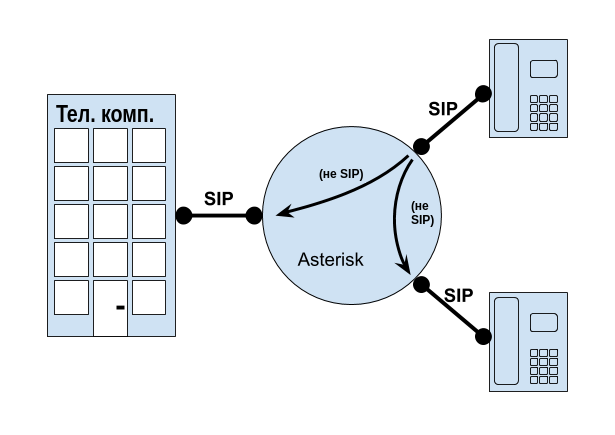
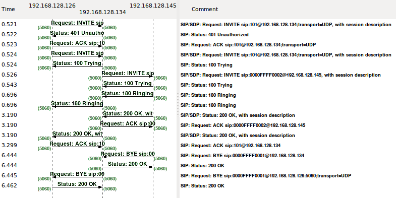

# Глава 5. Конфигурация пользовательских устройств

> _Я не всегда знаю, о чем говорю, но я знаю, что я прав._
>
>  —Мухаммед Али

Пришло время подключить некоторые пользовательские устройства SIP к Asterisk. Хотя мы собираемся сосредоточиться на Asterisk как конце вещей, имейте в виду, что определение канала устройства в Asterisk для непосредственного подключения через него - это только половина конфигурации; вам также нужно настроить другой конец — само устройство \(обычно телефон\)—так чтобы оно знало, куда отправлять свои вызовы.

---

#### Важное замечание относительно точки SIP

Настройка другого конца связи SIP конечно необходима, но не является частью конфигурации Asterisk и, в конечном счете, выходит за рамки этой книги. На рынке должно быть тысячи различных типов конечных точек SIP, включая настольные телефоны, программные телефоны, УАТС, прокси-серверы, серверы конференций и всевозможные другие продукты. У каждого производителя есть свои инструменты, позволяющие настраивать его продукцию \(а некоторые из них требуют обширных знаний). SIP - это сложный протокол. Сказав это, большинство настольных телефонов SIP имеют какой-то веб-интерфейс, и большинство софтфонов имеют меню конфигурации, встроенное в их графический интерфейс.

В самом простом случае настройка SIP-устройства включает в себя предоставление трех параметров:

* Адрес сервера, через который оно будет подключаться \(ваш сервер Asterisk\)
* Имя пользователя \(которое также можно назвать именем подписчика, расширением или чем-то подобным\)
* Пароль

Хотя каждый тип конечной точки будет отличаться, все они будут следовать аналогичному соглашению, и хотя потенциально существуют сотни параметров конфигурации, довольно часто можно настроить только эти три вещи.

---

Другими словами, есть две отдельные задачи, необходимые для настройки устройства для работы с Asterisk:

* Сообщение Asterisk об устройстве \(настройка учетных данных канала в Asterisk\)
* Сообщение устройству об Asterisk \(доступ к инструментам настройки для устройства и указание ему где находится сервер и как к нему подключиться\)

---

**Некоторые мысли о протоколе SIP**

SIP - является одноранговым протоколом, и хотя обычно используется настройка, в которой конечные точки \(телефоны\) ведут себя как клиенты, а какой-то шлюз \(например, Asterisk\) обеспечивает маршрутизацию и функции, сам протокол работает с точки зрения одноранговых отношений \(Рисунок 5-1\). Две конечные точки SIP могут напрямую разговаривать друг с другом \(т.е. пара SIP-телефонов теоретически должна иметь возможность создавать своего рода “интерком” непосредственно между собой без АТС посередине\).

При этом, безусловно, большинство SIP-транзакций происходят через какой-либо сервер, который обычно остается в пути вызова и обеспечивает все соединения \(также не требуется протоколом\). Когда SIP-вызов выполняется с телефона на другой телефон через Asterisk, на самом деле происходит два вызова: вызов от исходного аппарата в Asterisk и другой отдельный вызов из Asterisk в целевой аппарат \(этот второй этап вызова может даже не использовать SIP\). Asterisk соединяет их вместе. Аналогично, если вы делаете ”внешний" вызов, Asterisk примет вызов от вашего аппарата, а затем отправит вызов по другому каналу, который будет считаться магистральным \(транковым\), и снова соединит эти каналы вместе. На уровне протокола вызов set-to-set и set-to-trunk выглядят очень похожими.

Использование SIP-телефона с Asterisk означает, что вы хотите настроить SIP-телефон для совершения всех своих вызовов через Asterisk, даже если устройство вполне способно напрямую подключаться к другой конечной точке SIP без сервера Asterisk. Телефон будет рассматривать Asterisk в качестве своего регистратора и прокси-сервера \(хотя Asterisk на самом деле является Back to Back User Agent или B2BUA\) и будет искать Asterisk для принятия решений о маршрутизации для всех вызовов.



_Рисунок 5-1. Asterisk в роли шлюза_

---

---

**Некоторые мысли о провижинге аппаратов**

Хотя большинство устройств будут иметь веб-интерфейс для определения параметров, если вы используете более одного или двух телефонов в продакшене, вы должны изучить использование процесса провижинга (подготовки) на основе сервера. Таким образом, аппараты будут подключаться к серверу, идентифицироваться и аутентифицироваться, а также загружать файлы конфигурации, содержащие их параметры \(очень часто используется MAC-адрес телефона в качестве идентификатора для именования каждого уникального файла конфигурации\). Файлы конфигурации для различных продуктов обычно обслуживаются сервером HTTPS или SFTP и будут отформатированы как XML или некоторой формой пар ключ/значение.

К сожалению, точный процесс загрузки, протокол и синтаксис этих файлов будут отличаться от производителя к производителю. Это нетрудно узнать, если вы знакомы с такими понятиями, но попытаться охватить все их \(и держать постоянно меняющиеся процессы в актуальном состоянии\) было бы невозможно. Производители обычно предлагают свободно загружаемые и подробные руководства по настройке для своих телефонов, поэтому с небольшим количеством исследований и знакомством с настройкой файловых сервисов на Linux вы найдете множество информации, доступной в интернете. По нашему опыту, документация, предоставленная производителями, как правило, превосходна. Она будет предоставлять самую последнюю информацию о подготовке своих устройств.

При устранении неполадок подготовки аппарата всегда сначала проверяйте загрузку с помощью компьютера. Если вы не можете загрузить файлы на свой компьютер, ваши устройства, вероятно, также не смогут их загрузить.

Мы скажем одно последнее слово об этом: убедитесь, что любой процесс, который вы используете, включает шифрование файлов конфигурации так, что если файлы украдены, только предполагаемый получатель способен их расшифровать. Большинство производителей проделали хорошую работу, чтобы сделать это довольно простой задачей. Не отправляйте незашифрованные файлы конфигурации через общедоступный Интернет.

---

В этой главе мы сосредоточимся на конфигурации аппаратов с точки зрения Asterisk, поэтому мы не будем слишком много говорить о самонастраиваемых телефонах; вам нужно будет провести собственное исследование в этом отношении. Мы будем использовать пару софтфонов в нашей лаборатории и Вы так же можете. В наших примерах будет предпринята попытка предоставить достаточно информации, для настройки любых SIP-устройств, которые вы используете. Если мы сможем помочь вам зарегистрировать пару софтфонов в вашей лабораторной системе, мы направим вас по пути к более сложным сценариям \(которые, как правило, требуют некоторых исследований и прототипирования с вашей стороны\).

## Концепции именования телефонов

Прежде чем приступить к настройке Asterisk для наших телефонов, мы предложим некоторые рекомендации по именованию телефонов.

Во-первых, вы не должны назначать своим телефонам добавочный номер; вместо этого создайте систему так, чтобы добавочный номер был назначен пользователю, а затем назначьте телефон или другие ресурсы этому пользователю. Сами телефоны должны быть названы в соответствии с чем-то уникальным для них, таким как MAC-адрес или имя компьютера. В гибкой АТС следующего поколения необходимо абстрагировать понятия пользователей, добавочных номеров и телефонов чтобы обеспечить максимальную гибкость и простоту управления.

В Asterisk действительно нет понятия пользователя вообще. Добавочные номера - это триггеры, которые инициируют последовательность инструкций. Да, вы можете написать небольшой диалплан, указав, что при наборе добавочного номера 100 Asterisk будет звонить на телефон на вашем столе. Однако добавочный 100 может также легко получить доступ к ящику голосовой почты компании или, возможно, воспроизвести приглашение, присоединиться к конференц-залу или сделать любое количество других вещей. Мы даже можем написать диалплан, который указывает, что расширение 100 должно звонить на устройство на вашем столе с понедельника по пятницу между 9 утра и 5 вечера, но в остальное время звонить на устройство на другом столе. И наоборот, когда вызов выполняется с устройства в рабочее время, идентификатор вызывающего абонента может показывать дневной номер, а в остальное время может показывать номер после рабочего дня \(многие стойки регистрации становятся столами безопасности в ночное время\).

В Asterisk добавочные номера \(расширения\) не являются телефонами. Поэтому не давайте идентификаторы телефонов, которые являются добавочными номерами.

---

**Внутренние номера Asterisk**

Концепция внутренних номеров в Asterisk имеет решающее значение. В большинстве УАТС добавочный номер - это номер, который вы набираете для вызова телефона или службы. В Asterisk внутренний номер является именем группы инструкций в диалплане. Подумайте о внутр.номере Asterisk как об имени скрипта и вы на правильном пути. Да, внутр.номер Asterisk может быть номером, который звонит на телефон, но это может быть также словом \(например, `voicemail`\), которое предоставляет простую услугу какого-либо рода, никогда не отправляя вызов по какому-либо каналу.

Мы рассмотрим внутр.номера Asterisk более подробно на протяжении всей этой книги, но прежде чем мы это сделаем, мы должны настроить некоторые телефоны.

---

Абстракция между именем добавочного номера и телефоном, который может звонить - это мощная концепция. Отличным примером этого является функция УАТС, широко известная как _hot-desking_, которая позволяет пользователям совместно использовать один стол и/или перемещаться по разным столам. Допустим, у нас есть три агента по продажам, которые обычно работают вне офиса, но проводят пару дней каждый месяц в офисе, чтобы оформить документы. Поскольку они вряд ли будут находиться на месте одновременно, вместо того, чтобы у каждого агента был отдельный телефон, они могли бы использовать один офисный телефон \(или в большем масштабе, дюжина людей могла бы разделить пул, скажем, из трех телефонов\). Этот сценарий иллюстрирует удобство \(и необходимость\) предоставления системе возможности отделить концепцию пользователя и расширения от физического телефона.

Лучший способ назвать физический настольный телефон \(или любую физическую конечную точку SIP\) - использовать MAC-адрес устройства, который является уникальным для телефона, следует за ним, и не требует изменений конфигурации телефона, если меняется пользователь. У некоторых корпораций есть наклейки, которые они размещают на своем оборудовании со штрих-кодом и другой информацией, которая позволяет им хранить запас подготовленного оборудования; эти уникальные коды также будут приемлемым выбором для использования в качестве имен телефонов, поскольку они не обеспечивают никакой логической связи с конкретным человеком, но предоставляют конкретную информацию о самих устройствах.

Софтфоны \(программные телефоны\) на ноутбуках также могут использовать MAC-адрес или серийный номер, но убедитесь, что имя аппарата содержит ссылку на то, что это софтфон. `[JIMMY_VANM_SOFT]` - приемлимое имя, но `[JIM S_PHONE]` - нет. Если софтфон работает на настольном компьютере \(т.е. он не будет перемещаться с пользователем\), то назовите его, используя соглашение, которое вы используете для своих компьютеров \(`[DESK-5F23-SOFT]` или `[CUST_SRVC_001_SOFT]` являются потенциально хорошими именами\).

Выбор за вами относительно того, как вы хотите называть свои телефоны. Наша цель - помочь вам понять почему лучшей практикой является абстрагирование любой концепции телефона, принадлежащего человеку. Телефон - это просто способ получить и звук от человека и сигнал туда и обратно, поэтому гораздо лучше сделать возможным смешивание и сопоставление их, когда пользователи перемещаются, а люди приходят и уходят.

В этой книге, вы увидите имена телефонов, которые выглядят как MAC-адреса \(например, `[0000F3000001]` и `[0000F3000002]`\), или имя общего рабочего стола \(`[DESK-001-SOFT]`, `[DESK-002-SOFT]`\), для разделения устройств. Как правило, вы будете использовать имена телефонов, соответствующие используемому оборудованию \(или какой-либо другой строке, уникальной для регистрируемого устройства\).

В качестве окончательного рассмотрения мы должны четко указать что то, что мы предлагаем в отношении имен устройств, не является техническим требованием. Вы можете называть свои устройства как угодно, если они соответствуют требованиям соглашений об именах Asterisk для устройств \(оставайтесь с буквенно-цифровыми символами без пробелов и все будет в порядке\).

Вы увидите множество систем Asterisk, которые связывают имя устройства с расширением пользователя, но мы не поклонники этого метода.

## Телефоны, софтфоны и телефонные адаптеры

Существует три типа конечных точек, которые вы обычно предоставляете своим пользователям в качестве телефонного аппарата. Они обычно называются телефонами \(или настольными телефонами\), софтфонами и аналоговыми терминальными адаптерами \(ATA\).

_Аппаратный телефон_ - это физическое устройство - офисный телефон. У него есть трубка, нумерованные кнопки, какой-то экран и так далее. Он подключается непосредственно к сети и, вероятно, он является тем, что люди имеют в виду когда говорят о VoIP-телефоне \(или SIP-телефоне\). Обычно он стоит на столе, но его можно установить на стене, в лифте, на боковом столе или в коробке на обочине дороги.

_Софтфон_ - это программное приложение, которое работает на ноутбуке, настольном компьютере, смартфоне или другом вычислительном устройстве. Звук должен проходить через звуковую систему устройства, поэтому как правило нужна гарнитура, которая будет хорошо работать с приложениями телефонии. Софтфоны стали популярными приложениями на смартфонах, потому что они позволяют подключаться к телефонным сетям, отличным от сотовой сети \(например, вы можете зарегистрироваться в качестве внутреннего номера на своей корпоративной АТС\). Интерфейс софтфона часто стилизован под физический телефон, но в этом нет необходимости. WebRTC позволит использовать все виды дополнительных возможностей в этой области, так как он по существу позволяет программному телефону просто быть частью сеанса в браузере. Для УАТС софтфон выглядит и ведет себя точно так же, как и аппаратный телефон.

_ATA_ разработан, чтобы позволить традиционным аналоговым телефонам \(и другим аналоговым устройствам, таким как факсы, беспроводные телефоны, пейджинговые усилители и т.д.\) подключаться к сети SIP,[1](https://learning.oreilly.com/library/view/asterisk-the-definitive/9781492031598/ch05.html#idm46178408634856) и будет представлять собой коробку размером с сэндвич, которая содержит разъем RJ-11 для телефона \(обычно называемый портом FXS\), разъем RJ-45 для сети и разъем питания. Некоторые ATA могут поддерживать более одного телефона. Другие ATA могут иметь расширенные функции, такие как брандмауэр или порт FXO \(аналоговый порт, который может подключаться к линии ТфОП\). С точки зрения АТС, ATA выглядит точно так же, как SIP-телефон.

Телефоны имеют преимущество в том, что содержат хорошие акустические свойства для голосовой связи. Любой телефон приличного качества спроектирован так, чтобы улавливать частоты человеческого голоса, отфильтровывать нежелательные фоновые шумы и нормализовать результирующую форму волны. Люди используют телефоны с тех пор, как существует телефонная сеть, и нам, как правило, нравится то, что знакомо, поэтому наличие устройства, которое взаимодействует с Asterisk с помощью знакомого интерфейса, будет привлекательным для многих пользователей. Кроме того, жесткий телефон не требует, чтобы ваш компьютер работал все время.

Недостатки же телефонов включают в себя тот факт, что они трудно переносятся и стоят дорого по сравнению со многими качественными софтфонами на рынке сегодня, которые доступны бесплатно. Кроме того, дополнительный беспорядок на вашем столе может быть нежелателен, если у вас ограниченное рабочее пространство. Если вы много перемещаетесь и как правило не находитесь в одном и том же месте, аппаратный телефон вряд ли удовлетворит ваши потребности \(хотя, один в каждом месте, которое вы регулярно посещаете, может быть правильным решением\).

Софтфоны решают проблему переносимости, будучи установленными на устройстве, которое, вероятно, уже движется вместе с вами, например, ваш ноутбук или смартфон. Кроме того, их минимальная стоимость \(как правило бесплатны, или около $30 за один полнофункциональный\) является привлекательной. Поскольку многие софтфоны бесплатны, вполне вероятно, что первым телефонным аппаратом, который вы подключите к Asterisk, будет софтфон. Кроме того, поскольку софтфоны - это просто программное обеспечение, их легко устанавливать и обновлять, и как правило они имеют другие функции, которые используют другие периферийные устройства, такие как веб-камера для видеозвонков или возможность загружать файлы с вашего рабочего стола для отправки факсов. Еще одним потенциально огромным преимуществом софтфона является то, что его часто можно интегрировать с другими приложениями, работающими на устройстве.

Некоторые из недостатков софтфонов - это не всегда включенное устройство, необходимость надевать гарнитуру каждый раз, когда вы принимаете вызов, и тот факт, что многие ПК будут в произвольное время в течение дня выбирать другое приложение, которым пользователь будет пользоваться, что может привести к тому, что софтфон перестанет работать, пока какая-то фоновая задача захватила процессор. В мобильном устройстве софтфон может потреблять ресурсы, что влияет на время работы батареи, производительность и эксплуатационные расходы.

У ATAs есть преимущество, позволяющее подключать аналоговые устройства к сети SIP,[2](https://learning.oreilly.com/library/view/asterisk-the-definitive/9781492031598/ch05.html#idm46178408624504) такие как беспроводные телефоны \(которые все еще превосходят во многих случаях более продвинутые типы беспроводных Wi-Fi телефонов и гораздо менее дорогостоящие[3](https://learning.oreilly.com/library/view/asterisk-the-definitive/9781492031598/ch05.html#idm46178408623256)\), пейджинговые усилители, звонки и старинные телефоны.[4](https://learning.oreilly.com/library/view/asterisk-the-definitive/9781492031598/ch05.html#idm46178408622440) ATA также иногда можно использовать для подключения к старой проводке, где сетевое соединение может работать неправильно, или к надворным постройкам \(например, сторожка\), где стандартное подключение ethernet невозможно.

Основным недостатком ATA является невозможность получения тех же функций через аналоговую линию, что и с SIP-телефона. Это технология, которой уже более ста лет.

С Asterisk нам не обязательно выбирать между софтфоном, аппаратным телефоном или ATA; вполне возможно и довольно часто иметь один добавочный номер, который одновременно звонит на несколько устройств, таких как настольный телефон, софтфон на ноутбуке, сотовый телефон и, возможно, стробоскоп в задней части завода \(где слишком много шума для звонка\).

Больше, чем любая другая конечная точка, программный телефон будет развиваться в нечто гораздо более всеобъемлющее, чем простое телефонное приложение. Появление WebRTC может наконец сделать то, что было предсказано в течении многих долгих лет: интеграция голоса в реальном времени в вычислительные \(в частности, веб-приложения\). Конечно, есть много способов достичь этого уже, но преимущество WebRTC заключается в том, что это открытый стандарт, встроенный прямо во все браузеры без каких-либо плагинов. Софтфон мертв; да здравствует софтфон.

Нам все еще нравится настольный телефон для регулярных телефонных звонков.

## Настройка Asterisk

В этом разделе мы рассмотрим, как настроить PJSIP для обработки различных конечных точек SIP. Традиционно это делалось путем редактирования файлов в каталоге _/etc/asterisk/_; однако мы решили продемонстрировать как это делается через базу данных, поскольку в целом это превосходный метод, особенно по мере роста системы. Если вам более удобны в использовании _.conf_ файлы, вы должны найти, что это довольно легко сделать как только вы уяснили основы.[5](https://learning.oreilly.com/library/view/asterisk-the-definitive/9781492031598/ch05.html#idm46178408610760)

---

**Примечание**

Asterisk позволяет устройствам, использующим множество различных протоколов, общаться с ним \(и, следовательно, друг с другом\), но `chan_pjsip` - единственный модуль VoIP, который все еще активно поддерживается; остальные - устаревший код. Вы вряд ли будете использовать другие протоколы VoIP \(такие как IAX2, Skinny/SCCP, Unistim, H323 и MGCP\). Эти протоколы имеют историческое значение, так как это было во многом связано с тем, что Asterisk будет говорить с чем угодно и обо всём, что может оказать влияние на телекоммуникационную отрасль. Однако в настоящее время SIP почти вытеснил их все, поэтому эти драйверы каналов теперь являются историческими курьезами и не более того. Если вы все еще заинтересованы в одном из этих протоколов, сосредоточьтесь на том, чтобы сначала комфортно работать с SIP и признать, что он в значительной степени самодостаточен.

---

Таблицы конфигурации каналов в базе данных [6](https://learning.oreilly.com/library/view/asterisk-the-definitive/9781492031598/ch05.html#idm46178408603032) содержат сведения о конфигурации, относящиеся к этому драйверу канала, а также параметры и учетные данные, относящиеся к устройствам и поставщикам SIP, которые вы подключите к Asterisk \(входящие и исходящие\). Проще говоря: все звонки в Asterisk и из него должны проходить через канал.

Большинство параметров имеют значения по умолчанию, которые вы найдете в файлах примеров. Начните с чтения файла _pjsip.conf.sample_ находящегося в вашем каталоге _~/src/asterisk.&lt;TAB&gt;/configs/samples/_. Он предоставит множество информации о значениях по умолчанию, а также о других ресурсах, о которых стоит прочитать. Мы не будем использовать файл для фактической конфигурации \(вместо этого мы используем базу данных\); однако файл является отличной ссылкой, и вы должны держать его под рукой, так как он будет иметь ответы на многие вопросы, которые могут возникнуть о параметрах.

Мы собираемся сосредоточиться на получении базового устройства для вас как можно проще. Мы обнаружили, что настройка каналов является одной из самых неприятных вещей, которые испытывают новые пользователи Asterisk, и хотим продемонстрировать, что на самом базовом уровне это не должно быть болезненным вообще. После того, как вы преуспели здесь, у вас всегда будет известная хорошая конфигурация, чтобы вернуться, как вы продвинетесь вперед в более сложные сценарии.

### Как конфигурация канала работает с диалпланом

Каналы - это то, что Asterisk соединяет вызовы со всем, что находится за его пределами, но именно диалплан определяет что происходит с вызовами по мере их прохождения через систему. Таким образом, каналы и диалплан неразрывно связаны. Диалплан - это сердце системы Asterisk: он управляет тем, как логика вызова применяется к любому соединению, к любому каналу, например что происходит, когда устройство набирает добавочный номер 101 или входящий вызов от внешнего поставщика услуг направляется в DID. Таблицы конфигурации канала PJSIP в базе данных, а также файл _/etc/asterisk/extensions.conf_ будут играть важную роль в большинстве, если не во всех, вызовах, маршрутизируемых через систему. После того, как настроили свои каналы, вы обнаружите, что большая часть вашей работы будет в диалплане. Мы глубоко погрузимся в него в следующих главах.

Когда вызов поступает в Asterisk, идентификатор входящего вызова сопоставляется с конфигурацией канала используемого протокола \(SIP-соединения обрабатываются драйвером канала PJSIP\). Драйвер канала будет обрабатывать аутентификацию входящего соединения. Конфигурация канала также _определяет где этот канал будет входить в диалплан_.

Как только Asterisk определит, как будет обрабатывать канал \(т.е. он аутентифицирован и установлены различные параметры вызова\), он может передать управление вызовом в правильный контекст в диалплане. Это параметр контекста в таблице `ps_endpoints`, который сообщает каналу, где вызов будет входить в диалплан \(который содержит всю информацию о том, как обрабатывать и маршрутизировать вызов\).

На Рисунке 5-2 мы видим, что поток вызовов через конфигурацию для внутреннего вызова \(set-to-set\) будет выглядеть примерно так:

1. Пользователь устройства `0000f30A0A0101` набирает `102`.
2. Asterisk сопоставляет входящий SIP-запрос с конечной точкой \(и проверяет его подлинность\).
3. Набранный номер соответствует контексту `[sets]` в диалплане.
4. Приложение `Dial()` используется для отправки вызова по каналу PJSIP на контакт, связанный с `0000f30B0B02`.
5. Определяется контактный адрес \(обычно на основе регистрации, если это устройство, но также может быть жестко закодирован, если это транк\).
6. Сообщение SIP INVITE отправляется в пункт назначения.

Ключевым моментом является то, что файлы конфигурации каналов управляют не только тем, как вызовы входят в систему, но и тем, как они покидают систему. Так, например, если одно устройство вызывает другое, файл конфигурации канала используется не только для передачи вызова в диалплан, но и для направления вызова из диалплана к месту назначения.


_Рисунок 5-2. Отношение pjsip.conf к extensions.conf_

### chan_pjsip

Модуль канала PJSIP является одним из новых модулей в Asterisk. Он заменил оригинальный модуль `chan_sip`.

---

**Примечание**

Старый модуль SIP - `chan_sip` был устаревшим, поэтому мы не будем документировать его в этой книге. Если вы новичок в Asterisk, вы должны придерживаться PJSIP, но может быть полезно понять, что `chan_sip` использовался в течение многих лет и до сих пор широко используется на старых системах.

---

Платформа PJSIP, реализованная в Asterisk, состоит из многих компонентов. Если вы проверите свою базу данных, то обнаружите что существует более десятка таблиц, относящихся к PJSIP (с префиксом `ps_`). Однако, не все из них относятся к заданной конфигурации.

---

PJSIP - это универсальная библиотека с открытым исходным кодом для мультимедийной связи, которая обеспечивает не только сигнализацию SIP, но также функции медиапотока и обхода NAT, которые являются важными компонентами приложений на основе SIP. Он предоставляется и поддерживается компанией Telugu Ltd., и библиотека используется в гораздо большем числе приложений, чем просто Asterisk. Софтфоны, проприетарные продукты и другие проекты с открытым исходным кодом также используют фреймворк. Сообщество Asterisk нуждалось/хотело новый драйвер канала SIP, и вместо того, чтобы строить его с нуля, разработчики решили использовать библиотеку PJSIP.

---

Компоненты, перечисленные в [Таблице 5-1](Asterisk%20%20The%20Definitive%20Guide,%205th%20Edition/5.%20User%20Device%20Configuration%20-%20Asterisk%20%20The%20Definitive%20Guide,%205th%20Edition.htm%22%20/l%20%22table0501) будут испольоваться при настройке конечных точек.

Таблица 5-1. Компоненты PJSIP в Asterisk

| Компонент | Назначение |
| :--- | :--- |
| `ps_aors` | Address Of Record \(AOR\) - адрес записи - таблица используется для определения того, как Asterisk может связаться с конечной точкой. Когда комплект пытается зарегистрироваться, Asterisk будет обращаться к AOR, чтобы идентифицировать его. |
| `ps_auths` | Раздел Authentication \(проверки подлинности\) содержит учетные данные, которые конечные точки должны будут предоставить системе Asterisk для авторизации. |
| `ps_contacts` | Обычно создается автоматически как часть процесса регистрации, именно здесь Asterisk будет хранить сведения о конечной точке, определенной во время регистрации. |
| `ps_endpoints` | Сердце конфигурации SIP, именно здесь определяется каждая конечная точка. Здесь также определяются связи с другими записями PJSIP. |

#### Добавление конечной точки

Во время установки для вас было создано несколько примеров конечных точек, чтобы упростить процесс представления вам рабочей системы. Если вы хотите добавить дополнительные конечные точки, то нужно просто определить дополнительные записи в каждой из таблиц `ps_aors`, `ps_auths` и `ps_endpoints`.

Допустим, мы хотим добавить пару софтфонов с именами `SOFTPHONE_A` и `SOFTPHONE_B` в нашу систему.

Во-первых, в таблицу `ps_endpoints` мы должны добавить следующее:

```text
$ mysql -D asterisk -u asterisk -p
```

Давайте рассмотрим, что у нас там уже есть \(из предыдущих глав\):

```text
mysql> select id,transport,aors,auth,context,disallow,allow from asterisk.ps_endpoints;
+--------------+---------------+--------------+--------------+----------+----------+-------+
| id           | transport     | aors         | auth         | context  | disallow | allow |
+--------------+---------------+--------------+--------------+----------+----------+-------+
| 0000f30A0A01 | transport-udp | 0000f30A0A01 | 0000f30A0A01 | starfish | all      | ulaw  |
| 0000f30B0B02 | transport-udp | 0000f30B0B02 | 0000f30B0B02 | starfish | all      | ulaw  |
+--------------+---------------+--------------+--------------+----------+----------+-------+
2 rows in set (0.00 sec)
```

Мы собираемся вставить пару дополнительных записей.

```text
mysql> insert into asterisk.ps_endpoints
 (id,transport,aors,auth,context,disallow,allow)
values
 ('SOFTPHONE_A','transport-tls','SOFTPHONE_A','SOFTPHONE_A','sets','all','ulaw'),
 ('SOFTPHONE_B','transport-tls','SOFTPHONE_B','SOFTPHONE_B','sets','all','ulaw');
Query OK, 2 rows affected (0.02 sec)
```

Теперь таблица `ps_endpoints` должна выглядеть примерно так:

```text
mysql> select id,transport,aors,auth,context,disallow,allow from ps_endpoints;
+--------------+---------------+--------------+--------------+---------+----------+-------+
| id           | transport     | aors         | auth         | context | disallow | allow |
+--------------+---------------+--------------+--------------+---------+----------+-------+
| 0000f30A0A01 | transport-udp | 0000f30A0A01 | 0000f30A0A01 | sets    | all      | ulaw  |
| 0000f30B0B02 | transport-udp | 0000f30B0B02 | 0000f30B0B02 | sets    | all      | ulaw  |
| SOFTPHONE_A  | transport-tls | SOFTPHONE_A | SOFTPHONE_A   | sets    | all      | ulaw  |
| SOFTPHONE_B  | transport-tls | SOFTPHONE_B | SOFTPHONE_B   | sets    | all      | ulaw  |
+--------------+---------------+--------------+--------------+---------+----------+-------+
4 rows in set (0.00 sec)
```

Затем нам понадобятся две связанные записи в таблице `ps_aors`:

```text
mysql> insert into asterisk.ps_aors (id,max_contacts)
values ('SOFTPHONE_A',2),('SOFTPHONE_B',2);
Query OK, 2 rows affected (0.01 sec)
```

Затем таблица `ps_aors` должна возвращать следующее:

```text
mysql> select id from asterisk.ps_aors;
+--------------+
| id           |
+--------------+
| 0000f30A0A01 |
| 0000f30B0B02 |
| SOFTPHONE_A  |
| SOFTPHONE_B  |
+--------------+
4 rows in set (0.00 sec)
```

Наконец, таблица `ps_auths` будет нуждаться в записях для каждого нового устройства..

```text
insert into asterisk.ps_auths (id,auth_type,password,username)
values ('SOFTPHONE_A','userpass','iwouldnotifiwereyou','SOFTPHONE_A'),
('SOFTPHONE_B','userpass','areyoueventrying','SOFTPHONE_B');

Query OK, 2 rows affected (0.00 sec)
```

И, если все прошло хорошо, у вас будут следующие записи авторизации:[7](https://learning.oreilly.com/library/view/asterisk-the-definitive/9781492031598/ch05.html%22%20/l%20%22idm46178408545288)

```text
mysql> select id,auth_type,password,username
 -> from asterisk.ps_auths;
+--------------+-----------+----------------------+--------------+
| id           | auth_type | password             | username     |
+--------------+-----------+----------------------+--------------+
| 0000f30A0A01 | userpass  | not very secure      | 0000f30A0A01 |
| 0000f30B0B02 | userpass  | hardly to be trusted | 0000f30B0B02 |
| SOFTPHONE_A  | userpass  | iwouldnotifiwereyou  | SOFTPHONE_A  |
| SOFTPHONE_B  | userpass  | areyoueventrying     | SOFTPHONE_B  |
+--------------+-----------+----------------------+--------------+
4 rows in set (0.00 sec)
```

Новые конечные точки теперь готовы к регистрации устройств на них. Вы можете убедиться, что они существуют с помощью следующей команды Asterisk CLI:

```text
mysql> exit
$ sudo asterisk -rvvvvv
*CLI> pjsip show endpoints
```

Выходные данные должны содержать список новых конечных точек:

```text
Endpoint: 0000f30A0A01                   Unavailable   0 of inf
    InAuth: 0000f30A0A01/0000f30A0A01
       Aor: 0000f30A0A01                 2
 Transport: transport-udp     tls    0    0    0.0.0.0:5061

Endpoint: 0000f30B0B02                   Not in use    0 of inf
    InAuth: 0000f30B0B02/0000f30B0B02
       Aor: 0000f30B0B02                 2
     Contact: 0000f30B0B02/sip:0000f30B0B02@172.29.1.110 7542ca7ce1 Unknown    nan
 Transport: transport-udp     udp    0    0    0.0.0.0:5060

Endpoint: SOFTPHONE_A                    Unavailable    0 of inf
    InAuth: SOFTPHONE_A/SOFTPHONE_A
       Aor: SOFTPHONE_A                  2

Endpoint: SOFTPHONE_B                    Unavailable 0 of inf
    InAuth: SOFTPHONE_B/SOFTPHONE_B
       Aor: SOFTPHONE_B                  2
```

Подожди минутку…

Вы заметили, что для новых конечных точек не определен транспорт? Это потому, что мы еще ничего не определили для TLS; мы только что определили для стандартного UDP-стиля SIP.

Поскольку у нас есть те причудливые ключи, которые мы создали в предыдущей главе, давайте реализуем их сейчас и посмотрим, сможем ли мы это исправить.

```text
$ sudo vim /etc/asterisk/pjsip.conf
[transport-udp]
type=transport
protocol=udp
bind=0.0.0.0
[transport-tls]
type=transport
protocol=tls
bind=0.0.0.0
cert_file=/home/asterisk/certs/self-signed.crt     #если вы использовали certbot, то
priv_key_file=/home/asterisk/certs/self-signed.key #расположение будет здесь
```

Теперь, поскольку мы помещаем некоторые файлы в папку, которая не была частью нашей конфигурации SELinux, теперь мы должны это исправить. Мы хотим, чтобы SELinux генерировал ошибку, поэтому собираемся перезагрузить модуль `res_pjsip.so`, даже если он не сможет правильно загрузить транспорт:

```text
*CLI> module reload res_pjsip.so
```

Теперь у нас должны быть ошибки, которые мы ожидали, поэтому будем искать их в системном журнале.

```text
$ sudo grep -i sealert /var/log/messages |egrep "cert|crt"
```

Вы увидите некоторые сообщения, которые выглядят примерно так (мы урезали их для краткости):

```text
SELinux is preventing ... on the file /home/asterisk/certs/self-signed.crt.
 For complete SELinux messages run: sealert -l 1dbe51e2-7321-41d3-a5bb-f8f1b4a6f787
SELinux is preventing ... on the directory certs.
 For complete SELinux messages run: sealert -l 879db542-e0a9-43e8-8763-62fcf068bfee
SELinux is preventing ... on the file self-signed.crt.
 For complete SELinux messages run: sealert -l 8fb85940-ee82-44bd-adcb-e30d31ee516a
```

Полезно то, что SELinux говорит вам именно то, что нужно сделать для решения этой проблемы!

Для каждого из трех сообщений, относящихся к доступу к сертификатам, которые мы только что настроили, выполните соответствующую команду. А мы просто выполним одну, чтобы показать, что имеем в виду, но вам может потребоваться запустить более одной, пока загрузка не пройдет без ошибок.

```text
$ sealert -l 8fb85940-ee82-44bd-adcb-e30d31ee516a
```

Вы должны получить что-то вроде этого:

```text
SELinux is preventing asterisk from read access on the file self-signed.crt.
***** Plugin catchall (100. confidence) suggests **************************
You can generate a local policy module to allow this access.
allow this access for now by executing:
# ausearch -c 'asterisk' --raw | audit2allow -M my-asterisk
# semodule -i my-asterisk.pp
```

Вы не root, но вы будете запускать обе команды, которые он определяет:

```text
$ sudo ausearch -c 'asterisk' --raw | audit2allow -M my-asterisk
$ sudo semodule -i my-asterisk.pp
```

Помните, как все говорят что нужно просто отключить SELinux? Ну, больше не нужно этого делать.

Хорошо, перезапустите Asterisk (`$sudo service asterisk restart`) и убедитесь, что ваш файл журнала не генерирует ошибки SELinux (игнорируйте ошибки _ODBC.ini_, поскольку они не относятся к _/etc/odbc.ini_ и не должны ни на что влиять).

Вы должны увидеть, что `transport-tls` теперь готов к использованию:

```text
*CLI> pjsip show transports
Transport: <TransportId........> <Type> <cos> <tos> <BindAddress....................>
==========================================================================================
Transport: transport-tls tls 0 0 0.0.0.0:5061
Transport: transport-udp udp 0 0 0.0.0.0:5060
```

Если вы обнаружите, что он все еще не загружается, вернитесь и отработайте ошибки SELinux в файле _/var/log/messages_. Иногда приходится иметь дело не только с одной.

## Тестирование чтобы убедиться что ваши устройства зарегистрированы

После того, как ваши устройства зарегистрировались в Asterisk, вы сможете запросить их местоположение и состояние из Asterisk CLI.

---

**Примечание**

Это распространенное заблуждение, что регистрация - это то, как устройство аутентифицирует себя с целью получения разрешения на выполнение вызовов. Это неверно. Единственная цель регистрации - позволить устройству определить свое местоположение в сети, чтобы Asterisk[8](https://learning.oreilly.com/library/view/asterisk-the-definitive/9781492031598/ch05.html#idm46178408511480) знал, куда отправлять вызовы, предназначенные для этого устройства.

Аутентификация для исходящих вызовов является полностью отдельным процессом и всегда происходит на основе каждого вызова, независимо от того, зарегистрирован ли комплект. Это означает, что ваше устройство может совершать звонки, но не принимать их. Наиболее распространенной причиной этого является брандмауэр, который закрыл входящий порт \(и решение состоит в том, чтобы установить таймер регистрации на более короткое время, чтобы оно перерегистрировалось каждые несколько минут, так что брандмауэр будет держать соответствующий SIP-порт открытым\).

Можно иметь успешно установленную регистрацию и все же совершать звонки будет запрещено. Дело в том, что только потому, что устройство зарегистрировано не означает, что оно может совершать звонки (хотя это почти всегда будет так).

---

Проверка регистрации комплекта - это самый простой способ проверить правильность его настройки.

---

**Примечание**

Помните, что настройка устройства _не_ происходит в Asterisk. Вы должны настроить устройство с помощью любых инструментов, предоставленных производителем.

---

Для проверки состояния устройства, просто вызовите CLI Asterisk:

```text
$ sudo asterisk -rvvvv
```

При вводе следующей команды возвращается список всех пиров, о которых знает Asterisk (зарегистрированные устройства будут иметь соответствующий `Contact`):

```text
*CLI> pjsip show aors
 Aor: <Aor..............................................> <MaxContact>
 Contact: <Aor/ContactUri............................> <Hash....> <Status> <RTT(ms)..>
==========================================================================================
 Aor: 0000f30A0A01 2
 Aor: 0000f30B0B02 2
 Contact: 0000f30B0B02/sip:0000f30B0B02@172.29.1.110:5 7542ca7ce1 Unknown nan
 Aor: SOFTPHONE_A 2
 Aor: SOFTPHONE_B 2
```

## Базовый диалплан для теста ваших устройств

В следующей главе мы погрузимся в диалплан Asterisk. Здесь мы собираемся заложить очень простой диалплан, так что если вы регистрируете устройства на различные конечные точки SIP уже в конфигурации PJSIP, вы должны быть в состоянии сделать тестовые вызовы между ними.

```text
$ sudo -u asterisk vim /etc/asterisk/extensions.conf
[general]
[globals]
[sets]
exten => 100,1,Dial(PJSIP/0000f30A0A01)
exten => 101,1,Dial(PJSIP/0000f30B0B02)
exten => 102,1,Dial(PJSIP/SOFTPHONE_A)
exten => 103,1,Dial(PJSIP/SOFTPHONE_B)
exten => 200,1,Answer()
 same => n,Playback(hello-world)
 same => n,Hangup()
```

В консоли Asterisk введите следующую команду:

```text
*CLI> dialplan reload
*CLI> dialplan show
```

Вы увидите, что в контексте `sets` есть некоторые добавочные номера, которые вы можете вызвать.

Эта базовая абонентская группа позволит вам набирать ваши устройства SIP с помощью добавочных номеров 100, 101, 102 и 103. Вы также можете прослушать приглашение `hello-world`, созданное для этой книги, набрав добавочный номер 200.

Зарегистрируйте пару SIP-телефонов \(вы можете скачать софтфон на свой компьютер, а другой - на планшет или смартфон\). Вы должны быть в состоянии набрать между вашими номерами. Откройте CLI для того, чтобы увидеть прохождение звонка. Вы должны увидеть что-то вроде этого \(и устройство, которое вы вызываете, должно звонить\):

```text
-- Executing [102@sets:1] Dial("PJSIP/SOFTPHONE_A-00000001", "PJSIP/0000f30B0B02")
 -- Called PJSIP/0000f30B0B02
 -- PJSIP/0000f30B0B02-00000002 is ringing
```

Если этого не происходит, проверьте конфигурацию и регистрацию и убедитесь, что не сделали никаких опечаток.

---

**Регистрация устройств в Asterisk**

Существует так много различных видов SIP-устройств, которые вы можете зарегистрировать в Asterisk, невозможно привести пример, который будет полезен всем. У вас может быть ПК или Mac, или рабочая станция Linux, или iPhone, или Android, или настольный SIP-телефон, или какое-то иное устройство SIP; у каждого типа устройств есть много разных типов доступных клиентов SIP, и все они в основном одинаковы, но достаточно разные, чтобы раздражать новичка.

Мы не можем показать вам конкретный метод регистрации, но мы обнаружили, что из десятков или, возможно, сотен вариантов в каждом устройстве основной процесс аналогичен для всех из них. Вам нужно будет предоставить:

* Адрес вашего сервера Asterisk (`hostname`, `domen`, `proxy` и `server` - это все поля, которые мы видели для него)
* Идентификатор устройства (`id`, `user`, `subscriber`, `username`, `extension`, `name` и тд)
* Пароль

Если это становится сложным, вы, вероятно, зашли слишком далеко. Пусть все будет просто. Если продукт не имеет хорошей документации, то это может быть неправильный продукт для вас. Для большинства SIP-телефонов вы можете найти инструкции в интернете о том, как зарегистрировать их на Asterisk.

---

Если вы зарегистрируете второе устройство (теперь у вас их четыре!), вы можете сделать тестовые вызовы между ними.

Потратьте немного времени на это и убедитесь, что вы все это поняли. Это имеет решающее значение для всего, что последует далее.

## Под капотом: Ваш первый звонок

Чтобы вы задумались о том, что происходит под капотом, мы кратко рассмотрим некоторые вещи из того, что на самом деле происходит с протоколом SIP, когда два устройства в одной системе Asterisk вызывают друг друга.

---

## Asterisk как B2BUA

Имейте в виду, что на самом деле здесь происходит два вызова: один от исходного комплекта в Asterisk, а другой из Asterisk в целевой комплект. SIP - это одноранговый протокол, и с точки зрения протокола происходит два вызова. Протокол SIP не знает, что Asterisk соединяет вызовы; каждое устройство понимает свое соединение как соединение с Asterisk, без реального знания устройства на другой стороне. Именно по этой причине Asterisk часто называют B2BUA \(Back to Back User Agent\). Именно поэтому так легко соединять различные протоколы вместе с помощью Asterisk.

---

Для только что сделанного вызова будут созданы диалоги, показанные на Рисунке 5-3.

Для получения более подробной информации о том, как работает обмен SIP-сообщениями, обратитесь к [SIP RFC](http://www.ietf.org/rfc/rfc3261.txt).



_Рисунок 5-3. SIP диалоги_

## Вывод

В этой главе вы изучили рекомендации по именованию устройств путем абстрагирования понятий пользователь, добавочный номер и устройство, а также определения параметров конфигурации устройства и проверки подлинности в файлах конфигурации канала. Затем мы углубимся в магию Asterisk, которая является диалпланом, и посмотрим, как простые вещи могут давать отличные результаты.

[1](https://learning.oreilly.com/library/view/asterisk-the-definitive/9781492031598/ch05.html%22%20/l%20%22idm46178408634856-marker) Или любой другой сети, если на то пошло. Более формально можно было бы назвать области аналого-цифровых шлюзов, где характер цифрового протокола может варьироваться \(например, проприетарные АТС на традиционных УАТС\). Дело в том, что ATA не обязательно является SIP-устройством.

[2](https://learning.oreilly.com/library/view/asterisk-the-definitive/9781492031598/ch05.html%22%20/l%20%22idm46178408624504-marker) ATA - это не единственный способ подключения аналоговых телефонов. Поставщики оборудования, такие как Digium и Sangoma, предлагают карты, которые подключаются к серверу Asterisk и предоставляют аналоговые телефонные порты. Более крупные установки могут также использовать банки каналов или MSANы; однако этот метод подключения устаревших телекоммуникационных схем является более продвинутым предметом, а не предметом этой книги.

[3](https://learning.oreilly.com/library/view/asterisk-the-definitive/9781492031598/ch05.html%22%20/l%20%22idm46178408623256-marker) Для действительно удивительного беспроводного аналогового телефона вы должны проверить устройства EnGenius DuraFon, которые дороги, но впечатляют.

[4](https://learning.oreilly.com/library/view/asterisk-the-definitive/9781492031598/ch05.html%22%20/l%20%22idm46178408622440-marker) Наш друг Брайан Капуч собрал вместе множество занимательных демонстраций того, как можно использовать старинное телефонное оборудование для работы с Asterisk.

[5](https://learning.oreilly.com/library/view/asterisk-the-definitive/9781492031598/ch05.html%22%20/l%20%22idm46178408610760-marker) Проще говоря, вам нужно будет найти файл _pjsip.conf.sample_, и использовать его в качестве шаблона для создания файла _pjsip.conf_ в папке _/etc/asterisk_, а затем отредактировать этот файл таким же образом, как мы собираемся делать в базе данных.

[6](https://learning.oreilly.com/library/view/asterisk-the-definitive/9781492031598/ch05.html%22%20/l%20%22idm46178408603032-marker) Или в самом файле _.conf_ если вы заходите пойти по этому пути.

[7](https://learning.oreilly.com/library/view/asterisk-the-definitive/9781492031598/ch05.html%22%20/l%20%22idm46178408545288-marker) За исключением, конечно того, что ваши пароли будут намного лучше, чем те, которые мы использовали здесь.

[8](https://learning.oreilly.com/library/view/asterisk-the-definitive/9781492031598/ch05.html%22%20/l%20%22idm46178408511480-marker) Или любой другой сервер регистратора SIP, если на то пошло.

[Глава 4. Сертификаты для безопасности конечных точек](glava-04.md)  | [Содержание](SUMMARY.md)  | [Глава 6. Основы диалплана](glava-06.md)
