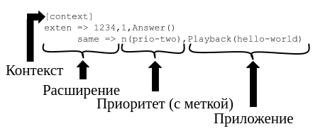

# Глава 6. Основы диалплана

>  _Всё должно быть изложено так просто, как только возможно, но не более того._
>
> ​	— Альберт Эйнштейн

Диалплан - это сердце вашей системы Asterisk. Он определяет, как звонки поступают в систему и выходят из нее. Диалплан является скриптовым языком, который определяет инструкции, которым Asterisk следует в ответ на вызовы, поступающие от каналов. В отличие от традиционных телефонных систем, диалплан Asterisk полностью настраивается.

Опытные разработчики программного обеспечения считают код диалплана Asterisk архаичным и часто предпочитают управлять потоком вызовов с помощью API Asterisk, таких как AMI и ARI (которые мы обсудим в последующих главах). Независимо от ваших планов в этом отношении - изучение поведения Asterisk намного проще, если вы сначала поймете диалплан. Возможно, также стоит отметить, что диалплан Asterisk настроен на производительность и поэтому является самым быстрым способом выполнения потока вызовов с точки зрения быстродействия и минимальной нагрузки на систему. Диалплан работает быстро.

В этой главе представлены основные понятия, которые лягут в базу любого диалплана, написанного вами. Не пропускайте слишком много из этой главы, так как примеры строятся друг на друге и это принципиально важно для Asterisk. Обратите также внимание, что эта глава ни в коем случае не является исчерпывающим обзором всех возможных вещей, которые может сделать диалплан; наша цель - охватить только самое необходимое. В последующих главах мы рассмотрим более сложные темы диалплана. Вам рекомендуется экспериментировать.

## Синтаксис диалплана

Диалплан Asterisk задается в конфигурационном файле с именем *extensions.conf*, расположенном в каталоге */etc/asterisk*.

Структура диалплана состоит из четырех иерархических компонентов: контекстов (Context), расширений (Extension), приоритетов (Priority) и приложений (Application) (смотри Рисунок 6-1).

  

_Рисунок 6-1. Иерархия диалплана_

Давайте нырнем прямо туда.

<table border="1" width="100%" cellpadding="5">
  <tr>
    <td>
      <p align="center"><b>Примеры файлов конфигурации</b></p>
<p>Основной файл <i>extensions.conf</i> был создан как часть процесса установки ранее в этой книге. Мы будем опираться на этот файл в этой главе.</p>
<p>Asterisk также поставляется с подробным файлом <i>extensions.conf</i>, который может быть установлен с образцами файлов конфигурации (за это отвечает команда установки <code>make samples</code>), и если вы запустили эту команду (мы не рекомендуем запускать её во время установки, но это предлагается установщиком), у вас, скорее всего, будет файл <i>/etc/asterisk/extensions.conf</i>, который переполнен информацией. Вместо того, чтобы начинать исправлять под себя файл примера, мы предлагаем вам построить свой <i>extensions.conf</i> с нуля (исходный файл вы можете переименовать или переместить куда-нибудь, если хотите сохранить в качестве источника примеров).</p>
<p>Как и говорилось, файл примера <i>extensions.conf</i> - это фантастический ресурс, полный примеров и идей, которые вы можете использовать после того, как изучили основные понятия. Если вы выполнили наши инструкции по установке, то найдете файл <i>extensions.conf.sample</i> в каталоге <i>~/src/asterisk-16./configs/samples</i> (наряду со многими другими образцами файлов конфигурации).</p>
</td>
</tr>
</table>

### Контексты

Диалплан делится на разделы, называемые *контекстами*, служащие для разделения различных частей диалплана. Расширение, определенное в одном контексте, полностью изолировано от расширений в любом другом контексте, если взаимодействие специально не разрешено.

В качестве простого примера представим, что у нас есть две компании, совместно использующие сервер Asterisk. Если мы поместим каждого автосекретаря компании (IVR) в свой собственный контекст - две компании будут полностью отделены друг от друга. Это позволяет нам самостоятельно определить, что происходит, когда, скажем, набирается номер 0:

- Абоненты, набирающие 0 из голосового меню компании A, должны быть переданы администратору компании A.
- Абоненты, набравшие 0 в голосовом меню компании B, будут отправлены в отдел обслуживания клиентов компании B.

Оба абонента находятся в одной и той же системе, взаимодействуя с одним и тем же диалпланом, но поскольку они прибыли в разные контексты, то испытывают совершенно разные потоки вызовов. То, что происходит с каждым входящим вызовом, определяется кодом диалплана в каждом контексте.

<table border="1" width="100%" cellpadding="5">
  <tr>
    <td>
    <p>Это очень важное соображение. В традиционных УАТС, для таких вещей как прием вызова, как правило, существует набор значений по умолчанию, что означает, в случае, если вы забудете их определить, они, вероятно, будут работать в любом случае. В Asterisk все наоборот. Если вы не скажете Asterisk, как обрабатывать каждую ситуацию, и он столкнется с чем-то, что не может обработать - вызов, как правило, будет отклонен.
    </td>
</tr>
</table>

Контексты определяются в файле *extensions.conf*. Имя контекста помещается в квадратные скобки ([ ]). Имя может состоять из букв A - Z (верхний и нижний регистр), чисел от 0 до 9, а также дефиса и подчеркивания.<sup><a href="#sn1">1</a></sup> Контекст для входящих вызовов от оператора связи может быть назван так:

```
[incoming]
```

<table border="1" width="100%" cellpadding="5">
  <tr>
    <td>
    <p>Имена контекстов имеют максимальную длину 79 символов (80 символов минус 1 завершающий null).
    </td>
</tr>
</table>

Или возможно:

```
[incoming_company_A]
```

Что тогда, конечно, может потребовать что-то вроде:

```
[incoming_company_B]
```

Все инструкции, помещенные после определения контекста, являются частью этого контекста, пока не будет определен следующий контекст.

В начале диалплана есть два специальных раздела с именами [general] и [globals]. Раздел [general] содержит список общих настроек диалплана (о которых вам, вероятно, никогда не придется беспокоиться), а контекст [globals] мы вскоре обсудим. На данный момент важно только знать, что эти две метки не являются контекстами, несмотря на использование синтаксиса контекста. Не используйте [general], [globals] и [default]<sup><a href="#sn2">2</a></sup> в качестве имен контекста, но в противном случае называйте свои контексты как угодно.

Контексты в типичном файле _extensions.conf_ могут быть структурированы примерно так:

```
[general] ; он всегда должен быть здесь
[globals] ; глобальные переменные (мы обсудим их позже)

[incoming] ; звонки от поставщиков услуг могут поступать сюда

[sets] ; в простой системе мы можем использовать это

[sets1] ; многопользовательская же нуждается в этом (устройства от одной компании входят в
	 ; диалплан здесь)

[sets2] ; ... и здесь (другая группа устройств может входить в диалплан здесь)
[services] ; специальные услуги, такие как конференц-связь, могут быть определены здесь
```

Когда вы определяете канал (что не делается в *extensions.conf*), одним из обязательных параметров в каждом определении канала является context. *Контекст - это точка в диалплане, куда будут поступать соединения из этого канала.* Таким образом, способ подключения канала к диалплану осуществляется через контекст (Рисунок 6-2).

  

 _Рисунок. 6-2. Связь между конфигурацией канала (слева) и контекстами в диалплане (справа)_

 <table border="1" width="100%" cellpadding="5">
   <tr>
     <td>
     <p>Это одна из наиболее важных концепций для понимания при работе с каналами и диалпланом. Устранение неполадок потока вызовов намного проще, если вы понимаете связь между контекстом канала (который сообщает каналу, где подключаться к диалплану) и контекстом диалплана (где мы создаем поток вызовов, который происходит при поступлении вызова).
     </td>
  </tr>
</table>

Важным (возможно, самым важным) использованием контекстов является обеспечение конфиденциальности и безопасности. При правильном использовании контекстов можно предоставить некоторым каналам доступ к функциям (например, междугородним вызовам), которые недоступны другим. Если вы не проработаете свой диалплан тщательно, то можете непреднамеренно позволить другим использовать вашу систему в корыстных целях. Пожалуйста, имейте это в виду, когда строите свою систему Asterisk; в интернете есть много ботов, специально написанных для идентификации и использования плохо защищенных систем Asterisk.

<table border="1" width="100%" cellpadding="5">
  <tr>
    <td>
    <p><a href=https://wiki.asterisk.org/wiki/display/AST/Important+Security+Considerations>Asterisk wiki</a> описывает несколько шагов, которые вы должны предпринять, чтобы сохранить вашу систему Asterisk в безопасности. Жизненно важно чтобы вы прочитали и поняли эту страницу. Если вы игнорируете меры безопасности, изложенные там, то можете в конечном итоге позволить всем и каждому совершать междугородние или платные звонки за ваш счет!

Если вы не относитесь к безопасности вашей системы Asterisk серьезно, то можете в конечном итоге поплатиться буквально. <i>Пожалуйста</i>, потратьте время и усилия, чтобы защитить вашу систему от мошенничества.
</td>
</tr>
</table>

### Extensions (расширения)

В телекоммуникационной отрасли слово *extension (расширение)* обычно относится к числовому идентификатору, который при наборе будет звонить на телефон (или вызывать системный ресурс, такой как голосовая почта или очередь). В Asterisk расширение представляет нечто гораздо более мощное, поскольку оно определяет уникальную серию шагов (каждый шаг, содержащий приложение), через которые Asterisk будет принимать этот вызов.

В каждом контексте мы можем определить столько (или несколько) расширений, сколько потребуется. Когда определенное расширение запускается (входящим каналом) - Asterisk будет следовать шагам, определенным для него. Поэтому именно расширения определяют что происходит с вызовами, когда они проходят через диалплан. Хотя расширения могут использоваться для указания телефонных добавочных номеров в традиционном смысле (т.е. расширение 153 вызовет звонок SIP-телефона на столе Джона), в диалплане Asterisk они могут использоваться для гораздо большего.

Синтаксис расширения - это слово exten, за которым следует стрелка, образованная знаком равенства и знаком больше, как это:

```
exten =>
```

После этого следует имя (или номер) расширения.

При работе с традиционными телефонными системами мы склонны думать о расширениях как о номерах, которые вы набираете, чтобы сделать еще один телефонный звонок. В Asterisk имена расширений могут быть любыми комбинациями цифр и букв. В этой и следующей главах мы будем использовать как цифровые, так и буквенно-цифровые расширения.

<table border="1" width="100%" cellpadding="5">
  <tr>
    <td>
    <p>Назначение имен для расширений может показаться необычной концепцией, но когда вы понимаете, что SIP поддерживает набор всех видов комбинаций символов (все, что является допустимым URI, строго говоря) - это имеет смысл. Это одна из особенностей, которая делает Asterisk настолько гибким и мощным.
    </td>
</tr>
</table>

Каждый шаг расширения состоит из трех компонентов:

- Имя (или номер) расширения
- Приоритет (каждое расширение может включать в себя несколько шагов; номер шага называется "приоритет”)
- Приложение (или команда), которое будет выполняться на этом шаге

Эти три компонента разделены запятыми, как здесь:

```
exten => name,priority,application()
```

Вот простой пример:

```
exten => 123,1,Answer()
```

Имя расширения - 123, приоритет - 1, а приложение - Answer().

### Приоритеты

Каждое расширение может иметь несколько шагов, называемых *приоритетами*. Приоритеты нумеруются последовательно, начиная с 1 и каждый выполняет одно конкретное приложение. Например, следующий добавочный номер ответит на звонок с приоритетом номер 1, а затем повесит трубку с приоритетом номер 2. Шаги в расширении происходят один за другим.

```
exten => 123,1,Answer()
exten => 123,2,Hangup()
```

Совершенно очевидно, что этот код на самом деле не делает ничего полезного. Ключевым моментом здесь является то, что для конкретного расширения Asterisk следует за приоритетами по порядку.

```
exten => 123,1,Answer()
exten => 123,2,делаем что-то
exten => 123,3,делаем что-то ещё
exten => 123,4,сделаем ещё одну вещь
exten => 123,5,Hangup()
```

Этот стиль синтаксиса диалплана все еще встречается время от времени, но он устарел. Новый синтаксис похож, но упрощен.

#### Ненумерованные приоритеты

В старых версиях Asterisk нумерация приоритетов вызывала много проблем. Представьте себе расширение, которое имеет 15 приоритетов, а затем нужно что-то добавить на Шаге 2: все последующие приоритеты должны быть перенумерованы вручную. Asterisk не обрабатывает пропущенные шаги или неправильно пронумерованные приоритеты и отладка этих типов ошибок была сложной.

Начиная с версии 1.2 Asterisk решила эту проблему: она ввела использование приоритета n, который означает “next." Каждый раз, когда Asterisk встречает приоритет с именем n - она принимает номер предыдущего приоритета и добавляет 1. Это упрощает внесение изменений в ваш диалплан, так как вам не нужно постоянно перенумеровывать все ваши шаги. Например, ваш диалплан может выглядеть примерно так:

```
exten => 123,1,Answer()
exten => 123,n,делаем что-то
exten => 123,n,делаем что-то ещё
exten => 123,n,сделаем ещё одну вещь
exten => 123,n,Hangup()
```

Внутри Asterisk будет вычислять следующий номер приоритета каждый раз, когда он сталкивается с n.<sup><a href="#sn3">3</a></sup> Теперь, если мы хотим добавить новый элемент в приоритет 3 - мы просто вводим новую строку, где она нам нужна, и не требуется перенумерация.

```
exten => 123,1,Answer()
exten => 123,n,делаем что-то
exten => 123,n,КАКАЯ-ТО НОВАЯ ВЕЩЬ
exten => 123,n,делаем что-то ещё
exten => 123,n,сделаем ещё одну вещь
exten => 123,n,Hangup()
```

Имейте в виду, что вы всегда должны указывать приоритет номер 1. Если вы случайно поставили n вместо 1 для первого приоритета (распространенная ошибка даже среди опытных кодеров диалплана), после перезагрузки диалплана вы обнаружите, что расширения не существует.

#### Оператор same =>

Для дальнейшего упрощения написания диалплана был создан новый синтаксис. Пока расширение остается неизменным, вы можете просто ввести same => с последующим приоритетом и приложением, а не вводить полное расширение в каждой строке:

```
exten => 123,1,Answer()
 same =>  n,делаем что-то
 same =>  n,делаем что-то
 same =>  n,сделаем ещё одну вещь
 same =>  n,Hangup()
```

Этот стиль диалплана также облегчит копирование кода из одного расширения в другое. Это предпочтительный и рекомендуемый стиль. Единственная причина обсуждения предыдущих стилей - помочь понять, как мы сюда попали.

​			Не ошибитесь: диалплан Asterisk весьма своеобразен. Многие люди избегают его вообще, и используют AGI и ARI для написания своего диалплана.Хотя, конечно, есть что сказать для написания диалплана на внешнем языке (и мы рассмотрим это в последующих главах), диалплан Asterisk является родным для него, и вы не получите лучшей производительности чем c ним. Код диалплана выполняется быстро.Кроме того, если вы хотите понять, как Asterisk думает - вам нужно понять его диалплан. 	

#### Метки приоритетов

Метки приоритетов позволяют назначить имя приоритету в пределах расширения. Это дает возможность ссылаться на приоритет иначе чем на его номер (который, вероятно, неизвестен, учитывая, что диалпланы теперь, как правило, используют ненумерованные приоритеты). Позже вы узнаете, что часто необходимо отправлять вызовы из других частей диалплана на определенный приоритет в определенном расширении. Чтобы назначить текстовую метку приоритету, просто добавьте метку в скобках после приоритета, например:

```
exten => 123,n(label),application()
```

Позже мы рассмотрим, как переключаться между различными приоритетами на основе логики диалплана. Вы увидите гораздо больше меток приоритетов и будете чаще использовать их в своих диалпланах.

<table border="1" width="100%" cellpadding="5">
  <tr>
    <td>
    <p>Очень распространенной ошибкой при написании меток является вставка запятой между номером приоритета и открывающейся скобкой, например:
<p><pre><code>
exten => 555,n,(label),application() ;<-- ЭТО НЕ БУДЕТ РАБОТАТЬ
exten => 556,n(label),application() ;<-- Это, что надо
</code></pre></p>
Эта ошибка нарушит часть вашего диалплана и вы получите соответствующее сообщение, указывающее, что приложение не может быть найдено.
</td>
</tr>
</table>

### Приложения

Приложения — это рабочие лошадки диалплана. Каждое приложение выполняет определённое действие в текущем канале, такое как — воспроизведение звука, приём набора сигналов DTMF, поиск чего-то в базе данных, выполнение вызова в канал, завершение вызова, кормление кошки или что-то иное.<sup><a href="#sn4">4</a></sup> В предыдущем примере мы показали два простых приложения: Answer() и Hangup(). Очевидно что они делают, но также очевидно что сами по себе они не очень полезны.

Некоторые приложения, включая Answer() и Hangup() не требуют дополнительных инструкций для выполнения своей задачи. Но большинству приложений требуется дополнительная информация. Эти дополнительные элементы или *аргументы* передаются в приложения чтобы повлиять на выполнение действий. Чтобы передать аргументы приложению, поместите их в круглых скобках, следующих за именем приложения, разделяя запятыми.

### Приложения Answer(), Playback() и Hangup()

Приложение Answer() используется для ответа на канал, который звонит. Это кажется простой вещью, но много вещей происходит на канале с этой одной командой. Answer() сообщает каналу отправить обратно на дальний конец сообщение, что вызов был отвечен, а также включить медиа-пути (сетевые потоки, которые будут нести звук между вызывающим абонентом и системой). Как мы уже упоминали ранее, Answer() не принимает аргументов. Answer() не всегда требуется (на самом деле, в некоторых случаях он может быть вообще нежелательным), но это эффективный способ обеспечить подключение канала перед выполнением дальнейших действий.

<table border="1" width="100%" cellpadding="5">
  <tr>
    <td>
      <p align="center"><b>Приложение Progress()</b></p>
<p>Иногда полезно иметь возможность передавать информацию обратно в сеть перед ответом на вызов. Приложение Progress() пытается предоставить информацию о ходе выполнения вызова исходному каналу. Некоторые операторы связи ожидают этого, и таким образом, вы можете решить странные проблемы с сигнализацией, вставив Progress() в диалплан, куда поступают ваши входящие вызовы. С точки зрения биллинга, использование <code>Progress()</code> позволяет поставщику услуг знать, что вы обрабатываете вызов, не запуская счетчик биллинга.</p>
</td>
</tr>
</table>

Приложение Playback() используется для воспроизведения ранее записанного звукового файла в канале. Ввод от пользователя игнорируется, что означает невозможность использования Playback() в автосекретаре, например если не хотите принимать ввод в этот момент.<sup><a href="#sn5">5</a></sup>

<table border="1" width="100%" cellpadding="5">
  <tr>
    <td>
    <p>Asterisk поставляется со многими профессионально записанными звуковыми файлами, которые могут быть найдены в каталоге звуков по умолчанию (обычно */var/lib/asterisk/sounds*). При компиляции Asterisk можно установить различные наборы образцов звуков, записанных на различных языках и в различных форматах файлов. Мы будем использовать эти файлы во многих наших примерах. Некоторые из файлов в наших примерах взяты из дополнительного звукового пакета, который мы установили в [Главе 3](#_toc2467). Вы также можете иметь свои собственные звуковые подсказки, записанные в тех же голосах, что и стоковые подсказки, посетив [www.theivrvoice.com](https://www.theivrvoice.com/). Далее в книге мы поговорим о том, как можно использовать телефон и диалплан для создания и управления собственными системными записями (или импорта *.wav* файлов).</p>
    </td>
  </tr>
</table>

Чтобы использовать функцию Playback(): укажите имя файла в качестве аргумента. Например, воспроизведение Playback(filename) воспроизведёт звуковой файл с именем *filename.wav*, предполагая, что он находится в каталоге звуков по умолчанию. Обратите внимание, что вы можете включить полный путь к файлу, если захотите, например:

```
Playback(/home/john/sounds/filename)
```

В предыдущем примере будет воспроизводиться *filename.wav* из каталога */home/john/sounds*. Это может быть проблематично из-за потенциальных проблем с правами доступа к файлам. Если вы планируете иметь много пользовательских звуков в своей системе, то вам, вероятно, понадобится создать для них выделенный каталог, а также проверить, чтобы Asterisk имела туда доступ.

Вы также можете использовать относительные пути из каталога звуков Asterisk, как показано ниже:

```
Playback(custom/filename)
```

В этом примере будет воспроизводиться *filename.wav* из подкаталога *custom* каталога звуков по умолчанию (возможно */var/lib/asterisk/sounds/en/custom/filename.wav*). Если указанный каталог содержит более одного файла с этим именем, но с разными расширениями, Asterisk автоматически воспроизведёт лучший.<sup><a href="#sn6">6</a></sup>

Приложение Hangup() делает именно то, что следует из его названия: оно завершает активный канал. Вы должны использовать это приложение в конце контекста когда хотите завершить текущий вызов, чтобы убедиться, что абоненты не продолжают выполнение диалплана таким образом, который вы, возможно, не ожидали. Приложение Hangup() не требует никаких аргументов, но вы можете передать код причины ISDN если захотите, например Hangup(16). Код будет переведен в сопоставимое сообщение SIP и отправлен на дальний конец.

По мере работы над книгой мы будем знакомить вас со многими другими приложениями Asterisk, но пока достаточно теории; давайте напишем диалплан!

### Базовый прототип диалплана

Итак, повторю, что форма всех диалпланов строится на основе четырех понятий: контекст, расширение, приоритет и приложение (Рисунок 6-3).



 _Рисунок 6-3. Прототип диалплана_

## Простой диалплан

Ладно, хватит теории. Откройте файл */etc/asterisk/extensions.conf* в вашем любимом редакторе, и давайте посмотрим на ваш первый диалплан (который был создан в [Главе 5](chapter-05.md)). Мы собираемся кое-что добавить к нему.

### Hello World

Как это обычно бывает во многих технологических книгах (особенно в книгах по компьютерному программированию), наш первый пример называется “Hello World.”

В первом приоритете нашего расширения мы отвечаем на вызов. Во втором мы проигрываем звуковой файл с именем *hello-world*, а в третьем вешаем трубку. Код, который нас интересует для этого примера выглядит так:

```
exten => 200,1,Answer()
 same => n,Playback(hello-world)
 same => n,Hangup()
```

Если вы следовали [Главе 5](chapter-05.md) - у вас уже будет настроен канал или два, а также пример диалплана,  содержащего этот код. Если нет, то вам нужен файл *extensions.conf* в каталоге */etc/asterisk*, содержащий следующий код:

```
[general]
[globals]

[sets]
exten => 100,1,Dial(PJSIP/0000f30A0A01) ; Замените 0000f30A0A01 на имя вашего устройства

exten => 101,1,Dial(PJSIP/SOFTPHONE_A)

exten => 102,1,Dial(PJSIP/0000f30B0B02)

exten => 103,1,Dial(PJSIP/SOFTPHONE_B)

exten => 200,1,Answer()
 same => n,Playback(hello-world)
 same => n,Hangup()
```

<table border="1" width="100%" cellpadding="5">
  <tr>
    <td>
    <p>Если у вас нет настроенных каналов - сейчас самое время создать их. Существует реальное удовлетворение, приходящее от совершения вашего первого вызова в диалплан Asterisk в системе, которую вы построили с нуля. Люди получают эту ухмылку на лицах когда понимают, что они только что создали телефонную систему. Это удовольствие может быть и вашим, поэтому, пожалуйста, не идите дальше, пока не сделаете эту маленькую работу диалплана. Если у вас есть какие-либо проблемы, вернитесь к [Главе 5](chapter-05.md) и проработайте примеры оттуда.</p>
    </td>
</tr>
</table>


Если у вас еще нет этого кода диалплана, то нужно будет добавить его и перезагрузить диалплан с помощью этой команды CLI:

```
$ sudo asterisk -rvvvvv # ('r' подключение к демону Asterisk; 'v' означает verbosity)
*CLI> dialplan reload
```

или вы можете выполнить команду непосредственно из оболочки с помощью:

```
$ sudo asterisk -rx "dialplan reload" # ('rx' выполнение команды Asterisk и возврат)
```

Вызов расширения 200 с любого из ваших настроенных телефонов<sup><a href="#sn7">7</a></sup> должен вознаградить вас дружелюбным голосом Эллисон Смит, говорящим: "Hello, World.”

Если это не работает - проверьте консоль Asterisk на наличие сообщений об ошибках и убедитесь, что ваши каналы назначены контексту sets.

<table border="1" width="100%" cellpadding="5">
  <tr>
    <td>
    <p>Мы не рекомендуем Вам продвигаться вперед в этой книге, пока вы не проверите следующее:</p>

1. Вызовы между добавочными номерами 100 и 101 работают.
2. Вызов расширения 200 воспроизводит “Hello World.”

</td>
</tr>
</table>

Хотя этот пример очень короткий и простой - он подчеркивает основные концепции диалплана: контексты, расширения, приоритеты и приложения. Теперь у вас есть фундаментальные знания, на которых строятся все диалпланы.

<table border="1" width="100%" cellpadding="5">
  <tr>
    <td>
      <p>Когда вы создаете диалплан, будет полезно открыть CLI Asterisk в новом окне. Вы будете часто перезагружать диалплан, и во время тестирования потока вызовов захотите увидеть что происходит. CLI Asterisk полезен для обеих этих вещей.
<p><pre><code>
$ <b>sudo asterisk -rvvvvv</b>
\*CLI> <b>dialplan reload # из командной строки Asterisk перезагружает диалплан</b>
</code></pre></p>
<p>Поэтому лучше всего было бы редактировать файлы конфигураций в одном окне, а перезагружать и отлаживать в другом.</p>
    </td>
   </tr>
</table>

## Создание интерактивного диалплана

Диалплан, который мы только что построили, был статическим; он всегда будет выполнять одни и те же действия при каждом вызове. Многие диалпланы также нуждаются в логике для выполнения различных действий на основе ввода пользователя, поэтому давайте посмотрим на это сейчас.

### Приложения Goto(), Background() и WaitExten()

Как следует из названия, приложение Goto() используется для отправки вызова в другую часть диалплана. Goto() требует, чтобы мы передали контекст назначения, расширение и приоритет в качестве аргументов, например:

```
same => n,Goto(context,extension,priority)
```

Мы создадим новый контекст под названием TestMenu и создадим расширение в нашем контексте sets, которое будет передавать вызовы в этот контекст с помощью Goto():

```
exten => 200,1,Answer()
 same => n,Playback(hello-world)
 same => n,Hangup()

exten => 201,1,Goto(TestMenu,start,1) ; добавьте это в конец
					; контекста [sets]

[TestMenu]
exten => start,1,Answer()
```

Теперь, когда устройство входит в контекст [sets] и набирает 201 - вызов будет передан в расширение start в контексте TestMenu (который в настоящее время не будет делать ничего интересного, потому что у нас есть ещё код для записи).

Мы использовали расширение start в этом примере, но могли бы использовать все что угодно в качестве имени расширения: либо числовое, либо буквенное. Мы предпочитаем использовать буквенные-символы для расширений, которые недоступны напрямую, так как это упрощает чтение диалплана. Суть в том, что можно было бы назвать нашей целью расширения 123 или xyz321, или 99luftballons, или всё что угодно чтобы начать. Слово start не означает ничего особенного для диалплана - это просто имя расширения.

Одним из наиболее полезных приложений в интерактивном диалплане Asterisk является приложение Background()<sup><a href="#sn8">8</a></sup>. Как и Playback(), оно воспроизводит записанный звуковой файл. Однако в отличие от функции Playback(), когда вызывающий абонент нажимает клавишу (или серию клавиш) на клавиатуре своего телефона - он прерывает воспроизведение и передает вызов на добавочный номер, соответствующий нажатой цифре (цифрам). Если вызывающий абонент нажимает 5, например, Asterisk прекратит воспроизведение звуковой подсказки и отправит управление вызовом на первый приоритет расширения 5 (при условии, что расширение 5 существует для отправки вызова).

Наиболее распространенным использованием приложения Background() является создание основных голосовых меню (часто называемых автосекретарями, IVR,<sup><a href="#sn9">9</a></sup> или телефонными деревьями). Многие компании используют голосовые меню для направления абонентов на соответствующие добавочные номера, тем самым освобождая своих администраторов от необходимости отвечать на каждый вызов.

Background() имеет тот же синтаксис что и Playback():

```
[TestMenu]
exten => start,1,Answer()
  same => n,Background(enter-ext-of-person)
```

Если вы хотите, чтобы Asterisk ждала ввода от вызывающего абонента после завершения воспроизведения звуковой подсказки - вы можете использовать WaitExten(). Приложение WaitExten() ожидает пока вызывающий абонент введет цифры DTMF и используется непосредственно после приложения Background(), например:

```
[TestMenu]
exten => start,1,Answer()
  same => n,Background(enter-ext-of-person)
  same => n,WaitExten()
```

Если вы хотите, чтобы приложение WaitExten() ждало ввода для ответа определенное количество секунд (вместо использования таймаута по умолчанию)<sup><a href="#sn10">10</a></sup> просто передайте количество секунд в качестве первого аргумента WaitExten(), например:

```
same => n,WaitExten(5) ; Передаем аргумент времени для WaitExten()
```

И Background() и WaitExten() позволяют абоненту вводить цифры DTMF. Затем Asterisk пытается найти расширение, соответствующее введенным абонентом цифрам, в текущем контексте. Если Asterisk найдет совпадение, то отправит вызов на этот добавочный номер. Давайте продемонстрируем, добавив несколько строк в наш пример диалплана:

```
[TestMenu]
exten => start,1,Answer()
 same => n,Background(enter-ext-of-person)
 same => n,WaitExten(5)

exten => 1,1,Playback(digits/1)

exten => 2,1,Playback(digits/2)
```

После внесения этих изменений сохраните и перезагрузите диалплан:

```
*CLI> dialplan reload
```

Если вы звоните на добавочный номер 201, то должны услышать звуковое приглашение, которое говорит: “Enter the extension of the person you are trying to reach". Система будет ждать 5 секунд, пока вы введете цифру. Если вы нажмете 1 или 2: Asterisk будет действовать соответственно расширению и произносить эту цифру вам. Поскольку мы не предоставили никаких дальнейших инструкций, ваш звонок будет закончен. Вы также обнаружите, что если введете другую цифру (например, 3), диалплан не сможет продолжиться.

Давайте немного приукрасим. Мы собираемся использовать приложение Goto() чтобы заставить диалплан повторить приветствие после воспроизведения номера:

```
[TestMenu]
exten => start,1,Answer()
same => n,Background(enter-ext-of-person)
same => n,WaitExten(5)

exten => 1,1,Playback(digits/1)
same => n,Goto(TestMenu,start,1)

exten => 2,1,Playback(digits/2)
same => n,Goto(TestMenu,start,1)
```

Эти новые строки отправят управление вызовом обратно в расширение start после воспроизведения набранного номера.

<table border="1" width="100%" cellpadding="5">
  <tr>
    <td>
    <p>Если посмотрите детали приложения Goto(), то обнаружите что вы действительно можете передать в приложение один, два или три аргумента. Если передадите один аргумент - Asterisk предположит что это приоритет назначения в текущем расширении. Если передадите два аргумента - Asterisk будет рассматривать их как расширение и приоритет для перехода в текущем контексте.</p>
    <p>В этом примере мы передали все три аргумента для ясности, но передача только расширения и приоритета имела бы тот же эффект, поскольку контекст назначения совпадает с исходным контекстом.</p>
</td>
</tr>
</table>

### Обработка неверных значений и тайм-аутов

Нам нужно расширение для недопустимых значений. В Asterisk, когда контекст получает запрос на расширение, которое не является допустимым в этом контексте (например, нажатие 9 в предыдущем примере), вызов отправляется на расширение i. Нам также нужно расширение для обработки ситуаций, когда вызывающий абонент не делает ввода (тайм-аут по умолчанию составляет 10 секунд). Вызовы будут отправлены на расширение t, если вызывающий слишком долго не нажимает цифру после вызова WaitExten(). Вот как будет выглядеть наш диалплан после добавления этих двух расширений:

```
[TestMenu]
exten => start,1,Answer()
 same => n,Background(enter-ext-of-person)
 same => n,WaitExten(5)

exten => 1,1,Playback(digits/1)
 same => n,Goto(TestMenu,start,1)

exten => 2,1,Playback(digits/2)
 same => n,Goto(TestMenu,start,1)

exten => i,1,Playback(pbx-invalid)
 same => n,Goto(TestMenu,start,1)

exten => t,1,Playback(please-try-again)
 same => n,Goto(TestMenu,start,1)
```

Использование расширений i<sup><a href="#sn11">11</a></sup> и t делает наше меню более надежным и удобным для пользователя. Но оно по прежнему все еще довольно ограничено, потому что внешние абоненты все еще не имеют возможности соединиться с живым человеком. Для этого нам нужно будет узнать о приложении Dial().

### Использование приложения Dial()

Одной из наиболее ценных особенностей Asterisk является возможность подключения различных абонентов друг к другу. Хотя Asterisk в настоящее время используется в основном для SIP-соединений, она поддерживает широкий спектр типов каналов (от аналоговых до SS7 и различных старых протоколов VoIP, таких как MGCP и SCCP). Asterisk берет на себя большую часть тяжелой работы по подключению и переводу между разрозненными сетями. Все, что вам нужно сделать, это научиться использовать приложение Dial().

Синтаксис приложения Dial() является более сложным, чем у других приложений, которые мы использовали до этого, но оно является тем, где происходит большая часть магии Asterisk. Dial() принимает до четырех аргументов, которые мы рассмотрим далее.

Синтаксис Dial() выглядит следующим образом:

```
Dial(Technology/Resource[&Technology2/Resource2[&...]][,timeout[,options[,URL]]])
```

Проще говоря, вы сообщаете Dial(), на какой канал<sup><a href="#sn12">12</a></sup> хотите отправить вызов и устанавливаете несколько параметров для настройки поведения. Использование Dial() может быть сложным, но в самом основном оно очень простое.

#### Аргумент 1: назначение

Первый аргумент - это назначение, которое вы пытаетесь вызвать, которое (в самой простой форме) состоит из технологии (или транспорта), через которую выполняется вызов, косой черты и адреса удаленной конечной точки или ресурса.

<table border="1" width="100%" cellpadding="5">
  <tr>
    <td>
    <p>В эти дни вы, скорее всего, будете использовать PJSIP в качестве типа канала, но в не слишком далеком прошлом общие типы технологий также включали DAHDI (для аналоговых и T1/E1/J1 каналов), старый канал SIP (до PJSIP) и IAX2.<sup><a href="#sn13">13</a></sup> Если вы посмотрите на более старый диалплан, то можете увидеть некоторые из этих представленных протоколов. В дальнейшем рекомендуется и поддерживается только PJSIP и DAHDI.<p>
    </td>
</tr>
</table>

Предположим, что мы хотим вызвать один из наших каналов PJSIP с именем SOFTPHONE_B. технология - PJSIP, а идентификатор ресурса (или канала) - SOFTPHONE_B. Аналогично, вызов устройства DAHDI (определенного в _chan_dahdi.conf_) может иметь пункт назначения `DAHDI/14169671111`. Если бы мы хотели чтобы Asterisk вызывал канал `PJSIP/SOFTPHONE_B` при достижении расширения `103` в диалплане то добавили бы следующее расширение:

```
exten => 101,1,Dial(PJSIP/SOFTPHONE_A)

exten => 103,1,Dial(PJSIP/SOFTPHONE_B)

exten => 200,1,Answer()
```

Мы также можем одновременно набирать несколько каналов, объединяя назначения амперсандом (`&`), например:

```
exten => 101,1,Dial(PJSIP/SOFTPHONE_A)

exten => 103,1,Dial(PJSIP/SOFTPHONE_B)

exten => 110,1,Dial(PJSIP/0000f30A0A01&PJSIP/SOFTPHONE_A&PJSIP/SOFTPHONE_B)

exten => 200,1,Answer()
```

Приложение Dial() вызовет все указанные назначения одновременно и соединит входящий вызов с тем каналом назначения, который ответит первым (другие каналы немедленно прекратят звонить). Если приложение Dial() не может связаться ни с одним из назначений, Asterisk установит переменную с именем DIALSTATUS соответственно причине, по которой не может набрать назначение, и продолжит со следующего приоритета в расширении.<sup><a href="#sn14">14</a></sup>

Приложение Dial() также позволяет подключаться к удаленной конечной точке VoIP, ранее не определенной в одном из файлов конфигурации канала. Полный синтаксис:

```
Dial(technology/user[:password]@remote_host[:port][/remote_extension])
```

Полный синтаксис приложения Dial() немного отличается для каналов DAHDI:

```
Dial(DAHDI/[gGrR]channel_or_group[/remote_extension])
```

Например, вот как бы вы набрали 1-800-555-1212 на канале DAHDI номер 4:<sup><a href="#sn15">15</a></sup>

```
exten => 501,1,Dial(DAHDI/4/18005551212)
```

#### Аргумент 2: таймаут

Вторым аргументом приложения Dial() является тайм-аут, заданный в секундах. Если задан тайм-аут, Dial() попытается вызвать указанное назначение(я) в течение этого количества секунд, прежде чем сдаться и перейти к следующему приоритету в расширении. Если тайм-аут не указан: Dial() будет продолжать набирать вызываемый канал(ы) пока кто-то не ответит или вызывающий абонент не повесит трубку. Давайте добавим тайм-аут в 10 секунд к нашему расширению:

```
exten => 101,1,Dial(PJSIP/SOFTPHONE_A)

exten => 102,1,Dial(PJSIP/0000f30B0B02,10)

exten => 103,1,Dial(PJSIP/SOFTPHONE_B)
```

Если на вызов отвечают до истечения тайм-аута - каналы соединяются и диалплан выполняется. Если адресат просто не отвечает, занят или недоступен иным образом, Asterisk установит переменную с именем DIALSTATUS, а затем продолжит работу со следующим приоритетом в расширении.

Давайте поместим то, что мы узнали ранее, в другой пример:

```
exten => 102,1,Dial(PJSIP/0000f30B0B02,10)
same => n,Playback(vm-nobodyavail)
same => n,Hangup()
```

Как вы можете видеть: этот пример будет воспроизводить звуковой файл *vm-nobodyavail.gsm*, если вызов остается без ответа (а затем повесит трубку). Обратите внимание: то что мы сделали не является голосовой почтой; мы просто проиграли файл подсказку, которая могла бы быть любым другим аудио файлом. Отправку звонков на голосовую почту мы рассмотрим позже.

#### Аргумент 3: опции

Третий аргумент для Dial() - это строка параметров. Он может содержать один или несколько символов, изменяющих поведение приложения Dial(). Список возможных вариантов слишком длинный чтобы охватить его здесь, поэтому для примера рассмотрим один из самых популярных вариантов - опцию m. Если вы поместите букву m в качестве третьего аргумента - вызывающая сторона услышит музыку удержания вместо звонка во время вызова канала назначения (при условии, конечно, что музыка на удержании была настроена правильно). Чтобы добавить опцию m к нашему последнему примеру - мы просто изменим первую строку:

```
exten => 102,1,Dial(PJSIP/0000f30B0B02,10,m)
 same => n,Playback(vm-nobodyavail)
 same => n,Hangup()
```

#### Аргумент 4: URI

Четвертым и последним аргументом приложения Dial() является URI. Если канал назначения поддерживает получение URI во время вызова, указанный URI будет отправлен (например, если у вас есть IP-телефон, поддерживающий получение URI, он появится на дисплее телефона; аналогично, если вы используете софтфон, URI может появиться на экране вашего компьютера). Этот аргумент используется очень редко.

#### Обновление диалплана

Давайте изменим расширения 1 и 2 в нашем меню, чтобы использовать приложение Dial(), и добавим расширения 3 и 4 просто для количества:

```
[TestMenu]
exten => start,1,Answer()
same => n,Background(enter-ext-of-person)
same => n,WaitExten(5)

exten => 1,1,Dial(PJSIP/0000f30A0A01,10)
same => n,Playback(vm-nobodyavail)
same => n,Hangup()

exten => 2,1,Dial(PJSIP/0000f30B0B02,10)
same => n,Playback(vm-nobodyavail)
same => n,Hangup()

exten => 3,1,Dial(PJSIP/SOFTPHONE_A,10)
same => n,Playback(vm-nobodyavail)
same => n,Hangup()

exten => 4,1,Dial(PJSIP/SOFTPHONE_B,10)
same => n,Playback(vm-nobodyavail)
same => n,Hangup()

exten => i,1,Playback(pbx-invalid)
same => n,Goto(TestMenu,start,1)

exten => t,1,Playback(vm-goodbye)
same => n,Hangup()
```

#### Пустые аргументы

Обратите внимание, что второй, третий и четвертый аргументы могут быть оставлены пустыми; требуется только первый аргумент. Например, если вы хотите указать параметр, но не тайм-аут, просто оставьте аргумент тайм-аут пустым, например:

```
exten => 4,1,Dial(SIP/SOFTPHONE_B,,m)
```

### Использование переменных

Если у вас есть опыт программирования - вы уже понимаете что такое переменная. Если нет, то мы кратко объясним, что это такое и как её использовать. Любая работа диалплана за пределами только что приведенных очень простых примеров значительно выиграет от использования переменных. Они являются одной из полезных функций настраиваемого диалплана, который вы не найдете в типичной проприетарной АТС.

*Переменная* - это именованный контейнер, который может содержать значение. Думайте о ней как о почтовом ящике. Преимущество переменной заключается в том, что ее содержимое может изменяться, но ее имя остается постоянным. Это означает что вы можете написать код, который ссылается на имя переменной, и не беспокоиться о том, каким будет её значение. Практически невозможно запрограммировать что-либо без переменных.

Существует два способа ссылки на переменную. Чтобы ссылаться на имя переменной, просто введите имя переменной. Если же вы хотите сослаться на значение переменной, необходимо ввести знак доллара, открывающую фигурную скобку, имя переменной и закрывающую фигурную скобку. Итак, используя аналогию с почтовым ящиком, если вы ссылаетесь на сам ящик, просто используйте его имя, если ссылаетесь на его содержимое, используйте обертку ${}. Переменная с именем MyVar называется MyVar и доступ к ее содержимому осуществляется с помощью ${MyVar}. Вот как мы могли бы использовать переменную внутри приложения Dial():<sup><a href="#sn16">16</a></sup>

```
exten => 203,1,Noop(say some digits)
same => n,Answer()
same => n,Set(SomeDigits=123)
same => n,SayDigits(${SomeDigits})
same => n,Wait(.25)
same => n,Set(SomeDigits=543)
same => n,SayDigits(${SomeDigits})
```

В нашем диалплане всякий раз, когда мы ссылаемся на ${SomeDigits} - Asterisk автоматически заменит его любым значением, присвоенным переменной с именем SomeDigits.

<table border="1" width="100%" cellpadding="5">
  <tr>
    <td>
    <p>Обратите внимание, что имена переменных чувствительны к регистру. Переменная по имени SOMEDIGITS отличается от переменной SomeDigits. Вы также должны знать, что любые переменные, заданные Asterisk, будут прописными. Некоторые переменные, такие как CHANNEL и EXTEN, зарезервированы Asterisk. Вы не должны пытаться установить их. Распространенным является запись глобальных переменных в верхнем регистре и переменных канала в виде Pascal/Camel, но это не является строго обязательным.</p>
    </td>
  </tr>
</table>    

Существует три типа переменных, которые мы можем использовать в нашем диалплане: глобальные переменные, переменные канала и переменные среды. Давайте воспользуемся моментом, чтобы посмотреть на каждый тип.

#### Глобальные переменные

Как следует из их названия, *глобальные* переменные видны всем каналам в любое время. Глобальные переменные полезны тем, что их можно использовать в любом месте диалплана для повышения читаемости и управляемости. Предположим на мгновение, что у вас есть большой диалплан и несколько сотен ссылок на канал PJSIP/0000f30A0A01. Теперь представьте, что вы заменили телефон другим устройством (возможно, другим MAC-адресом) и должны теперь пройти через свой диалплан и изменить все эти ссылки на PJSIP/0000f30A0A01. Не очень удобно.

С другой стороны, если бы вы определили глобальную переменную, содержащую значение PJSIP/0000f30A0A01 в начале вашего диалплана, а затем ссылались на нее, то пришлось бы изменить только одну строку кода, чтобы повлиять на все места в диалплане, где использовался этот канал.

Глобальные переменные должны быть объявлены в контексте [globals] в начале *extensions.conf*. В качестве примера мы создадим несколько глобальных переменных, которые хранят идентификаторы каналов наших устройств. Эти переменные задаются во время анализа диалплана Asterisk:

```
[globals]
UserA_DeskPhone=PJSIP/0000f30A0A01
UserA_SoftPhone=PJSIP/SOFTPHONE_A
UserB_DeskPhone=PJSIP/0000f30B0B02
UserB_SoftPhone=PJSIP/SOFTPHONE_B
```

Мы вернемся к ним позже.

#### Канальные переменные

Переменная *канала* - это переменная, связанная только с определенным вызовом. В отличие от глобальных переменных, переменные канала определяются только на время текущего вызова и доступны только для каналов, участвующих в этом вызове.

Существует множество предопределенных переменных канала, доступных для использования в диалплане, которые описаны в [Asterisk wiki](https://wiki.asterisk.org/wiki/display/AST/Channel+Variables). Вы определяете переменную канала с расширением 203 и приложением Set():

```
exten => 203,1,Noop(say some digits)
  same => n,Set(SomeDigits=123)
  same => n,SayDigits(${SomeDigits})
  same => n,Wait(.25)
  same => n,Set(SomeDigits=543)
  same => n,SayDigits(${SomeDigits})
```

Вы увидите гораздо больше переменных канала. Читайте дальше.

#### Переменные среды

Переменные *среды* - это способ доступа к переменным среды Unix из Asterisk. На них ссылаются с помощью функции диалплана ENV()<sup><a href="#sn17">17</a></sup>. Синтаксис выглядит как ${ENV(*var*)}, где *var* - переменная среды Unix, на которую вы хотите ссылаться. Переменные среды обычно не используются в диалплане Asterisk, но они доступны в случае необходимости.

#### Добавление переменных в ваш диалплан

Теперь, когда мы узнали о переменных, давайте включим их в наш диалплан. Мы добавим три глобальные переменные, которые свяжут имя переменной с именем канала:

```
[general]
[globals]
UserA_DeskPhone=PJSIP/0000f30A0A01
UserA_SoftPhone=PJSIP/SOFTPHONE_A
UserB_DeskPhone=PJSIP/0000f30B0B02
UserB_SoftPhone=PJSIP/SOFTPHONE_B

[sets]
exten => 100,1,Dial(${UserA_DeskPhone})

exten => 101,1,Dial(${UserA_SoftPhone})

exten => 102,1,Dial(${UserB_DeskPhone},10)
same => n,Playback(vm-nobodyavail)
same => n,Hangup()

exten => 103,1,Dial(${UserB_SoftPhone})

exten => 110,1,Dial(${UserA_DeskPhone}&${UserA_SoftPhone}&${UserB_SoftPhone})

exten => 200,1,Answer()
```

Теперь давайте обновим наше тестовое меню:

```
[TestMenu]
exten => start,1,Answer()
same => n,Background(enter-ext-of-person)
same => n,WaitExten(5)

exten => 1,1,Dial(${UserA_DeskPhone},10)
same => n,Playback(vm-nobodyavail)
same => n,Hangup()

exten => 2,1,Dial(${UserA_SoftPhone},10)
same => n,Playback(vm-nobodyavail)
same => n,Hangup()

exten => 3,1,Dial(${UserB_DeskPhone},10)
same => n,Playback(vm-nobodyavail)
same => n,Hangup()

exten => 4,1,Dial(${UserB_SoftPhone},10)
same => n,Playback(vm-nobodyavail)
same => n,Hangup()

exten => i,1,Playback(pbx-invalid)
```

Редко имеет смысл жестко кодировать данные в диалплане. Почти всегда лучше использовать переменную.

Проверьте диалплан на предмет опечаток и протестируйте его. Также вы можете посмотреть как это выглядит в Asterisk CLI при выполнении:

```
# asterisk -rvvvvvv
*CLI> dialplan reload
 -- Executing [201@sets:1] Goto("PJSIP/0000f30A0A01", "TestMenu,start,1")
 -- Goto (TestMenu,start,1)
 -- Exec [start@TestMenu:1] Answer("PJSIP/0000f30A0A01", "")
 -- Exec [start@TestMenu:2] BackGround("PJSIP/0000f30A0A01", "enter-ext-of-person")
 -- <PJSIP/0000f30A0A01> Playing 'enter-ext-of-person.slin' (language 'en')
 -- Exec [1@TestMenu:1] Dial("PJSIP/0000f30A0A01", "PJSIP/0000f30A0A01,10")
 -- Called PJSIP/0000f30A0A01
 -- PJSIP/0000f30A0A01-00000011 is ringing
 == Spawn extension (TestMenu, 1, 1) exited non-zero on 'PJSIP/0000f30A0A01'
```

#### Объединение переменных

Чтобы объединить переменные, просто поместите их вместе, например:

```
exten => 204,1,Answer()
same => n,Set(ONETWO=12)
same => n,Set(THREEFOUR=34)
same => n,SayDigits(${ONETWO}${THREEFOUR}) ; проще простого
same => n,Wait(0.2)
same => n,Set(NOTFIVE=${THREEFOUR}${ONETWO}) ; легче не бывает
same => n,SayNumber(${NOTFIVE}) ; видите, что мы здесь сделали?
same => n,Wait(0.2)
same => n,SayDigits(2${ONETWO}3) ; Вы можете объединять константы и переменные
```

#### Наследование переменных канала

Переменные канала всегда связаны с исходным каналом, который их задает, и больше недоступны после передачи канала.

Чтобы разрешить переменным канала следовать за каналом при его передаче по системе, необходимо использовать наследование переменных канала. Существует два модификатора, которые позволяют переменной канала следовать за каналом: одиночное подчеркивание и двойное подчеркивание.

Одиночное подчеркивание (`_`) приводит к тому, что переменная канала наследуется каналом для одной передачи, после чего она больше недоступна для дополнительных передач. Если вы используете двойное подчеркивание (`__`) - переменная канала будет наследоваться на протяжении всего срока жизни этого канала.

Установка переменных канала для наследования просто требует префикса имени канала с одним или двойным подчеркиванием. Затем на переменные канала ссылаются точно так же, как и обычно.

Вот пример установки переменной канала для наследования одной передачи:

```
exten => example,1,Set(_MyVariable=thisValue)
```

Вот пример установки переменной канала для бесконечного наследования передачи:

```
exten => example,1,Set(__MyVariable=thisValue)
```

Если вы хотите прочитать значение переменной канала - не используете подчеркивание(я):

```
exten => example,1,Verbose(1,Value of MyVariable is: ${MyVariable})
```

### Совпадения по шаблонам

Если мы хотим чтобы люди могли набирать номер через Asterisk и подключаться к внешним ресурсам, нам нужен способ сопоставить любой возможный номер телефона, который может набрать вызывающий абонент. Для таких ситуаций Asterisk предлагает создание шаблонов. Шаблоны позволяют создать в диалплане одно расширение, которое соответствует множеству различных номеров. Это чрезвычайно полезно.

#### Синтаксис сравнения по шаблонам

Когда мы используем шаблоны, определенные буквы и символы в нём представляют то, что мы пытаемся сопоставить. Шаблоны всегда начинаются с подчеркивания (`_`). Это говорит Asterisk, что мы ищем совпадение по шаблону, а не по явному имени расширения.

<table border="1" width="100%" cellpadding="5">
  <tr>
    <td>
    <p>Если вы забудете подчеркивание в начале вашего шаблона - Asterisk подумает, что это просто именованное расширение и не будет выполнять сопоставление шаблонов. Это одна из самых распространенных ошибок, которые совершают люди, начинающие изучать Asterisk.</p>
    </td>
  </tr>
</table>    

После подчеркивания можно использовать один или несколько следующих символов:

`X`

Соответствует любой одиночной цифре от 0 до 9.

`Z`

Соответствует любой одиночной цифре от 1 до 9.

`N`

Соответствует любой отдельной цифре от 2 до 9.

<table border="1" width="100%" cellpadding="5">
  <tr>
    <td>
    <p>Другой распространенной ошибкой является попытка использовать буквы X, Z и N буквально в соответствии с шаблоном; для этого оберните их в квадратные скобки (без учета регистра), как пример: <code>\_ale[X][Z]A[N]der</code>.
    </td>
  </tr>
</table>

`[15-7]``

Соответствует одному символу из указанного диапазона цифр. В этом случае шаблону соответствует один 1, а также любое число в диапазоне 5, 6, 7.

`.` (период)

Совпадение с подстановочным знаком; соответствует *одному или нескольким* символам, независимо от того, что они из себя представляют.

<table border="1" width="100%" cellpadding="5">
  <tr>
    <td>
    <p>Если вы не будете осторожны, подстановочные совпадения могут заставить ваши диалпланы делать то, что вы не ожидаете (например, сопоставление встроенных расширений, таких как i или h). Вы должны использовать подстановочное соответствие в шаблоне только после того, как сопоставили как можно больше других цифр. Например, следующий шаблон никогда не должен использоваться:</p>

<p><pre><code>
\_.
</code></pre></p>

<p>На самом деле, Asterisk предупредит вас, если вы попытаетесь его использовать. Вместо этого, если вам действительно нужно всеохватывающее совпадение шаблона, используйте чтобы соответствовать всем строкам, которые начинаются с цифры, за которой следует один или несколько символов (см. ! если хотите иметь возможность соответствовать нулю или более символов):</p>

<p><pre><code>
\_X.
</code></pre></p>

<p>Или этот, чтобы соответствовать любой буквенно-цифровой строке:</p>

<p><pre><code>
\_[0-9a-zA-Z].
</code></pre></p>

</td>
</tr>
</table>

`!` (bang)

Подстановочный знак соответствия; соответствует *нулю или более символов*, независимо от того, что они из себя представляют.

Чтобы использовать сопоставление шаблонов в вашем диалплане, просто поместите шаблон вместо имени расширения (или номера):

```
exten => _4XX,1,Noop(User Dialed ${EXTEN})
 same => n,Answer()
 same => n,SayDigits(${EXTEN})
 same => n,Hangup()
```

В этом примере шаблон соответствует любому трехзначному расширению от 400 до 499.<sup><a href="#sn18">18</a></sup>

Еще одна важная вещь, которую нужно знать о сопоставлении шаблонов, заключается в том, что если Asterisk найдет более одного шаблона, соответствущих набранному расширению - она будет использовать *наиболее точный* (слева направо). Предположим, вы определили следующие два шаблона, и вызывающий абонент набрал 555-1212:

```
exten => _555XXXX,1,Answer()
 same => n,SayDigits(${EXTEN})
exten => _55512XX,1,Answer()
 same => n,Playback(tt-monkeys)
```

В этом случае будет выбрано второе расширение, поскольку оно более конкретно. Загрузите это и сделайте звонки на 5550000, 5550123, 5551212, 5551200, 5551300, 5551299 и так далее чтобы почувствовать, как это работает. Поиграйте с различными совпадениями шаблонов. Например, что будет соответствовать шаблону `_555NNNN`? Что будет соответствовать шаблону `_[0-9]`?

#### Североамериканский план нумерации - примеры совпадений шаблонов

Этот шаблон соответствует любому семизначному числу, если первая цифра равна 2 или более:

```
_NXXXXXX
```

Предыдущий шаблон будет совместим с любым североамериканским планом нумерации местного семизначного номера.

В областях с 10-значным набором этот шаблон будет выглядеть следующим образом:

```
_NXXNXXXXXX
```

Обратите внимание, что ни один из этих двух шаблонов не будет обрабатывать междугородние звонки. Мы рассмотрим их в ближайшее время.

<table border="1" width="100%" cellpadding="5">
  <tr>
    <td>
      <p align="center"><b>NANP и мошенничество</b></p>
      <p>Североамериканский план нумерации (NANP) - это общая схема нумерации телефонов, используемая 19 странами Северной Америки и Карибского бассейна. Все эти страны имеют общий код страны 1.</p>
      <p>В США и Канаде существует достаточная конкуренция, что вы можете сделать междугородний звонок на большинство номеров в коде страны 1 и ожидать разумной платы. Однако многие люди не понимают, что 17 других стран, многие из которых имеют очень разные правила телекоммуникаций, [разделяют 	NANP](http://www.nanpa.com/). В некоторые из этих мест довольно дорого звонить.</p>
      <p>Одна популярная афера с использованием NANP - попытка обмануть наивных североамериканцев в вызове дорогих поминутных платных номеров в карибской стране; абоненты считают, что, поскольку они набрали 1-NPA-NXX-XXXX чтобы дозвониться до номера - они будут платить по своему стандартному национальному междугороднему тарифу. Поскольку в рассматриваемой стране могут быть правила, допускающие такую форму вымогательства, абонент в конечном итоге несет ответственность за оплату вызова.</p>
      <p>Возможно, будет разумно блокировать звонки на коды регионов в страны NANP за пределами США и Канады, пока у вас не будет возможности пересмотреть свои тарифы на вызовы в эти страны. Википедия имеет [хорошую 	ссылку](http://bit.ly/2Ztku7l) на основы того, что вам нужно знать о NANP, в том числе какие NPA (коды регионов) какой стране принадлежат.</p>
      </td>
    </tr>
  </table>      

Давайте попробуем другой:

```
_1NXXNXXXXXX
```

Этот номер будет соответствовать номеру с 1, за которым следует код города между 200 и 999, а затем любое семизначное число, которое не начинается с 0 или 1. В области вызова NANP этот шаблон будет использоваться для сопоставления любого междугороднего номера.<sup><a href="#sn19">19</a></sup>

И, наконец, этот:

```
_011.
```

Обратите внимание на период в конце. Этот шаблон соответствует любому числу, которое начинается с 011 и имеет по крайней мере еще одну цифру. В NANP это указывает на международный номер телефона. (Мы будем использовать такие шаблоны в следующем разделе для добавления возможности исходящего набора в нашем диалплане.)

#### Общие глобальные совпадения шаблонов

За пределами Северной Америки существует большое различие в том, как обрабатывается нумерация; однако некоторые шаблоны являются общими. Вот несколько простых примеров:

```
; UK, Germany, Italy, China, etc.
exten => _00X.,1,noop() ; международный телефонный код
exten => _0X.,1,noop() ; национальный префикс набора номера
exten => 112,1,Noop(--==[ Экстренный вызов ]==--)

; Австралия
exten => _0011X.,1,noop() ; международный телефонный код
exten => _0X.,1,noop() ; национальный префикс набора номера

; Голландский Карибский Бассейн (Саба)
exten => _00X.,1,noop() ; международный
exten => _416XXXX,1,noop() ; локальный (островной)
exten => _0[37]XXXXXX,1,noop() ; звонок на код страны 599 неостровной (не Кюрасао)
exten => _09XXXXXXX,1,Noop() ; звонок на код страны 599 неостровной (Кюрасао)
```

Вам нужно будет понять план набора номера вашего региона, чтобы произвести необходимое совпадение шаблона.

##### Использование канальной переменной ${EXTEN}

Итак, что произойдет, если вы хотите использовать сопоставление шаблонов, но должны знать, какие цифры были фактически набраны? Введите переменную канала ${EXTEN}. Всякий раз, когда вы набираете расширение - Asterisk записывает полученные цифры в переменную канала ${EXTEN}. Мы использовали приложение SayDigits(), чтобы продемонстрировать это.

```
exten => _4XX,1,Noop(User Dialed ${EXTEN})
 same => n,Answer()
 same => n,SayDigits(${EXTEN})
 same => n,Hangup()

exten => _555XXXX,1,Answer()
 same => n,SayDigits(${EXTEN})
```

В этих примерах, приложение SayDigits() читает номер расширения, которое вы набрали.

Часто бывает полезно манипулировать ${EXTEN}, удаляя определенное количество цифр в передней части расширения. Это достигается с помощью синтаксиса ${EXTEN:*x*}, где *x* - это позиция начала возвращаемой строки слева направо. Например, если значение ${EXTEN} равно 95551212, ${EXTEN:1} равно 5551212. Давайте попробуем другой пример:

```
exten => _XXX,1,Answer()
 same => n,SayDigits(${EXTEN:1})
```

В этом примере приложение SayDigits() будет начинать со второй цифры и, таким образом, считывать только последние две цифры набранного добавочного номера.

<table border="1" width="100%" cellpadding="5">
  <tr>
    <td>
      <p align="center"><b>Продвинутые возможности манипуляций с цифрами</b></p>
      <p>Переменная <code>${EXTEN}</code> в общем случае имеет синтаксис <code>${EXTEN:*x*:*y*}</code>, где <code>*x*</code> - начальная позиция, а <code>*y*</code> - количество возвращаемых цифр. Учитывая следующую строку набора:</p>
      <code>94169671111</code>
      <p>мы можем извлечь следующие строки цифр, используя конструкцию <code>${EXTENT:*x*:*y*}</code>:</p>
      <ul>
      <li><code>${EXTEN:1:3}</code> будет содержать <code>416</code></li>
      <li><code>${EXTEN:4:7}</code> будет содержать <code>9671111</code></li>
      <li><code>${EXTEN:-4:4}</code> начнется с 4 цифры с конца и вернет 4 цифры, давая нам <code>1111</code></li>
      <li><code>${EXTEN:2:-4}</code> начнет со второй цифры и исключит последние четыре цифры, давая нам <code>16967</code></li>
      <li><code>${EXTEN:-6:-4}</code> начнет с шестой цифры с конца и исключит последние четыре цифры, давая <code>67</code></li>
      <li><code>${EXTEN:1}</code> даст нам все цифры после первой или <code>4169671111</code> (если количество цифр для возврата оставлено пустым, то вернет всю оставшуюся строку)</li>
      </ul>
      <p>Это очень мощная конструкция, но большинство из этих вариаций не очень распространены в обычном использовании. По большей части вы будете использовать <code>${EXTEN}</code> (или, возможно <code>$⁠{EXTEN:1}</code> если вам нужно удалить внешний код доступа, например приставку 9).</p>
      </td>
    </tr>
  </table>      

### Включения (Includes)

Asterisk имеет важную функцию, позволяющую расширениям одного контекста быть доступными из другого контекста. Это достигается за счет использования директивы include, позволяющей нам контролировать доступ к различным разделам диалплана.

Оператор include принимает следующую форму, где *context* - это имя удаленного контекста, который мы хотим включить в текущий:

```
include => context
```

Включение одного контекста в другой позволяет набирать расширения в пределах включенного контекста.

Когда мы включаем другие контексты в наш текущий - мы должны помнить о порядке, в котором мы их включаем. Asterisk сначала попытается сопоставить набранное расширение в текущем контексте. В случае неудачи она затем попытается использовать первый включенный контекст (включая любые контексты, включенные уже в этот контекст), а затем продолжит работу с другими включенными контекстами в том порядке, в котором они были включены.

Мы обсудим директиву include подробнее в [Главе 7](chapter-07.md).

## Вывод

Описанное в этой главе - базовый, но функциональный диалплан. Есть еще многое, что мы не рассмотрели, но это - основа. В следующих главах мы продолжим строить свой диалплан на этом фундаменте.

Если части этого диалплана для вас непонятны - вы можете вернуться и перечитать один или два раздела, прежде чем перейти к следующей главе. Крайне важно, чтобы вы поняли эти принципы и то как их применять, поскольку следующие главы основаны на этой информации.

<ol>
<li id="sn1"> Обратите внимание, что пробел явно отсутствует в списке разрешенных символов. Не используйте пробелы в именах контекста — результат вам не понравится!</li>

<li id="sn2"> Контекст по умолчанию был популярным способом создания простых конфигураций, но это оказалось несколько проблематичным для безопасности. Лучшая практика в эти дни - это избежать любого его использования.</li>

<li id="sn3"> Asterisk допускает простую арифметику в пределах приоритета, такого как <code>n+200</code> и приоритет <code>s</code> (для same), но их использование несколько устарело из-за существования меток приоритета. Обратите внимание, что расширения и приоритет <code>s</code> - это два разных понятия.</li>

<li id="sn4"> Хорошо, кормление кошки не является обычным использованием для телефонной системы, но через Asterisk такие вещи не невозможны. Доку Брауну бы это понравилось.</li>

<li id="sn5"> Существует еще одно приложение под названием <code>Background()</code>, которое очень похоже на <code>Playback()</code> за исключением того, что оно позволяет получать ввод данных от вызывающего абонента. Вы можете прочитать больше об этом приложении в Главах [14](chapter-14.md) и [16](chapter-16.md).</li>

<li id="sn6"> Asterisk выбирает лучший файл на основе затрат на транскодинг — то есть она выбирает файл, являющийся наименее трудоемким для преобразования в свой собственный аудиоформат. Когда вы запускаете Asterisk - она вычисляет затраты на перевод между различными аудиоформатами (они часто варьируются от системы к системе). Вы можете увидеть эти затраты на перевод, набрав <code>core show translation</code> в Asterisk CLI. Приведенные цифры показывают, сколько микросекунд требуется Asterisk для перекодирования одной секунды звука.</li>

<li id="sn7"> Если вы еще не настроили два телефона, пожалуйста, вернитесь к Главе 5 и установите несколько телефонов, чтобы вы могли поиграть с ними. Вы можете уйти только с одним телефоном для тестирования, но на самом деле необходимы два. Есть много бесплатных софтфонов и некоторые из них довольно хороши.</li>

<li id="sn8"> Следует отметить, что некоторые люди ожидают, что <code>Background()</code> из-за его названия, будет продолжаться дальше через следующие шаги в диалплане во время воспроизведения звука. На самом деле, его название относится к тому, что он воспроизводит звук в фоновом режиме, ожидая DTMF на переднем плане.</li>

<li id="sn9"> Дополнительную информацию об автосекретарях и IVR можно найти в [Главе 14](chapter-14.md).</li>

<li id="sn10"> Смотри функцию диалплана <code>TIMEOUT()</code> для получения информации о том, как изменить тайм-ауты по умолчанию. См. [Главу 10](https://translaster.github.io/Definitive-Guide-5th-Edition/glava-10.html) для получения информации о том, что такое функции диалплана.</li>

<li id="sn11"> Расширение <code>i</code> предназначено для перехвата недопустимых значений, предоставленных приложением диалплана, например <code>Background()</code>. Оно не используется для сопоставления на неверно набранные номера или несовпадения шаблонов.</li>

<li id="sn12"> Или каналы, если вы хотите звонить более чем по одному за раз.</li>

<li id="sn13"> IAX2 (произносится как “EEKS”), является протоколом обмена между Asterisk (v2). В первые дни Asterisk он был популярен для транкинга, поскольку значительно уменьшал накладные расходы сигнализации на нагруженных линиях. Пропускная способность стала намного дешевле, а протокол SIP стал почти повсеместным. Протокол IAX2 больше не поддерживается активно, но он по-прежнему сохраняет некоторую популярность за свою способность обходить брандмауэры и поддержку нескольких медиапотоков. Тем не менее, его использование является устаревшим, и на самом деле не рекомендуется.</li>

<li id="sn14">Мы рассмотрим переменные в разделе “[Использование 	переменных](https://translaster.github.io/Definitive-Guide-5th-Edition/glava-06.html#Испольозование-переменных)”. В следующих главах мы обсудим, как заставить ваш диалплан принимать решения, основанные на значении <code>DIALSTATUS</code>.</li>

<li id="sn15"> Имейте в виду: это предполагает, что этот канал подключается к чему-то, что знает, как достичь внешних номеров.</li>

<li id="sn16"> В частности то, что мы устанавливаем здесь, является переменной канала.</li>

<li id="sn17"> Позже мы перейдем к функциям диалплана. Не беспокойтесь слишком о переменных окружения прямо сейчас. Они не важны для понимания диалплана.</li>

<li id="sn18"> Мы использовали переменную канала EXTEN, без введения в неё. Читайте дальше - она будет рассмотрена ниже в этой главе.</li>

<li id="sn19"> Если вы выросли в Северной Америке, то можете полагать, что 1, которую вы набираете перед междугородним звонком - это “междугородний код”. Это не совсем правильно. Число 1 также является международным кодом страны для NANP. Имейте это в виду, если отправляете свой номер телефона кому-то в другой стране. Получатель может не знать код вашей страны и поэтому не сможет позвонить вам только с вашим кодом города и номером телефона. Ваш полный номер телефона с кодом страны +1 NPA NXX XXXX (где NPA - ваш код города) - например, +1 416 555 1212. Это также известно как формат E.164 ([Wikipedia](https://ru.wikipedia.org/wiki/E.164) может рассказать вам все о E.164).</li>
</ol>

[Глава 5. Конфигурация пользовательских устройств](glava-05.md)  | [Содержание](summary.md)  | [Глава 7. Внешние подключения](glava-07.md)
