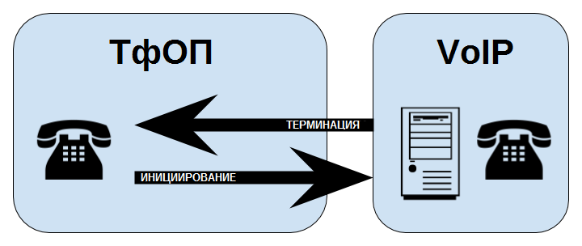

# Глава 7. Внешние подключения

> _Вы не всегда можете контролировать то, что происходит снаружи. Но вы всегда можете контролировать то, что происходит внутри._
>
> -- Уэйн Дайер

В предыдущих главах мы рассмотрели много важной информации, которая необходима для работы системы Asterisk. Однако нам еще предстоит обсудить то, что жизненно важно для любой АТС: а именно, подключение ее к внешнему миру. В этой главе мы обсудим внешние подключения.

Новаторская архитектура Asterisk была знаменательной в значительной степени из-за того, что она рассматривала все типы каналов как равные. Это отличается от традиционной АТС, где транки \(линии соединяющие АТС с внешним миром\) и расширения \(линии соединяющие пользователей и ресурсы\) логически разделены. Тот факт, что диалплан Asterisk обрабатывает все каналы аналогичным образом означает, что в системе Asterisk вы можете очень легко выполнить то, что гораздо сложнее \(или невозможно\) достичь на традиционной АТС.

Однако, эта гибкость имеет цену. Поскольку система по своей сути не знает разницы между внутренним ресурсом \(например, телефонным аппаратом\) и внешним \(например, каналом телефонной связи\), вы должны убедиться, что ваш диалплан обрабатывает каждый тип ресурса соответствующим образом.

## Основы транкинга

Целью _транкинга_ является обеспечение общего соединения между двумя объектами. У деревьев есть стволы \(англ. trunks\), и все, что проходит между корнями и листьями, происходит через ствол. Железные дороги используют термин "магистраль \(trunks\)" для обозначения основной линии, которая соединяет фидерные линии вместе.

В телекоммуникациях транк соединяет две системы вместе. Операторы связи используют транки \(магистрали\) для подключения своих сетей друг к другу. В АТС линии, которые соединяют АТС с внешним миром \(с точки зрения АТС\), обычно называются транками \(хотя сами операторы связи обычно не считают их транками\). С технической точки зрения определение транка не так ясно, как это было раньше \(транки АТС использовали совершенно другую технологию от станционных линий, но теперь обе, как правило, являются SIP\), но как концепция, транки по-прежнему важны. С SIP все технически одноранговое, поэтому с точки зрения технологии больше нет такой вещи, как транк \(или, возможно, точнее сказать, что все является транком\). С функциональной точки зрения все еще полезно иметь возможность различать ресурсы VoIP, которые подключаются к внешнему миру \(транки \(магистрали\), схемы и т.д.\) и средства IP-телефонии подключенных конечных пользователей \(радиостанции, устройства, расширения, телефонные трубки, телефоны и т.д.\).

В УАТС Asterisk у вас могут быть транки, которые идут к вашему VoIP-провайдеру для междугородних звонков внутри страны, транки для звонков за границу и транки, которые соединяют ваши офисы вместе. Эти транки могут фактически работать через одно и то же сетевое соединение, но в диалплане вы можете относиться к ним совершенно по-разному. У вас даже может быть транк в Asterisk, который просто зацикливается на себе \(обычно это какой-то хитрый хак, который решает некоторую проблему с пространством имен или CDR, которую не удалось решить другим способом\).

## Фундаментальный диалплан для исходящих соединений

В традиционной АТС доступ к внешним линиям обычно осуществляется с помощью кода доступа, который необходимо набрать перед номером.\[^1\] Для этой цели обычно используется цифра 9.

В Asterisk аналогично можно назначить 9 для маршрутизации внешних вызовов, но поскольку диалплан Asterisk намного более интеллектуальный, на самом деле нет необходимости заставлять пользователей набирать 9 перед вызовом. Как правило, у вас будет диапазон номеров для вашей системы \(скажем, 100-199\) и диапазон кодов функций \(от \*00 до _\*_99\). Все, что находится за пределами этих диапазонов и соответствует шаблону набора номера для вашей страны или региона и может рассматриваться как внешний вызов.

Если у вас есть один оператор, обеспечивающий всю внешнюю маршрутизацию, то вы можете обрабатывать свой внешний набор через несколько простых совпадений шаблонов. Пример в этом разделе действителен для североамериканского плана нумерации \(NANP\). Если ваша страна не входит в NANP \(который обслуживает Канаду, США и многие страны Карибского бассейна\), вам понадобится другой шаблон соответствия.

Раздел `[globals]` содержит две переменные, названные `LOCAL` и `TOLL`.\[^2\] Целью этих переменных является упрощение управления вашим диалпланом, если вам когда-либо понадобится изменить провайдера. Они позволяют внести одно изменение в диалплан, которое повлияет на все места, где указан данный канал:

```text
[globals]
; Эти каналы одинаковы для asterisk, как и любая конечная точка PJSIP,
; поэтому они будут настроены аналогично телефонным аппаратам.
; Каждый поставщик услуг будет иметь свои собственные требования к конфигурации
; (хотя все они будут похожи)
LOCAL=PJSIP/my-itsp
TOLL=PJSIP/my-other-itsp
```

Раздел `[external]` содержит фактический код диалплана, который распознает набранные номера и передает их в приложение `Dial()`: \[^3\]

```text
[external]
exten => _NXXNXXXXXX,1,Dial(${LOCAL}/${EXTEN}) ; 10-значный шаблон для NANP
exten => _NXXXXXX,1,Dial(${LOCAL}/${EXTEN}) ; 7-значный шаблон NANP
exten => _1NXXNXXXXXX,1,Dial(${TOLL}/${EXTEN}) ; шаблон международного направления
; для NANP
exten => _011.,1,Dial(${TOLL}/${EXTEN}) ; Шаблон международного вызова,
; сделанного из NANP
; Этот раздел функционально совпадает с приведенным выше разделом.
; Это для людей, которым нравится набирать '9' для их звонков.
exten => _9NXXNXXXXXX,1,Dial(${LOCAL}/${EXTEN:1})
exten => _9NXXXXXX,1,Dial(${LOCAL}/${EXTEN:1})
exten => _91NXXNXXXXXX,1,Dial(${TOLL}/${EXTEN:1})
exten => _9011.,1,Dial(${TOLL}/${EXTEN:1})
```

В любом контексте, который будет использоваться комплектами или пользовательскими устройствами, вы будете использовать директиву `include=>`, чтобы разрешить доступ к контексту `external`:

```text
[sets]
include => external
```


**Предупреждение**

Крайне важно, чтобы вы не включали доступ к внешним линиям в любом контексте, который может обрабатывать входящий вызов. Риск здесь заключается в том, что фишинговый бот может в итоге получить доступ к вашим исходящим транкам \(вы будете удивлены тем, насколько эти фишинговые боты распространены\).

_**Мы не можем не подчеркнуть, насколько важно, чтобы вы гарантировали, что никакой внешний ресурс не может получить доступ к вашим платным линиям.**_


## ТфОП

Телефонная сеть общего пользования \(ТфОП, на англ. PSTN\) существует уже более ста лет. Это предшественник многих технологий, которые формируют наш мир сегодня, от интернета до MP3-плееров.

Использование линий ТфОП старой школы в системах Asterisk больше не является распространенным явлением. Технические сложности, затраты и ограничения устаревшей технологии оправданы только в ситуациях, когда надежное подключение к интернету недоступно \(и даже когда традиционные линии являются проблематичным выбором\). Даже сами операторы связи в значительной степени перешли на VoIP для своих внутренних транков.


**ТфОП пора на пенсию**

Больше, чем любой технический фактор, пожалуй, самым значительным гвоздем в гробу ТфОП является тот факт, что большинство технических экспертов в области традиционной телефонии близки или достигли пенсионного возраста, и современные дети не интересуются такими вещами. Суть в том, что вы все чаще обнаружите, что поставщики услуг больше не имеют квалифицированного персонала, необходимого для развертывания традиционных услуг ТфОП. Все крутые ребята изучают VoIP \(который в конечном счете является просто сетевой технологией\), и все операторы связи делают все возможное и самое яркое в сфере бизнеса VoIP/SIP.

Таким образом, если раньше вы не могли не подключиться через PRI, в настоящее время это уже не так. На самом деле многие компании поставляют PRI через SIP соединения, что для Asterisk является избыточным и не нужным.


Там, где ТфОП все еще может оставаться в силе в течение нескольких лет - это телефонные номера. Если бы VoIP был изобретен без предшествующего ему ТфОП маловероятно, что когда-либо было бы изобретено что-то вроде телефонного номера. Тем не менее, они у нас есть, и мы их используем, и причина, по которой мы делаем это, возможно, не столько из-за какой-либо полезности, которую они обеспечивают, а скорее из-за того, что они управляются сложным, многонациональным консорциумом органов по стандартизации и кураторами, которые обеспечивают целостность глобального плана маршрутизации вызовов.

Можно представить, что если бы интернет определял телефонную сеть \(и телефонные звонки были такими же бесплатными, как электронная почта\), все наши SIP-телефоны, вероятно, звонили бы весь день с одним спам-предложением за другим. Это так и происходит, но в значительно меньших масштабах из-за того, что телефонный звонок стоит денег. И даже если он стоит всего лишь копейки, этого достаточно, чтобы делать невыгодным большую часть бессмысленного спама.

Еще одной особенностью ТфОП является соответствие стандартам и совместимость. Если вы посмотрите на любой интернет-голосовой продукт, он либо является проприетарным, огороженным садами, либо управляется сообществом и не сможет получить какую-либо полезную тягу. Мы считаем, что это не изменится до тех пор, пока не будет создан какой-то механизм доверия, который гарантирует проверку личности входящих абонентов каким-то широко признанным органом.

### Традиционные транки ТфОП


**Примечание**

Этот раздел был написан как дань уважения телекоммуникационной отрасли и истории самой Asterisk. Отчасти это связано с тем, что раз Asterisk мог взаимодействовать со столькими различными типами линий старой школы, потому он и добился раннего успеха. В наши дни использование этих старых линий по большей части исчезло в истории.


Существует два типа фундаментальных технологий, которые используются поставщиками услуг ТфОП для предоставления телефонных линий: аналоговые и цифровые.

#### Аналоговая телефония

Первые телефонные сети были полностью аналоговыми. Звуковой сигнал, который вы сгенерировали своим голосом, использовался для генерации электрического сигнала, который передавался на другой конец провода. Электрический сигнал имел те же характеристики, что и производимый звук.

Аналоговые линии имеют несколько характеристик, отличающих их от других линий, которые вы можете подключить к Asterisk:

* Отсутствует сигнальный канал — сигнализация состояния линии является электромеханической, а адресация осуществляется с использованием внутриполосных звуковых сигналов.
* Механизм наблюдения за отключением обычно задерживается на несколько секунд и не является полностью надежным.
* Контроль дальнего конца минимален \(например, контроль ответа отсутствует\).
* Различия в линиях означают, что звуковые характеристики будут варьироваться от линии к линии и потребуют настройки.

Входящие аналоговые линии, которые вы захотите подключить к системе Asterisk, должны быть подключены к порту Foreign eXchange Office \(FXO\). Поскольку в любом стандартном компьютере не существует такого понятия, как порт FXO, то перед подключением традиционных аналоговых линий системе должен быть предоставлен какой-либо порт FXO. Такие компании, как Digium и Sangoma предлагают карты с таким функционалом, но вы также можете приобрести устройство SIP, которое предоставляет эти порты.


**FXO и FXS**

Для любой аналоговой линии есть два конца: офис \(как правило, центральный офис ТфОП\) и станция \(как правило, телефон, но также может быть карта, такая как модем или линейная карта в АТС\).

Центральный офис отвечает за:

* Питание на линии \(номинально 48 Вольт постоянного тока\)
* Напряжение звонка \(номинально 90 Вольт переменного тока\)
* Предоставление гудка \(сигнала ответа станции\)
* Обнаружение состояния трубки \(положена или поднята\)
* Отправка дополнительной сигнализации, такой как идентификатор вызывающего абонента \(Caller ID\)

Станция отвечает за:

* Обеспечение звонка \(или, по крайней мере, возможности каким-то образом обрабатывать напряжение звонка\)
* Предоставление номеронабирателя \(или какой-либо способ отправки DTMF\)
* Предоставление рычажного переключателя для указания состояния линии

Порт Foreign eXchange \(FX\) _называется тем, к чему он подключается_, а не тем, что он делает. Так, например, порт Foreign Exchange Office \(FXO\) на самом деле является станцией: он соединяется с центральным офисом. Порт Foreign eXchange Station \(FXS\) - это фактически порт, который предоставляет услуги центрального офиса \(другими словами, вы бы подключили аналоговый аппарат к порту FXS\).

Обратите внимание, что мы не можем перейти с FXO на FXS просто изменив настройки. Порты FXO и FXS требуют совершенно разную электронику.

Это старая школа, ребята. Вы можете запускать старые телефоны возрастом более 100 лет с порта FXS!


Мы не рекомендуем использовать аналоговые транки в системе Asterisk. Их конфигурация и использование выходят за рамки данной книги.\[^4\]

#### Цифровая телефония

Цифровая телефония была разработана для преодоления многих ограничений аналоговой. Некоторые из преимуществ цифровых линий включают:

* Отсутствие потери амплитуды на больших расстояниях
* Снижение уровня шума на линиях \(особенно на междугородних дистанциях\)
* Возможность выполнять более одного вызова через физический канал
* Более быстрая установка соединения и разъединение
* Более богатая сигнальная информация \(особенно при использовании ISDN\)
* Более низкая стоимость для поставщиков услуг
* Более низкая цена для клиентов \(на более высоких плотностях\)

Существует несколько  типов цифровых линий, которые получили широкое применение в телекоммуникационной отрасли:

T1 \(24 канала\)

Используется в Канаде и США \(в основном для ISDN-PRI\)\[^5\]

E1 \(32 канала\)

Используется в остальном мире \(ISDN-PRI или MFC/R2\)

BRI \(2 канала\)

Используется для линий ISDN-BRI \(Евро-ISDN\)

Обратите внимание, что физическая линия может быть дополнительно определена протоколом, работающим по схеме. Например, T1 может использоваться для ISDN-PRI или CAS, а E1 может использоваться для ISDN-PRI, CAS или MFC/R2.

Трудно обосновать использование этих типов линий. По сравнению с протоколами VoIP, они стали дорогими, сложными и несколько негибкими. Если вам нужно подключить такие линии к системе Asterisk, мы рекомендуем какое-то шлюзовое устройство для преобразования линии в SIP, а затем подключиться через SIP к вашей системе Asterisk. Если вам нужна система с одним шасси, такие компании как Digium и Sangoma предлагают цифровые карты ТфОП, которые могут быть установлены непосредственно на ваш сервер Asterisk; они подключаются к Asterisk через драйвер канала DAHDI. Использование этой технологии выходит за рамки данной книги.\[^6\]

## VoIP

По сравнению с длительной историей телекоммуникационной отрасли, \[^7\] VoIP по-прежнему является относительно новой концепцией. За столетие, или около того, до появления VoIP единственным способом подключить вас к ТфОП было использование каналов, предоставленных для этой цели вашей местной телефонной компанией. Теперь же VoIP позволяет устанавливать соединения между конечными точками без участия ТфОП \(хотя в большинстве сценариев VoIP в какой-то момент все равно будет присутствовать компонент ТфОП, особенно если используется традиционный телефонный номер E.164\). ТфОП по-прежнему контролирует телефонные номера и мы будем использовать их до тех пор, пока кто-нибудь не придумает механизм адресации на основе интернета, который не будет подвергаться злоупотреблениям, как электронная почта\[^8\].

### Преобразование сетевых адресов \(NAT\)

Если вы собираетесь использовать VoIP через любой вид глобальной сети \(например, интернет\), вы будете иметь дело с брандмауэрами и довольно часто с преобразованием сетевых адресов \(NAT\).\[^9\] Базовое понимание того, как протоколы SIP и RTP работают вместе для создания VoIP-вызова может быть полезно в понимании и в отладке функциональных проблем \(таких как проблема “односторонней слышимости” часто возникающая при ошибках конфигурации NAT\). NAT позволяет использовать один внешний IP-адрес совместно несколькими устройствами за маршрутизатором. Поскольку NAT обычно обрабатывается в брандмауэре, он также является частью уровня безопасности между частной сетью и интернетом.

VoIP-вызов с использованием SIP не состоит только из сигнальных сообщений для настройки вызова \(часть SIP-соединения\). Он также требует потоков RTP \(медиапотоки\), которые несут фактическое аудио соединение\[^10\], как показано на Рисунке 7-1.


Использование отдельного протокола для передачи звука - это то, что может сделать обход NAT трудным для VoIP-соединений, особенно если удаленные телефоны находятся за одним NAT, а УАТС - за другим. Проблема вызвана тем фактом, что в то время как SIP-сигнализация обычно разрешена в брандмауэрах на обоих концах, потоки RTP не могут быть распознаны как часть сеанса SIP, и, таким образом, будут проигнорированы или заблокированы, как показано на Рисунке 7-2. Эффект блокировки одного или обоих потоков RTP заключается в том, что пользователи будут видеть что их вызовы проходят, и смогут отвечать на них, но не смогут слышать другого абонента \(или не смогут быть услышаны\).


В этом разделе мы обсудим некоторые методы, которые вы можете использовать для устранения проблем, вызванных NAT. Существует два различных сценария, которые необходимо рассмотреть, каждый из которых требует определения параметров в файле _pjsip.conf_. Проблемы NAT могут быть раздражающими при устранении неполадок, поскольку в продакшене существует множество различных типов брандмауэров и множество различных способов их настройки.

В общем, вам нужно добавить следующие параметры в секцию транспорта вашего файла _/etc/asterisk/pjsip.conf_:

```text
[transport-udp]
type=transport
protocol=udp
bind=0.0.0.0
local_net=x.x.x.x/xx ; IP/CIDR вашей внутренней сети
external_media_address=x.x.x.x ; Внешний IP-адрес для использования в обработке RTP
external_signaling_address=x.x.x.x ; Внешний адрес для SIP-сигнализации
```


**Примечание**

Если вы хотите узнать внешний адрес вашей УАТС, выполните следующие действия из командной строки:

`$ dig +short myip.opendns.com @resolver1.opendns.com`


Вероятно, установка этих параметров безопасна для всех случаев, но будьте готовы экспериментировать, комментируя настройки и перезагружая PJSIP для тестирования различных сценариев.

#### Устройства за NAT

Если ваши телефонные аппараты находятся за удаленным NAT, в таблице `ps_endpoints` вашей базы данных могут быть параметры, которые следует настроить из настроек по умолчанию. Вам нужно будет поэкспериментировать с изменением следующих значений выбрав между `yes` и `no`.

```text
MySQL> update ps_endpoints set rtp_symmetric='yes',force_rport='yes',rewrite_contact='yes'
```

Другие параметры, которые вы можете посмотреть, включают `media_address` и `direct_media`.

При внесении изменений учитывайте значения по умолчанию. Если вы сомневаетесь - установите значение поля, которое вы изменили на `NULL`, это фактически вернет его к значению по умолчанию.


**Сохранение удаленного брандмауэра открытым**

Иногда возникает проблема с SIP-телефоном, когда телефон регистрируется и функционирует при первой загрузке, но затем внезапно становится недоступным. Это часто происходит если удаленный брандмауэр не видя никакой активности поступающей от устройства закрывает внешнее соединение с телефоном, и таким образом, АТС теряет возможность подавать сигнал на его вызов. Эффект заключается в том, что если АТС попытается отправить вызов на телефон, он не сможет подключиться \(удаленный брандмауэр отклонит соединение\). Если, с другой стороны, пользователь делает вызов, то в течение нескольких минут устройство снова сможет принимать входящие вызовы. Естественно это может путать пользователей.

Относительно простое решение этой проблемы\[^11\] включает в себя установку таймера регистрации на удаленном телефоне на достаточно низкое значение, которое будет стимулировать соединение каждую минуту или около того, и, таким образом, убедить брандмауэр, что этому соединению может быть позволено существовать на некоторое время дольше. Это небольшой хак, но он оказался успешным. Проблема с предложением универсального решения заключается в том, что существует множество различных моделей брандмауэров, от недорогих устройств потребительского класса до сложных контроллеров границ сеанса, и это одно из немногих решений, которое, по-видимому, надежно решает проблему почти во всех случаях.

Этот подход лучше всего подходит для небольших систем \(менее 100 телефонов\). Большая система с сотнями или тысячами телефонов не будет хорошо обслуживаться этим решением, так как будет увеличена нагрузка на систему из-за почти постоянного потока регистраций с удаленных телефонов. В таком случае необходимо будет более тщательно продумать общую конструкцию \(например, вместо Asterisk можно было бы использовать выделенный сервер регистратора для обработки регистрационного трафика\).

В идеальном мире вы могли бы указать конкретную модель брандмауэра и разработать конфигурацию для этих брандмауэров, которая бы обеспечивала правильную обработку вашего SIP-трафика. На самом деле, вы столкнетесь не только с разными моделями брандмауэров, но даже с разными версиями прошивки для одной и той же модели брандмауэра.


#### Asterisk за NAT

Во-первых, мы должны сказать вам, что размещение вашей АТС за NAT не рекомендуется. Гораздо лучше обеспечить брандмауэр без уровня NAT \(особенно если у вас есть конечные точки, которые не находятся в той же сети, что и УАТС\).

Если у вас возникли сложности с работой АТС за NAT, вам нужно будет плотно взаимодействовать с вашей командой сетевых инженеров, чтобы убедиться в корректной работе  вашего устройства NAT \(как правило брандмауэром\). Если же их навыки окажутся недостаточными для решения этой задачи, Вам могут потребоваться услуги внешнего консультанта, который  обладает достаточной квалификацией для настройки прохождения  трафика SIP/RTP через NAT. Как мы уже говорили, нахождение вашей АТС за NAT не рекомендуется.

Как правило, конечные точки также будут находиться за NAT, и, таким образом, у вас будет сценарий с двойным NAT, который, вероятно, потребует нескольких часов экспериментов с различными настройками не только в Asterisk, но и в брандмауэре чтобы добиться успеха. Помните - очень важно чтобы вы проверяли звук в обоих направлениях; недостаточно просто проверить, что звонки можно набирать и отвечать.

В сценарии, где нет выбора, кроме как использовать двойной NAT, мы рекомендуем выяснить, можно ли использовать VPN между УАТС и удаленными конечными точками. Во многих случаях его будет легче настроить. Мы хотели бы сказать, что есть простой и надежный способ, который будет работать во всех случаях, но, к сожалению, такого метода нет.

Для работы с NAT Вы также можете изучить такие технологии как STUN, TURN и ICE. Подробности использования этих технологий выходят за рамки данной книги, так как они требуют внешних серверов, но многие люди успешно применили эти протоколы там, где другие методы потерпели неудачу.

### Терминация и инициирование ТфОП

Передача вызовов между средой VoIP и ТфОП требует некоего шлюза для преобразования сигнализации VoIP \(обычно SIP\) в нечто совместимое с протоколами ТфОП. Эти процессы называются _инициированием_ и _терминацией_ \(Рисунок 7-3\).



Люди часто путают термины _инициирование_ и _терминация_. Для нас полезно помнить, что, поскольку ТфОП уже существовал когда появился VoIP, термины развивались по отношению к нему. В идеале процессы, вероятно, должны называться _инициирование_ ТфОП и _терминация_ ТфОП, и мы рекомендуем вам запомнить их таким образом.\[^12\]

#### Терминация ТфОП

До тех пор, пока VoIP полностью не заменит ТфОП будет необходимость подключения вызовов из VoIP-сетей к телефонной сети общего пользования. Этот процесс называется _терминацией_ \(Рисунок 7-4\).


Хотя вы можете сконструировать систему Asterisk для работы в качестве шлюза терминации \(используя некоторые интерфейсы ТфОП\), на практике вы с большей вероятностью будете использовать _поставщика услуг интернет-телефонии_ \(ITSP, также иногда называемый _оператором VoIP_\) для терминации ваших телефонных звонков. Интернет-провайдеры обычно вкладывают огромные инвестиции в инфраструктуру и вам будет трудно сделать что-то лучше не тратя кучу денег.


Если вам действительно нужно подключить систему Asterisk непосредственно к ТфОП, вам потребуется следующее:

* Соответствующая линия\(и\) от тел.комп. ТфОП \(аналоговая, BRI, PRI, SS7, MFC/R2 и т.д.\)
* Подходящее оборудование для подключения к этой линии \(FXO, BRI, T1, E1 и т.д.\)
* Эхоподавление \(аппаратное или программное\)
* Навыки, необходимые для правильной настройки вашего оборудования для оператора, с которым вы имеете дело \(есть множество вариантов каждой из этих типов линий, и это может быть трудно даже для тех, кто хорошо знает технологию\)\[^13\]

Кроме того, вам часто придется обрабатывать гораздо более сложную логику маршрутизации, которая учитывает такие вещи, как география, корпоративная политика, стоимость, доступные ресурсы и т.д.


Для того, чтобы отправить ваши вызовы на ITSP, ваш диалплан должен выглядеть примерно так:

```text
; Для систем NANP
[to-pstn] ; Да, мы проходим через ITSP, но ТфОП - это наш пункт назначения
exten => _1NXXNXXXXXX.,1,Dial(${TOLL}/${EXTEN}) ;  код страны плюс номер телефона
; Добавляем '1' и отправляем
exten => _NXXNXXXXXX.,1,Dial(${LOCAL}/1${EXTEN}) ; код страны плюс номер телефона
; Отбрасываем '011' и отправляем
exten => _011X.,1,Dial(${TOLL}/${EXTEN:3}) ; код страны плюс номер телефона
; Вызов экстренных служб
exten => 911,1,Dial(${LOCAL}/911) ; определение этого потребует информации от вашего оператора

; Большая часть остального мира
[to-pstn]
; Убрать префикс NDD, добавить код страны и отправить
exten => _0X.,1,Dial(${TOLL}/<добавить сюда код страны>${EXTEN:1})
; Убрать префикс IDD и отправить
exten => _00X,1,Dial(${LOCAL}/${EXTEN:2}) ; код страны плюс номер телефона
; Вызов экстренных служб (и других служб)
exten => 11X,1,Dial(${LOCAL}/${EXTEN}) ; для определения этого потребуется информация от вашего оператора
```


**Предупреждение**

Учитывая, что большинство каналов ТфОП позволит вам набрать любой номер в любой точке мира, и учитывая, что вы будете платить за все понесенные расходы, мы ЕЩЕ РАЗ ПОДЧЕРКИВАЕМ важность обеспечения безопасности на машине шлюза, которая обеспечивает терминацию ТфОП. Преступники прикладывают много усилий для взлома телефонных систем \(особенно плохо защищенных систем Asterisk\), и если вы не уделите пристального внимания всем аспектам безопасности, то станете жертвой мошенничества. Это лишь вопрос времени.

_Не допускайте никаких незащищенных VoIP-соединений в любой контекст, содержащий терминацию ТфОП._


Терминация как правило будет более сложной, чем мы описали здесь — даже если вы используете ITSP в качестве своего оператора, но основная концепция довольно проста: сопоставьте шаблон номера, который ваши пользователи могут набрать, подготовьте его для оператора, удалив или добавив необходимые цифры, и отправьте вызов соответствующей конечной точке PJSIP \(транку\). Мы здесь только обсудили диалплан; в более позднем разделе мы обсудим, как настроить SIP-транки для передачи этого трафика.

#### Инициирование ТфОП

Вы также можете принимать звонки от ТфОП в свою сеть VoIP. Процесс выполнения этого обычно называют _инициированием_. Это просто означает что вызов инициирован в ТфОП \(Рисунок7-5\).


Для того, чтобы обеспечить инициирование, требуется номер телефона.

В старые добрые времена, когда VoIP и Asterisk были молоды, для людей было довольно распространено обрабатывать подключение линии к ТфОП самостоятельно, используя аналоговые или цифровые транки, предоставляемые местной телефонной компанией. По большей части этот тип соединения теперь обрабатывается ITSP, и вам просто нужно подключить вашу систему к VoIP-оператору через SIP-транк.

Телефонные номера — при использовании в целях инициирования обычно называются DID'ами \(номера Direct Inward Dialing\). Ваш оператор связи отправит вызов вниз по каналу в вашу систему и передаст DID \(или специальные полученные цифры в некоторых случаях\[^14\]\), которые будет интерпретировать диалплан Asterisk. Другими словами, вам понадобится контекст диалплана, который принимает входящие вызовы от вашего оператора, с расширениями или шаблонами, которые будут коррелировать с вашими DID.

Чтобы принять вызов по линии VoIP, вам нужно будет обработать цифры, которые поставщик услуг будет посылать вам \(DID или номер телефона\). Номера DNIS и DID не должны совпадать, но, как правило, будут. Ранее провайдер обычно спрашивал, в каком формате вы хотите получать цифры. В настоящее время оператор VoIP, как правило, говорит вам в каком формате будет отправлять, и вы должны принять его. Два распространенных формата: DNIS \(который по сути является цифрами вызываемого DID\) или E.164, что означает, что они будут включать код страны с номером.

В диалплане входящий канал связывается с контекстом, который будет знать, как обрабатывать входящие номера. Он может выглядеть примерно так:

```text
[from-pstn]
exten => _X.,1,Verbose(2,Incoming call to ${EXTEN})
same => n,Goto(number-mapping,${EXTEN},1)

[number-mapping]
exten => 4165550100,1,Goto(sets,100,1)
exten => 4165550101,1,Goto(sets,101,1)
exten => 4165550102,1,Goto(sets,102,1)
exten => 4165550103,1,Goto(sets,103,1)
exten => 4165554321,1,Goto(main-menu,${EXTEN},1)
exten => 4165559876,1,VoiceMailMain() ; удобный ход для прослушивания голосовых сообщений
exten => i,1,Verbose(2,Incoming call to invalid number)
```

В контексте `number-mapping` вы явно перечисляете все идентификаторы DID, которые ожидаете принимать, а также обработчик ошибок для всех неперечисленных DID \(вы можете отправлять недопустимые номера в приёмную или в автосекретарь или даже в некоторый контекст, который воспроизводит оповещение об ошибке\).

Теперь мы готовы обсудить, как настроить транки для передачи вашего внешнего трафика.

### Настройка SIP-транков

SIP является самым популярным из VoIP-протоколов. Настолько, что термины _VoIP_ и _SIP_ стали означать почти одно и то же. В предыдущих изданиях этой книги мы рассмотрели некоторые из других протоколов, которые были популярны в то время \(в первую очередь IAX2 и H.323\), но для этого издания больше нет реальной причины обсуждать что-либо, кроме SIP. Драйверы каналов для этих старых протоколов по-прежнему доступны в Asterisk, но они больше не поддерживаются.

Протокол SIP является одноранговым и на самом деле не имеет формальной спецификации транка. Это означает, что независимо от того, подключаете ли вы один телефон к серверу или соединяете два сервера вместе, SIP-соединения будут одинаковыми. По правде говоря, есть некоторые различия в том, как эти ресурсы могут быть настроены, и определенно будет разница в том, как ваш диалплан будет обрабатывать маршрутизацию по транкам.

#### Подключение системы Asterisk к SIP-провайдеру

Довольно часто используется один и тот же поставщик услуг ITSP для терминации и инициирования, но имейте в виду, что эти два процесса не связаны друг с другом. Если звонки, идущие в одном направлении, проходят ваше тестирование, это не означает, что звонки в другом направлении в порядке. При изменении конфигурации каждый раз проверяйте маршрутизацию как внутри, так и снаружи.

Многие компании предоставляют примеры конфигураций для Asterisk. К сожалению, эти документы обычно относятся к устаревшему драйверу `chan_sip`. Digium разработал мастер настройки PJSIP, который призван значительно упростить конфигурацию провайдера. Вы все еще можете настроить транки ITSP, используя те же методы, которые мы показывали ранее для настройки других конечных точек \(создание записей в `ps_endpoint`, `ps_aors`, `ps_auths` и т.д.\), но вместо того, чтобы снова повторять все это, мы рассмотрим мастер настройки, поскольку он объединяет несколько компонентов в один файл конфигурации. Мы обнаружили, что в отличии от часто меняющихся конечных точек пользователей, конечные точки провайдеров меняются редко, поэтому бывает полезно настроить провайдеров в файле конфигурации, а не в базе данных.

Перед созданием любой конфигурации важно определить, как оператор будет взаимодействовать с вашей системой. Есть две фундаментальные модели, которые мы видели:

_Аутентификация на основе пароля, включая регистрацию_\[^15\]

Это характерно для небольших провайдеров, ориентированных на рынок малого бизнеса. Представляет такой же тип услуги, которую вы получите, если просто регистрируете SIP-телефон непосредственно в службе.

_IP-аутентификация_

Без пароля и без регистрации. Это чаще встречается у провайдеров, которые предоставляют услуги оптового транкинга более крупным предприятиям и реселлерам. \(Как правило, они также сопровождаются каким-то минимальным обязательством с точки зрения объема.\) От вас ожидают, что у вас будут хорошие навыки работы с SIP и сетью.

Это не строгие ограничения, но они наиболее часто встречаются на практике.

Таким образом, существует два способа настройки ITSP в файле _/etc/asterisk/pjsip\_wizard.conf_.

Во–первых, если провайдер использует IP-аутентификацию - он будет ожидать, что вы будете отправлять трафик со статического IP-адреса \(и если ваш адрес изменится, то нужно будет сообщить его, чтобы он мог перенастроить свое оборудование\). Ваш файл _pjsip\_wizard.conf_ может выглядеть примерно так:

```text
; ITSP используя IP-аутентификацию
[itsp-no-auth]
type=wizard
remote_hosts=itsp.example.com
endpoint/context=pstn-in
endpoint/allow = !all,ulaw,g722
sends_registrations=no
accepts_registrations=no
sends_auth=no
accepts_auth=no
```

Кроме того, если ваш IP-адрес часто меняется \(или ваш оператор требует этот метод\), вы можете зарегистрировать свою систему у провайдера \(что потребует от вас отправки учетных данных для проверки подлинности, чтобы доказать, что это действительно Вы\). Ваши звонки, как правило, также потребуется аутентифицировать:

```text
[itsp-with-auth]
type=wizard
remote_hosts=itsp.example.com
endpoint/context=pstn-in
endpoint/allow = !all,ulaw,g722
sends_registration=yes
accepts_registrations=no
sends_auth=yes
accepts_auth=no
outbound_auth/username=itsp_provided_username
outbound_auth/password= itsp_provided_password
```

Обратите внимание, что имена `[itsp-no-auth]` и `[itsp-with-auth]` не имеют смысла для Asterisk. Они становятся именами каналов PJSIP, на которые вы отправляете свои звонки.

_**Настройка транков для терминирования**_

Мастер PJSIP создал определения каналов, необходимые для нашего оператора связи. Чтобы отправить вызов, нам нужно только внести незначительные изменения в раздел `[globals]` нашего файла _extensions.conf_, как показано ниже:

```text
[globals]
UserA_DeskPhone=PJSIP/0000f30A0A01
UserA_SoftPhone=PJSIP/SOFTPHONE_A
UserB_DeskPhone=PJSIP/0000f30B0B02
UserB_SoftPhone=PJSIP/SOFTPHONE_B
TOLL=PJSIP/itsp-no-auth
LOCAL=${TOLL}
;OR
;TOLL=PJSIP/itsp-with-auth
;LOCAL=${TOLL}
```

_**Настройка транков для инициирования**_

Для входящих звонков в файле _/etc/asterisk/extensions.conf,_  вам понадобится контекст соответствующий контексту, указанному для канала ITSP. Предположим, что у нас есть два DID'а NANP: 4169671111 и 4167363636. Данный код необходимо поместить над контекстом `[sets]`:

```text
TOLL=PJSIP/itsp-no-auth
LOCAL=${TOLL}
;OR
;TOLL=PJSIP/itsp-with-auth
;LOCAL=${TOLL}
[pstn-in]
exten => 4169671111,1,Dial(sets,100,1)
exten => 4167363636,1,Dial(sets,101,1)
[sets]
exten => 100,1,Dial(${UserA_DeskPhone})
```

В небольшой системе это довольно легко администрировать. В более крупной системе целесообразно поместить DID'ы в таблицу своей базы данных и заставить диалплан искать нужную цель. Мы будем работать с базами данных далее в этой книге.\[^16\]

В этом и заключается суть настройки связи с оператором. Она может показаться достаточно сложной, потому что есть много вариантов, но на самом деле всё довольно просто. Обычно обнаруживаются проблемы с незначительными несоответствиями конфигурации. Будьте методичны, и, пожалуйста, пожалуйста, пожалуйста, будьте параноиком по поводу безопасности!

## Набор экстренных служб

В Северной Америке люди привыкли иметь возможность набрать 911, чтобы позвонить в экстренные службы. За пределами Северной Америки хорошо известны номера экстренных служб 112 и 999. Если вы сделаете свою систему Asterisk доступной для людей, то обязаны \(во многих случаях регулируется\) гарантировать совершение звонков в экстренные службы с любого телефона, подключенного к системе \(даже с телефонов, которые ограничены от совершения звонков\).

Одна из важных частей информации, которую экстренная организация должна знать - это то, где произошла чрезвычайная ситуация \(например, куда направить пожарные машины\). В традиционном транке ТфОП эта информация уже известна оператору и впоследствии передается любому местному органу, который выполняет эти задачи \(в Канаде и США они называются пунктами ответов на вопросы общественной безопасности или PSAP\). С VoIP-линиями все может стать немного сложнее, в силу того, что они физически не привязаны к какому-либо географическому местоположению.

Вы должны убедиться, что ваша система будет правильно обрабатывать экстренные вызовы с любого телефона, подключенного к нему, и вам необходимо сообщить, что доступно вашим пользователям. Например, если вы разрешаете пользователям регистрироваться в системе с софтфонов на своих ноутбуках, что произойдет, если они находятся в гостиничном номере в другой стране, и кто-то набирает 911?\[^17\]

Диалплан для обработки экстренных вызовов не должен быть сложным. На самом деле гораздо лучше держать его простым. Администраторы часто испытывают соблазн реализовать все виды причудливых функций в контекстах вызова аварийных служб своих диалпланов, но ошибка в одной из этих функций может вызвать сбой экстренного вызова и стоить кому-то жизни. _Здесь не место для игр_. Раздел `[emergency-services]` вашего диалплана может выглядеть примерно так:

```text
[emergency-services]
exten => 911,1,Goto(dialpsap,1)
exten => 9911,1,Goto(dialpsap,1) ; некоторые люди будут набирать '9'
; потому что они привыкли делать это с АТС
exten => 999,1,Goto(dialpsap,1)
exten => 112,1,Goto(dialpsap,1)
exten => dialpsap,1,Verbose(1,Call initiated to PSAP!)
 same => n,Dial(${LOCAL}/911) ; ЗАМЕНИТЕ 911 ЗДЕСЬ НА ЧТО УГОДНО
 ; ПОДХОДЯЩЕЕ ДЛЯ ВАШЕГО РАЙОНА
[internal]
include => emergency-services ; эта запись должна быть в любом контексте,
                              ; который используется людьми
```

В контекстах с пользователями работающими удаленно, лучше использовать  следующий код:

```text
[no-emergency-services]
exten => 911,1,Goto(nopsap,1)
exten => 9911,1,Goto(nopsap,1) ; для людей, которые набирают '9' перед внешними вызовами
exten => 999,1,Goto(nopsap,1)
exten => 112,1,Goto(nopsap,1)
exten => nopsap,1,Verbose(1,Call initiated to PSAP!)
 same => n,Playback(no-emerg-service) ; вам нужно будет записать эту подсказку
[remote-users]
include => no-emergency-services
```

В Северной Америке правила обязали многих VoIP-операторов предлагать то, что в народе известно как _E911_\[^18\]. Когда вы регистрируетесь в их сервисах, им потребуется адресная информация для каждого из DID, которые вы хотите связать с исходящими вызовами. Эта адресная информация будет затем отправлена в PSAP, соответствующий этому адресу, и ваши экстренные вызовы должны обрабатываться так же, как если бы они были набраны по традиционной схеме ТфОП.

Суть в том, что вы должны убедиться, что телефонная система, которую вы создаете, обрабатывает экстренные вызовы в соответствии с местными правилами и ожиданиями пользователей.

## Вывод

Обычно прогнозируется, что ТфОП в конечном итоге полностью исчезнет. Однако, прежде чем это произойдет, потребуется широко используемый и надежный распределенный механизм, который позволит организациям и отдельным лицам публиковать адресную информацию, чтобы их можно было найти. Любая голосовая технология, которая не использует PSTN, в настоящее время является либо запатентованным продуктом, закрытой экосистемой, либо игровой площадкой спамеров и преступников. Мы подозреваем, что ТфОП будет существовать еще некоторое время, и поэтому инициирование и терминация должны быть частью вашей системы Asterisk.

\[^1\] В системе клавиш каждая линия имеет соответствующую кнопку на каждом телефоне, и доступ к линиям осуществляется нажатием нужной клавиши линии.

\[^2\] Вы можете назвать их как угодно.

\[^3\] Дополнительную информацию о совпадениях шаблонов см. в [Главе 6](glava-06.md).

\[^4\] Мы должны отметить, что в прошлом мы много писали на эту тему, и эта работа была выпущена под лицензией Creative Commons и находится в свободном доступе.

\[^5\] В Японии также используется линия, называемая J-1, которую проще всего назвать 24-канальной E1.

\[^6\] Мы хотели бы еще раз отметить, что мы много писали о цифровых микросхемах и DAHDI в предыдущих выпусках, и этот объем работ был выпущен по лицензии Creative Commons и находится в свободном доступе. Также Sangoma/Digium предоставляют подробные инструкции по установке и настройке своих карт PSTN. Если вы хотите использовать эту технологию, воспользуйтесь услугами профессионального технического ресурса. Это сложный материал полный нюансов, с которым вам не понравится играть, если у вас не было какого-то предыдущего опыта. Данный материал также не обязателен для изучения или понимания Asterisk.

\[^7\] «длительный» по отношению к другим электронным технологиям.

\[^8\] На мгновение просто представьте, что на ваш телефон приходит такое же количество спам звонков, как спам писем на ваш адрес электронной почты. Фактически, то что ТфОП регулируется, стоит денег и использует телефонные номера служит для ограничения чумы спама, от которого пострадала электронная почта.

\[^9\] [Страница Wikipedia по трансляции сетевых адресов](https://ru.wikipedia.org/wiki/NAT) является всеобъемлющей и полезной. Эта страница является неплохим началом для получения дополнительной информации о различных типах NAT и о том, как он работает в целом.

\[^10\] SIP-это не единственный протокол, использующий RTP для передачи медиапотоков.

\[^11\] Вопрос о том, является ли это наилучшим решением, все еще обсуждается.

\[^12\] И, возможно, даже использовать их таким образом в разговоре, так как многие люди смущены этими терминами, и мало кто признает это, когда вы говорите с ними.

\[^13\] Поверьте нам, Джим Ван Меггелен работал с этим материалом в течение многих лет, прежде чем попасть в VoIP.

\[^14\] В традиционных УАТС назначение DID состояло в том, чтобы разрешить подключение непосредственно к дополнительному номеру в офисе. Многие УАТС не могут поддерживать такие понятия, как перевод номера или гибкие длины цифр, и поэтому оператор должен передавать добавочный номер, а не номер, который был набран \(который также назывался номером DNIS, от Directory Number Information Service\). Например, телефонный номер 416-555-1234 мог бы быть сопоставлен с добавочным номером 100, и таким образом оператор отправил бы цифры 100 в УАТС вместо DNIS 4165551234. Если вы когда-нибудь замените старую АТС системой Asterisk, вы можете обнаружить данные переводы при миграции диалпланов, и вам нужно будет получить список сопоставлений между номерами, которые набирает абонент, и номерами, которые отправляются на УАТС. Было также распространено видеть, что оператор передает только последние четыре цифры номера DNIS, который УАТС затем переводит во внутренний номер. С VoIP-транками это будет редко иметь место, но имейте в виду, что это возможно.

\[^15\] Помните, что регистрация - это просто механизм, посредством которого конечная точка SIP сообщает серверу регистратора где она расположена. Это полезно, если ваш IP-адрес изменяется, как это может быть в случае потребителей или малого бизнеса где часто используются динамические адреса.

\[^16\] Для этой обработки в таблица просто потребуется поле для DID и еще три для целевого контекста, расширения и приоритета.

\[^17\] Не думайте, что это не сможет произойти. Звонки в службу спасения происходят в чрезвычайной ситуации, и небезопасно предполагать, что человек будет в рациональном, адекватном состоянии. Запись, которая сообщает пользователям программного телефона, какой адрес система будет отправлять в PSAP, может указывать на то, что пожарные машины будут отправляться не туда, где они нужны. \(«Этот телефон зарегистрирован в нашей системе Торонто. Экстренные службы будут отправлены в наш офис по адресу 301 Front St W. Нажмите 1, чтобы продолжить этот вызов».\).

\[^18\] На самом деле это не оператор предлагает эту услугу; скорее это возможность PSAP. E911 также используется и на транках ТфОП, но поскольку это происходит без какого-либо участия с вашей стороны \(операторы ТфОП предоставляют эту информацию за вас\), вы как правило даже не знаете, что на ваших местных линиях есть E911.
