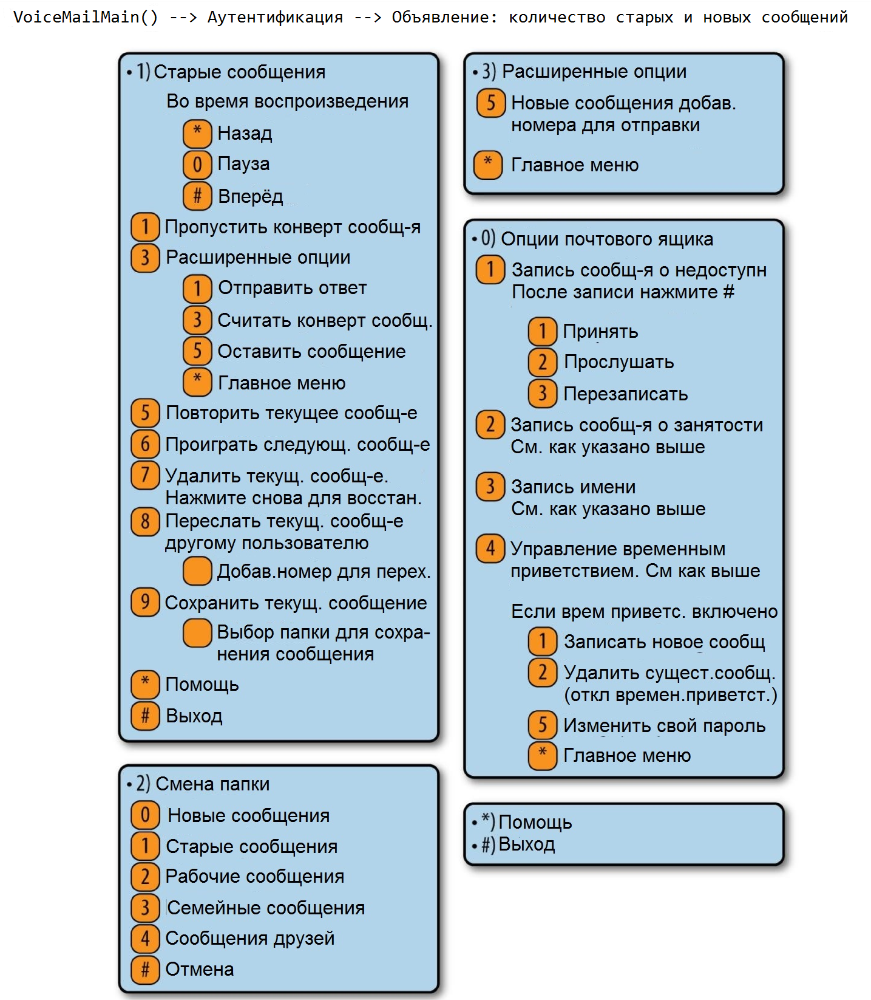
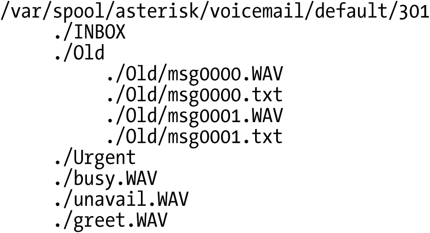

# Глава 8. Голосовая почта

> _Просто оставьте сообщение, может быть, я перезвоню._
>
> -- Джо Уолш

До того как почта и мгновенные сообщения стали широко распространены, голосовая почта была очень популярна. Даже теперь, когда большинство людей предпочитает обмениваться текстовыми сообщениями, голосовая почта является важным компонентом любой телефонной станции.

В Asterisk есть достаточно гибкая система голосовой почты называемая Comedian Mail<sup><a href="#sn1">1</a></sup>. В диалплане она реализуется посредством модуля `app_voicemail.so`.

#### Предупреждение о модуле голосовой почты в Asterisk

Модуль `app_voicemail` один из старейших в Asterisk, как следствие он имеет много ограничений, особенно если сравнивать его с другими, постоянно совершенствуемыми модулями. Код модуля настолько устарел, что ни у кого не возникает желания с ним разбираться, и поэтому очень маловероятно появление в нем новых функций. Вы должны понимать что `app_voicemail` не просто предоставляет элемент диалплана; для работы голосовой почты должно произойти много событий, например хранение и управление файлами, взаимодействие с почтовой системой операционной системы, распознавание часовых поясов, работы с форматами файлов, вопросы безопасности и еще куча вещей. И хотя `app_voicemail` все это делает, в итоге получается довольно неуклюжая подсистема (стоит заметить, что в традиционных АТС  для голосовой почты выделяется отдельная машина).

 Было предпринято множество попыток реинжинировать голосовую почту, но все они оказались неудачными. Причина проста: объем работ (а следовательно и стоимость), необходимых для перепроектирования модуля (таким образом, чтобы удовлетворить потребности сообщества), в сочетании с отсутствием интереса к технологии голосовой почты в целом, быстро убивали любую инициативу.

Тем не менее важно отметить, что голосовая почта в Asterisk работает, и работает хорошо. Возможно, она даже удовлетворит ваши потребности. В ином случае сообщество будет более чем благодарно, если вы попытаетесь перепроектировать её.

Вот некоторые функции, которые включает в себя модуль голосовой почты:

* Неограниченное количество защищенных паролем ящиков голосовой почты, каждый из которых содержит подкаталоги для сортировки голосовой почты
* Различные  приветствия для различных статусов, таких как "недоступен" или "занят"
* Наличие  предустановленных приветствий и возможность создания собственных
* Возможность ассоциирования телефонов с несколькими  почтовыми ящиками и почтового ящика с несколькими телефонами
* Уведомление о голосовом сообщении на электронную почту,  опционально с прикрепленным  аудио файлом
* Широковещательная голосовая почта и перенаправление голосовой почты
* Индикатор ожидания сообщения  (мигающий светодиод или специальный сигнал) поддерживаемый на многих типах телефонов
* Справочник сотрудников на основе голосовой почты

Теперь давайте познакомимся с основными частями конфигурационного файла голосовой почты, включая настройки в общем разделе, различными возможными региональными настройками, интеграцией голосовой почты в ваш диалплан и проведем краткий обзор того, как Asterisk хранит голосовую почту в файловой системе Linux.

## Файл конфигурации voicemail.conf

Ранее в базе данных MySQL мы установили таблицу, необходимую для голосовой почты, и поэтому сейчас мы  можем создавать в ней почтовые ящики без какой-либо другой конфигурации. Однако, также можно создавать почтовые ящики в  конфигурационном файле _/etc/asterisk/voicemail.conf_ (в том числе в этом файле можно изменять различные настройки по умолчанию). Мы продолжим использовать базу данных для создания пользователей и управления ими, поскольку она гораздо лучше подходит для этой задачи, но также  исследуем конфигурационный файл,  чтобы вы могли почувствовать гибкость настройки голосовой почты Asterisk.

Файл _voicemail.conf_ содержит несколько секций, в которых могут быть переопределены различные предустановленные параметры. В большинстве случаев вам не понадобится их менять; однако  вы можете  посмотреть в файл примера  _~/src/asterisk-1.15.<your version>/configs/samples/voicemail.conf.sample_. Он содержит полезную информацию о различных настройках.

Далее мы рассмотрим простейший _voicemail.conf_ файл. Если у вас  возникнет желание доработать базовую конфигурацию, просто добавьте или измените соответствующие опции.

### Исходный файл voicemail.conf

Мы рекомендуем использовать следующий пример кофигурации как базовый. Вы можете ознакомиться с файлом _~/asterisk-complete/asterisk/11/configs/voicemail.conf.sample_ для детализации различных настроек.

Разместите следующий код в файле _/etc/asterisk/voicemail.conf_:

```
; Voicemail Configuration
[general]
format=wav49|wav
serveremail=voicemail@shifteight.org
attach=yes
skipms=3000
maxsilence=10
silencethreshold=128
maxlogins=3
emaildateformat=%A, %B %d, %Y at %r
pagerdateformat=%A, %B %d, %Y at %r
sendvoicemail=yes ; Allow the user to compose and send a voicemail while inside
[zonemessages]
eastern=America/New_York|'vm-received' Q 'digits/at' IMp
central=America/Chicago|'vm-received' Q 'digits/at' IMp
central24=America/Chicago|'vm-received' q 'digits/at' H N 'hours'
military=Zulu|'vm-received' q 'digits/at' H N 'hours' 'phonetic/z_p'
european=Europe/Copenhagen|'vm-received' a d b 'digits/at' HM
```

---

Настройка Linux сервера для отправки почтовых сообщений  администратору выходит за рамки данной книги. Вы должны будете протестировать вашу службу голосовой почты чтобы убедиться что она корректно обрабатывается почтовым агентом <sup><a href="#sn2">2</a></sup> и что нижеследующие спам-фильтры не отклоняют эти сообщения (одна из причин почему это может происходить — использование сервером Asterisk в теле письма имени хоста которое не может быть разрешено)

---

Вы можете создать массивный и сложный файл `voicemail.conf` (и даже хранить в нем почтовые ящики пользователей), но для упрощения задачи мы сосредоточимся на нескольких примерах.

### Секция [general]

В первой секции файла _voicemail.conf_, `[general]`, определяются глобальные настройки. Многие из этих настроек могут быть переопределены в настройках каждого конкретного ящика. В Таблице 8-1 мы перечислили  некоторые опции, которые, как мы считаем, наиболее важно рассмотреть.

Таблица 8-1. _Настройки секции \[General\] файла voicemail.conf_

| Опция          | Значение/пример | Примечание |
| :------------  | :--- | :--- |
| `format`       | wav49\|gsm\|wav | Для каждого перечисленного формата, Asterisk создает  отдельную запись в этом формате, каждый раз когда остается сообщение. Преимущество этого механизма в  экономии ресурсов на транскодировании, которое не надо выполнять, если для записи используется тот же самый кодек что и для канала. Мы любим WAV за высокое качество, и WAV49 потому что  он хорошо сжимается и легок для передачи по почте. Мы не любим GSM за шумы в записи, но он пользуется  некторой популярностью <sup><a href="#sn3">3</a></sup>. |
| `serveremail`  | user@domain | Адрес в заголовке письма FROM, отображаемый в отправленном с Asterisk письме <sup><a href="#sn4">4</a></sup>. |
| `attach`       | yes,no | Если для ящика голосовой почты указан адрес электронной почты, эта опция определяет, будет ли прикреплено записанное сообщение к письму \(если нет, то будет отправлено простое уведомление, и пользователю нужно будет позвонить на голосовую почту чтобы получить свое сообщение\). |
| `maxmsg`       | `9999` | По умолчанию, Asterisk разрешает хранить  максимум 100 сообщений на пользователя. Для пользователей удаляющих прослушанные сообщения это не является проблемой. Для пользователей которые предпочитают сохранять свои сообщения, этот лимит будет достигнут очень быстро. С размерами жестких дисков  в наши дни, вы можете легко хранить тысячи сообщений для каждого пользователя. Поэтому, по нашему мнению, можно выставить эту опцию в максимальное значение и позволить пользователям самим управлять этими данными. Имейте в виду, что после нескольких лет хранения, старые сообщения голосовой почты в больших системах могут занимать много места на жестком диске. |
| `maxsecs`      | 600 | Эта установка может быть полезной, когда большая система голосовой почты имеет хранилище размером в 40МБ <sup><a href="#sn5">5</a></sup> : В данном случае необходимо ограничение длины сообщения, иначе система легко использует весь объем хранилища. Этот параметр может раздражать вызывающих абонентов (хотя он заставляет их переходить к сути сообщения, поэтому некоторым людям это нравится). В настоящее время с терабайтными дисками, нет никаких технических причин для ограничения длины сообщения. Но есть два соображения: 1) Если канал завис, то хорошо бы иметь какое-либо ограничение, чтобы система не записывала бесконечное пустое сообщение 2)Если абонент использует свой почтовый ящик как голосовую записную книжку, он не обрадуется если вы его отключите через три минуты. Вероятно, будет правильным установить значение где-то между 600 секундами (10 минут) и 3600 секундами (1 час). |
| `emailsubject` |\[PBX\]: New message ${VM\_MSGNUM} in mailbox ${VM\_MAILBOX}| Этой настройкой вы можете  задать вид темы письма которое отсылает Asterisk. Подробное описание смотрите в файле примера _voicemail.conf.sample_. |
| `emailbody`    | Dear ${VM\_NAME}:\n\n\t you have a ${VM\_DUR} long message (number ${VM\_MSGNUM})\n in mailbox ${VM\_MAILBOX} \n\n\t\t\t\t --Asterisk\n| Этой настройкой вы определяете как будет выглядеть тело письма. Подробное описание смотрите в файле примера _voicemail.conf.sample_. |
| `emaildateformat` | %A, %d %B %Y at %H:%M:%S | Эта опция позволяет определить формат даты в письме. Используется тот же синтаксис, что и в функции `STRFTIME` языка C. |
| `pollmailboxes` | `no`, `yes` | Если содержимое почтового ящика меняется чем-нибудь кроме `app_voicemail` (Например внешним приложением или другой системой Asterisk), эта настройка выставленная в "yes" указывает периодически опрашивать  почтовые ящики на предмет изменений и выставляет правильную индикацию ожидающих сообщений (MWI). |
| `pollfreq`      | `30` | Используется в сочетании с параметром `pollmailboxes` и в секундах задает частоту опроса почтового ящика. |

---

#### Проверка паролей голосовой почты внешними средствами

По умолчанию, Asterisk не проверяет  пароли пользователей на устойчивость к взлому. Любой кто разрабатывает системы голосовой почты скажет вам, что подавляющее число пользователей устанавливает такие пароли к своим ящикам, которые легко запомнить, например `1234` или `1111`. Хотя обычно Фрод-боты не предназначены для баловства, наличие слабых паролей представляет собой дыру в системе безопасности голосовой почты.

Поскольку модуль `app_voicemail.so` не имеет встроенной возможности проверки паролей, настройки `externpass`, e`xternpassnotify`, и `externpasscheck` позволяют проверять их с помощью внешней программы. Asterisk вызовет приложение находящееся по указанному вами пути и передаст следующие аргументы:

`mailbox context oldpass newpass`

Затем скрипт будет оценивать аргументы основываясь на правилах, которые вы в нем определили, и, соответственно, он должен вернуть в Asterisk значение `VALID` в случае успеха или `INVALID` в случае неуспеха (На самом деле возвращаемое значение для пароля не прошедшего проверку может быть любое, кроме слов `VALID` и `FAILURE`). Это значение выводится в `stdout` -- на стандартный вывод. Если сценарий вернул значение `INVALID`, Asterisk будет воспроизводить запись ошибочного пароля и пользователю будет нужно попробовать набрать что-то иное.

Возможно вам стоит реализовать следующие правила:

* Минимальная длина пароля должна составлять 6 символов
* Пароль не должен представлять собой строку повторяющихся цифр \(т.к. `111111`\)
* Пароль не должен представлять собой последовательность цифр \(т.к. `123456` или `456789`\)

Asterisk поставляется с простейшим сценарием, значительно усовершенствующим безопасность вашей системы голосовой почты. Он расположен в каталоге исходного кода: _/contrib/scripts/voicemailpwcheck.py_.

Мы настоятельно рекомендуем вам скопировать его в ваш каталог _/usr/local/bin_ \(или туда где вы держите подобные вещи\), и затем раскомментировать опцию `externpasscheck=` в вашем файле _voicemail.conf_.

---

Часть секции `[general]`, это раздел дополнительных опций \(Они упоминаются в конфигурационном файле как расширенные опции, хотя ничего особенного в них нет\). Эти опции \(перечисленные в Таблице 8-2\) определены также как и другие в секции `[general]`, но выделяет их то, что они могут быть переопределены для каждого отдельного почтового ящика, что перезапишет свойства установленные в этой области секции `[general]`. Другими словами нижеследующие опции могут быть установлены в базе данных когда вы создаете новый почтовый ящик.

_Таблица 8-2. Утвержденный список дополнительных опций для voicemail.conf_

| Опция | Значение/пример | Примечание |
| :--- | :--- | :--- |
| tz | eastern, european, etc. | Указывает имя временной зоны, также определенной в разделе \[zonemessages\] \(мы будем говорить об этом в следующей части главы\). |
| locale | de\_DE.utf8, es\_US.utf8, etc. | Используется для определения того, как Asterisk задает формат строки с данными даты и времени в различных локалях. Для определения локали корректной для вашей Linux системы, выполните в консоли операционной системы команду locale -a. |
| attach | yes, no | Если для вашего голосового почтового ящика определен адрес электронной почты, эта опция определяет, будут ли сообщения прикреплены к почтовым уведомлениям \(В ином случае будет отправлено простое уведомление\). |
| attachfmt | wav49, wav, etc. | Если опция attach включена и сообщения хранятся в различных форматах, данная опция определяет формат в котором будут отправлены записанные сообщения в почтовых уведомлениях. Обычно wav49 является хорошим выбором, так как использует лучший алгоритм сжатия, а следовательно использует меньшую полосу пропускания, и в тоже время не так жутко звучит как формат gsm. |
| exitcontext | context | Эта опция позволяет звонящим абонентам выйти из системы голосовой почты, когда они находятся в процессе записи сообщений \(для примера, нажатие на 0 переключает на оператора\). По умолчанию, контекст с которого пришел вызов будет использоваться как выходной. По желанию этот параметр может быть определен в иной контекст. |
| review | yes, no | Этот параметр почти всегда должен быть установлен в yes \(Хотя его значение по умолчанию no\). Люди расстраиваются, если ваша система голосовой почты не позволяет им прослушать свое сообщение перед отправкой. |
| operator | yes, no | В соответствии с лучшими практиками вы должны разрешить своим абонентам в любой момент прекратить запись, если они передумали оставлять голосовое сообщение. Обратите внимание, что для обработки этих вызовов контексте exitcontext, требуется расширение o (не «ноль», а буква «о»). |
| delete | no, yes | После того как почтовое уведомление (которое может включать само голосовое сообщение) будет отправлено, оно будет удалено. Эта опция рискованна, так как факт отправки сообщения не гарантирует его получения \(Спам фильтры любят удалять сообщения голосовой почты Asterisk\). На новых системах оставьте эту опцию в значении \"no\", до тех пор пока не убедитесь, что сообщения не теряются из-за спам-фильтров. |
| nextaftercmd | yes, no | Эта удобная маленькая опция сэкономит вам немного времени, так как переключает вас на следующее сообщение сразу после завершения работы с предыдущим. |
| passwordlocation | spooldir | Если вы захотите, то можете хранить пароли в собственных spool каталогах каждого почтового ящика<sup><a href="#sn6">6</a></sup>. Одно из преимуществ использования  опции `spooldir` в том, что она позволяет вам определять операторы `#include` в файле _voicemail.conf_ (Имеется в виду что вы можете хранить ссылки на почтовые ящики в нескольких файлах, как, например, с кодом диалплана). По другому так сделать невозможно, потому что в обычном случае `app_voicemail` записывает изменение пароля в файловую систему и не может обновлять пароль почтового ящика  хранящийся за пределами _voicemail.conf_ или spool. Если вы не используете опцию `passwordlocation`, вы не сможете определять почтовые ящики снаружи _voicemail.conf_ так как пароль не будет обновлен. Хранение паролей в файле в специальном spool каталоге решает эту проблему. |

### Секция [zonemessages]

Следующей в файле _voicemail.conf_ идет секция `[zonemessages]`. Цель этой секции, разрешить обработку сообщений в соответствии с часовым поясом, таким образом вы можете воспроизводить сообщения пользователей с правильными отметками времени. Вы можете установить имя зоны в нужное вам значение. Затем вы можете определить на какой часовой пояс будет ссылаться это имя зоны, а так же некоторые параметры которые определяют как воспроизводятся временные метки. Примеры синтаксиса вы можете посмотреть в файле _~/src/asterisk-16.*/configs/samples/voicemail.conf.sample_. Asterisk  включает примеры показанные в Таблице 8-3. Можно настроить любую временную зону, известную Linux-системе. Просто используйте для зон имена как в Linux и затем определите как вы хотите чтобы они обрабатывались.

_Таблица 8-3. Настройки секции \[zonemessages\] для voicemail.conf_

| Имя пояса | Значение/пример | Примечание |
| :--- | :--- | :--- |
| eastern | America/New\_York\|'vm-received' Q 'digits/at' IMp | Это значение подойдет для восточных часовых поясов \(EST/EDT\). |
| central | America/Chicago\|'vm-received' Q 'digits/at' IMp | Это значение подойдет для центрального часового пояса \(CST/CDT\). |
| central24 | America/Chicago\|'vm-received' q 'digits/at' H N 'hours' | Это значение так же подойдет для CST/CDT, но будет отображать время в 24 часовом формате. |
| military | Zulu\|'vm-received' q 'digits/at' H N 'hours' 'phonetic/z\_p' | Это значение подойдет для UTC - Всемирное координированное время \(Zulu time, formerly GMT\). |
| european | Europe/Copenhagen\|'vm-received' a d b 'digits/at' HM | Это значение подойдет для Центральной Европы \(CEST\). |

### Почтовые ящики

Вы можете настраивать почтовые ящики в конфигурационном файле _voicemail.conf_, но это не рекомендуемый путь. Для определения ваших ящиков мы будем использовать базу данных.
Первая вещь которую нам надо сделать -- это сказать Asterisk, что голосовая почта пользователей доступна в базе данных. Это можно сделать отредактировав файл /_etc/asterisk/extconfig.conf_:

```text
$ sudo vim /etc/asterisk/extconfig.conf

[settings] ; older mechanism for connecting all other modules to the database
ps_endpoints => odbc,asterisk
ps_auths => odbc,asterisk
ps_aors => odbc,asterisk
ps_domain_aliases => odbc,asterisk
ps_endpoint_id_ips => odbc,asterisk
ps_contacts => odbc,asterisk
voicemail => odbc,asterisk,voicemail
```
Вы должны перезапустить Asterisk для применения этих изменений.
```text
$ sudo service asterisk restart
```
В системе голосовой почты, почтовый ящик должен быть определен в контексте. Это не имеет отношения к какому-нибудь контексту диалплана; Этот контекст является специфичной меткой голосовой почты, которая определяет, какие почтовые ящики будут сгруппированы вместе, а также используется для именования папки в спуле, который содержит различные файлы связанные с этим почтовым ящиком (Приветствия, сообщения, конверты, и т.д.). Обычно вам не стоит волноваться об этом, так как все почтовые ящики окажутся в контексте по умолчанию. На самом деле вам нужно определить только контексты, настройки которых отличаются от остальных -- если вы используете сложную, мультитенантную систему, в которой возможно перекрытие расширений, или если вы не хотите, чтобы определенные группы пользователей были доступны другим группам пользователей.

Таблица `asterisk`.`voicemail` поддерживает много опций; Однако, для создания почтового ящика необходимо заполнить только три поля, плюс еще два рекомендовано. Требуются поля `context`, `mailbox`, и `password`, а `fullname` и `email` являются строго рекомендованными. Вот простой MySQL запрос позволяющий вам создать несколько почтовых ящиков:

```
INSERT INTO `asterisk`.`voicemail` (context,mailbox,password,fullname,email)
VALUES
('default','100','486541','Russell Bryant', 'russell@shifteight.org'),
('default','101','957642','Leif Madsen', 'leif@shifteight.org'),
('default','102','656844','Jared Smith', 'jared@shifteight.org'),
('default','103','375416','Jim VanMeggelen', 'jim@shifteight.org')
;
```

Ниже части определений почтового ящика:

_mailbox_
Это номер почтового ящика. Обычно он соответствует добавочному номеру абонента.

_password_
Это числовой пароль с помощью которого владелец почтового ящика сможет получить доступ к своей голосовой почте. Если пользователь меняет пароль, система обновит это поле в базе данных.

Если перед паролем стоит знак дефиса \(-\), пользователь не сможет изменить свой  пароль почтового ящика.

_fullname \(FirstName LastName\)_
Это имя владельца почтового ящика. Каталог компании использует текст в этом поле для проверки имен пользователей. вы можете использовать только один пробел, чтобы отделить имя от фамилии, поэтому если ваша фамилия Ван Меггелен, вы должны записать ее как ВанМеггелен. Другие знаки пунктуации также могут вызвать проблемы. \(Мы смотрим на тебя, О'Рейли. \)

_email address_
Это почтовый адрес владельца ящика. Asterisk может выслать запись голосовой почты на определенный адрес электронной почты.

**Внимание**

Asterisk не может обрабатывать концепцию фамилии отличающуюся от простого слова. Это значит, что перед добавлением в _voicemail.conf_, во всех таких фамилиях как О'Рейли, Брайан-Мэдсен-Смитт, и, да, даже Ван Меггелен, должны быть удалены все пунктуационные символы и пробелы.

Есть довольно много других опций, которые вы можете определить для каждого пользователя. Маловероятно что вы будете использовать их все, но в Таблице 8-4 содержится список тех из них которые могут быть вам полезны:

_Таблица 8-4. Параметры почтового ящика_

| Опция | Описание |
| :--- | :--- |
| delete | Asterisk удалит с сервера отправленное по электронной почте голосовое сообщение. Эта опция полезна для пользователей, которые хотят получать голосовую почту только по почте.  После того, как Asterisk отправит голосовую почту по электронной почте, она будет удалена с сервера. Эта опция полезна для пользователей, которые хотят получать голосовую почту только по электронной почте. Допустимые значения `yes` или `no.` Параметр устанавливается на каждый отдельный ящик. |
| envelope | Включает или выключает проигрывание даты и времени звонка перед воспроизведением голосового сообщения. Допустимые значения `yes` или `no`. По умолчанию стоит значение `yes`.|
| exitcontext | Контекст диалплана в который будет произведен выход из приложения голосовой почты, когда нажата клавиша \* или 0. Хорошо работает в сочетании с опцией operator. Для выхода по \*, в контексте необходимо иметь расширение "a", или расширение "о" для выхода по 0. Вам нужно будет поработать над своим диалпланом чтобы включить эти функции, поэтому лучше оставить эту опцию пока пустой, до того момента когда будете уверены что сделали все что хотели. |
| forcegreeting | Принудительно записывает приветствие для новых почтовых ящиков. Новый почтовый ящик определяется его номером и паролем. Допустимые значения `yes` или `no`. По умолчанию стоит значение `no.` |
| forcename | Принудительно записывает имя человека для новых почтовых ящиков. Новый почтовый ящик определяется его номером и паролем. Допустимые значения `yes` или `no`. По умолчанию стоит значение `no.` |
| hidefromdir | Если установлено значение `yes`, этот почтовый ящик будет скрыт от приложения `Directory()`. По умолчанию `no`. |
| locale | Позволяет установить языковой стандарт для почтового ящика, чтобы контролировать форматирование строк даты/времени. Смотри _voicemail.sample.conf_ для получения дополнительной информации. |
| messagewrap | Позволяет зацикливать очередь сообщений (то есть позволяет переходить к первому сообщению после последнего или к последнему, если мы хотим прослушать предыдущее первому сообщению). Допустимые значения `yes` или `no`. По умолчанию стоит значение `no`. |
| minpassword | Устанавливает минимальную длину пароля. Аргумент должен быть задан числом. |
| nextaftercmd | Переходит к следующему сообщению после нажатия пользователем клавиши 7 \(delete\) или 9 клавиши \(save\). Допустимые значения `yes` или `no`. По умолчанию стоит значение \"yes\". |
| operator | Позволяет отправителю голосовой почты набрать 0 до, во время, или после записи голосовой почты. Завершит работу с расширением "o" в том же контексте или в контексте, заданном параметром exitcontext. Допустимые значения `yes `или `no`. По умолчанию стоит значение `no`. С этим связаны риски безопасности, поэтому лучше не использовать его до тех пор, пока вы не убедитесь, что `exitcontext` не разрешает вызовам выходить из системы \(т. е. В итоге вы совершаете дорогой зарубежный вызов\). |
| passwordlocation | По умолчанию, пароль для голосовой почты хранится в конфигурационном файле _voicemail.conf_, и изменяется Asterisk всякий раз, когда изменяется пароль. Это может быть нежелательно, особено если вы хотите распарсить пароль из внешнего местоположения \(или сценария\). Альтернативной опцией для установки пароля является spooldir, который помещает пароль для пользователя голосовой почты в файл с именем _secret.conf_ в каталоге спулинга голосовой почты пользователя. Допустимые параметры: `voicemail.conf` и `spooldir`. Опция по умолчанию - `voicemail.conf`. |
| review | Если этот параметр включен, пользователь, записывающий сообщение голосовой почты, сможет перезаписать свое сообщение. После нажатия клавиши \# для сохранения голосовой почты ему будет предложено перезаписать или сохранить сообщение. Допустимые значения `yes `или `no`. По умолчанию стоит значение `no`. |
| saycid | Если этот параметр включен и в _/var/spool/asterisk/voicemail/recordings/callerids_ имеется приглашение, оно будет воспроизводиться перед сообщением, вместо произнесения цифр идентификационного номера вызывающего абонента. Допустимые значения `yes `или `no`. По умолчанию стоит значение `no`. |
| sayduration | Озвучивает длительность записи перед сообщением. Допустимые значения `yes` или `no`. По умолчанию стоит значение `yes`. |
| saydurationm | Позволяет установить минимальную продолжительность воспроизведения \(в минутах\). Например, если вы установите значение 2, вы не будете проинформированы о длине сообщения длиной менее 2 минут. Допустимые значения - целые числа. По умолчанию 2. |
| searchcontexts | Для таких приложений, как `Voicemail()`, `VoicemailMain()` и `Directory()`, контекст голосовой почты является необязательным аргументом. Если контекст голосовой почты не указан, то по умолчанию выполняется поиск в контексте по умолчанию. Если эта опция включена, то поиск будет происходить во всех контекстах. Предупреждаем, что, если параметр включен, номер почтового ящика должен быть уникальным во всех контекстах, иначе произойдет коллизия, и система не поймет, какой почтовый ящик использовать. Допустимые значения `yes` или `no`. По умолчанию стоит значение `no`. |
| sendvoicemail | Позволяет пользователю создавать и отправлять сообщения голосовой почты из приложения `VoicemailMain()`. Доступно как опция 5 в расширенном меню. Если эта опция отключена, то опция 5 в расширенном меню не будет предложена. Допустимые значения `yes` или `no`. По умолчанию стоит значение \"no\". |
| tempgreetwarn | Включает уведомление для пользователя, когда его временное приветствие включено. Допустимые значения `yes` или `no`. По умолчанию стоит значение `no`. |
| tz | Устанавливает часовой пояс для пользователя голосовой почты \(или глобально\). Смотрите /_usr/share/timezone_ для различных доступных часовых поясов. Не применимо, если `envelope=no`. |
| volgain | Опция `volgain` позволяет вам установить уровень громкости для сообщений голосовой почты. Значение указывается в децибелах \(дБ\). Для этого должно быть установлено приложение _sox_. |

## Интеграция диалплана голосовой почты

Существует два основных приложения диалплана, предоставляемых модулем `app_voicemail.so` в Asterisk. Первый, называемый просто `VoiceMail()`, делает именно то, что вы ожидаете, то есть записывает сообщение в почтовый ящик. Второй -- `VoiceMailMain()`, позволяет пользователю входить в почтовый ящик для получения сообщений.

### Приложение диалплана VoiceMail()

Если вы хотите передать вызов на голосовую почту, вам нужно предоставить два аргумента: почтовый ящик (или почтовые ящики), в котором должно быть оставлено сообщение, и любые относящиеся к этому параметры, например, какое приветствие следует воспроизвести или отметка срочности сообщения. Структура команды `VoiceMail()` такова:

<code><i>VoiceMail\(mailbox\[@context\]\[&mailbox\[@context\]\[&...\]\]\[,options\]\)</i></code>

Параметры, которые вы можете передать `VoiceMail()`, обеспечивающие более высокий уровень контроля, подробно описаны в Таблице 8-5.

Таблица 8-5. _Необязательные аргументы VoiceMail()_

| Аргумент | Цель |
| :--- | :--- |
| b | Предписывает Asterisk воспроизводить приветствие \"занято\" для почтового ящика (если приветствие \"занято\" отсутствует, будет воспроизводиться приветствие \"недоступно\"). |
| d\(\[c\]\) | Принимает цифры, подлежащие обработке в контексте \"c\". Если контекст не указан, по умолчанию будет использоваться текущий контекст. |
| g\(\#\) | Применяет заданную величину усиления (в децибелах) к записи. Работает только на каналах DAHDI. |
| s | Подавляет воспроизведение инструкций вызывающим абонентам после воспроизведения приветствия. |
| u | Поручает Asterisk воспроизводить уведомление о недоступном почтовом ящике (это поведение по умолчанию). |
| U | Указывает, что сообщение должно быть отмечено как срочное. Этот эффект наиболее заметен, когда голосовая почта хранится на IMAP сервере, в этом случае электронное письмо будет также отмечено как срочное. Когда владелец почтового ящика звонит в систему голосовой почты Asterisk, он также будет проинформирован, что запись является срочной. |
| P | Указывает, что сообщение должно быть помечено как приоритетное. |

Приложение `VoiceMail()` перенаправляет абонентов в указанный почтовый ящик, чтобы они могли оставить сообщение. Почтовый ящик должен быть указан как mailbox@context, где _context_ -- это имя контекста голосовой почты \(не контекст диалплана\).
Буквы опций b или u могут быть добавлены для запроса типа приветствия. Если используется буква b, вызывающий абонент услышит сообщение о занятости владельца почтового ящика \(если оно существует\). Если используется буква u, вызывающий абонент услышит сообщение о недоступности владельца почтового ящика \(также при условии, что оно существует\). Если приветствия не существует, система сгенерирует общее сообщение: <codi><i>Aбонент с почтовым ящиком `<mailbox>` не доступен. Пожалуйста, оставьте сообщение после сигнала.</i></code>

В диалплане, который мы создали в [Главе 6](glava-06.md), было создано несколько расширений. Рассмотрим пример добавочного номера 102, который позволяет вызывать  абонентов `UserB_DeskPhone`:

```
exten => 102,1,Dial(${UserB_DeskPhone},10)
 same => n,Playback(vm-nobodyavail)
 same => n,Hangup()
```
В примере выше, вместо почтового ящика, мы просто проигрываем приветствие, и больше ничего. Давайте поменяем диалплан, чтобы звонок приходил на действительный почтовый ящик.
Для начала мы просто дадим голосовой почте воспроизвести общее приветствие, которое услышит звонящий. Помните, что вторым аргументом приложения `Dial()` является время ожидания. Если в течении времени ожидания на вызов не ответили, он отправляется на следующий приоритет. У нас есть 10-секундный интервал времени ожидания и новый приоритет для отправки звонящего на голосовую почту после ожидания набора:

```
exten => 102,1,Dial(${UserB_DeskPhone},10)
same => n,Voicemail(${EXTEN}@default,u))
same => n,Hangup()
```

Если захотим, мы можем сделать больше, и изменить код так, что если пользователь занят \(разговаривает по другой линии\), вызывающий абонент услышит сообщение "занято". Для этого мы будем использовать переменную `${DIALSTATUS}`, которая содержит одно из нескольких значений состояния \(наберите core show application Dial в консоли Asterisk для получения списка всех возможных значений\):

```text
exten => 102,1,Dial(${UserA_SoftPhone})
 same => n,GotoIf($["${DIALSTATUS}" = "BUSY"]?busy:unavail)
 same => n(unavail),VoiceMail(101@default,u)
 same => n,Hangup()
 same => n(busy),VoiceMail(101@default,b)
 same => n,Hangup()
```

Теперь звонящие получат ответ голосовой почты (с соответствующим приветствием), если пользователь занят или недоступен. Альтернативный синтаксис для определения нужного сообщения ("недоступен" или "занят") заключается в использовании функции `IF()` <sup><a href="#sn7">7</a></sup>

```
exten => 103,1,Dial(${UserB_SoftPhone})
 same => n,Voicemail(${EXTEN}@default,${IF($["${DIALSTATUS}" = "BUSY"]?b:u)})
 same => n,Hangup()
```

Небольшая проблема заключается в том, что наши пользователи не могут ни получать свои сообщения, ни настраивать свои приветствия, ни какие-либо другие параметры голосовой почты. Мы исправим это в следующей секции.


### Приложение диалплана VoiceMailMain()

Пользователи могут получать сообщения голосовой почты, изменять параметры и записывать приветствия с помощью приложения `VoiceMailMain()`. `VoiceMailMain()` принимает два аргумента: номер почтового ящика (и, если необходимо, контекст), а также несколько параметров. Оба аргумента являются необязательными.

Структура приложения `VoiceMailMain()` выглядит следующим образом:
```
VoiceMailMain([mailbox][@context][,options])
```

При использовании приложения `VoiceMailMain()` без аргументов, будет воспроизведено сообщение предлагающее вызывающему абоненту предоставить номер своего почтового ящика. Варианты, которые могут быть предоставлены, перечислены в Таблице 8-6

_Таблица 8-6. Необязательные аргументы VoiceMailMain()._

| Аргумент | Цель |
| :--- | :--- |
| p | Позволяет обрабатывать параметр почтового ящика как префикс к номеру почтового ящика |
| g(#) | Увеличивает громкость на # децибел при воспроизведении сообщений |
| s | Пропускает проверку пароля |
| a(folder) | Запускает сессию в одной из следующих папок голосовой почты (по умолчанию 0):<br> 0 - `INBOX`<br>1 - `Old`<br>2 - `Work`<br>3 - `Family`<br>4 - `Friends`<br>5 - `Cust1`<br>6 - `Cust2`<br>7 - `Cust3`<br>8 - `Cust4`<br>9 - `Cust5` |

Чтобы позволить пользователям набирать добавочный номер для проверки своей голосовой почты, вы можете добавить этот номер в абонентскую группу следующим образом:

```
exten => *98,1,NoOp(Access voicemail retrieval.)
 same => n,VoiceMailMain()
```

Любой пользователь, чье устройство обозначено в контексте `[sets]`, теперь может набрать \*98, и войти в свой почтовый ящик, чтобы прослушивать сообщения, записывать свое имя, устанавливать приветствие и т.д.

### Стандартные комбинации кнопок голосовой почты

[Рисунок 8-1](pics/pic8-1.png) Показывает стандартную конфигурацию комбинаций клавиш для почты Asterisk. Некоторые параметры могут быть включены или отключены в зависимости от конфигурации _voicemail.conf_ (например, `envelope=no`). Рисунок можно дать пользователям в качестве памятки.



_Рисунок 8-1. Конфигурация клавиш для Comedian Mail_


### Создание каталога набор-по-имени

Еще одной особенностью голосовой почты Asterisk, которую мы должны рассмотреть является каталог набора-по-имени. Он создается приложением `Directory()`. Это приложение использует имена определенные в почтовых ящиках в _voicemail.conf_ чтобы предоставить вызывающему абоненту каталог для набора пользователей по имени.

`Directory()` принимает до трех аргументов: контекст голосовой почты из которого будут считываться имена, необязательный контекст диалплана, в котором будет набираться пользователь, и строка параметров (так же являющаяся необязательной). По умолчанию `Directory()` ищет пользователя по фамилии, но установка параметра `f` заставляет вместо этого искать по имени. Давайте добавим  два каталога набора-по-имени в контекст TestMenu нашего диалплана, так чтобы звонящие абоненты могли  осуществлять поиск по имени или фамилии:

```
exten => 4,1,Dial(${UserB_SoftPhone},10)
   same => n,Playback(vm-nobodyavail)
   same => n,Hangup()
exten => 8,1,Directory(default,sets,f)
exten => 9,1,Directory(default,sets)
exten => i,1,Playback(pbx-invalid)
   same => n,Goto(TestMenu,start,1)
```

Если вы набираете 201 и затем нажимаете 8, вы  получаете каталог с поиском по имени, если вы нажали 9  то каталог с поиском по фамилии.

## Голосовая почта по электронной почте

Когда Asterisk впервые вышел, он делал нечто очень простое но тем не менее революционным на рынке АТС того времени. Ни один из крупных брендов АТС не смог предоставить технологию эффективной отправки голосовых сообщений на электронную почту (проще говоря просто отправку на электронную почту сообщения как прикрепление WAV файла). Конечно некоторые производители предлагали такую функциональность, но она была излишне сложной, ненадежной и дорогой. Asterisk прекратил это недоразумение и просто разрешил ящику голосовй почты иметь прикрепленный адрес электронной почты, таким образом сообщения отправлялись нормальными механизмами отправки электронной почты Linux. Это оказалось и просто и эффективнои и действительно показало насколько устарели традиционные производители АТС.

К сожалению, в каждой хорошей истории есть плохой парень, а в этом случае из них случилась эпидемия: Спамеры почти поставили интернет на колени. Больше нельзя было доверять простому SMTP релею, так как любая машина открытая для пересылки писем быстро становилась бы целью для спамеров.


Таким образом электронная почта стала более сложной. Если вы хотите послать письмо из системы Asterisk, то как показано в Таблице 8-7, у вас есть три основных способа это сделать.

_Таблица 8-7. Обзор методов передачи голосовой почты по e-mail_

| Метод | Недостатки | Достоинства |
| :--- | :--- | :--- |
| 1. Отправить письмо непосредственно на SMTP порт адреса указанного в MX записи возвращаемого от запроса к домену. Почти всегда обречены на провал. | Спам-фильтры  будут стремится отбрасывать подозрительный трафик. А этот трафик  будет выглядеть очень подозрительным | На сервере Asterisk не требуется дополнительной настройки. |
| 2. Ретрансляция вашей почты через хост который знает и доверяет вашей системе. Команде, которая занимается сервером ретрансляции необходимы твердые знания технологий DNS и почтовых серверов. | Необходимо настроить нижеследующий релей сервер \(это необходимо для доверия сообщениям ретранслируемым с вашего сервера Asterisk\). | Относительно простая настройка на сервере Asterisk. |
| 3. Создать нормальный аккаунт пользователя на почтовом сервере \(С действительным почтовым адресом\), и посылать сообщения как аутентифицированный  пользователь через эту платформу. Мы рекомендуем  этот метод, так как он обычно хорошо работает и требования могут быть легко сообщены команде, которая поддерживает вашу почту. | Чуть сложнее в настройке на сервере Asterisk | Легко настроить учетную запись электронной почты для Asterisk: вам просто нужно создать в своей почтовой системе пользователя с именем «УАТС компании» или имя, которое его идентифицирует, а затем использовать учетные данные этого пользователя для отправки всей электронной почты. |

По существу вам нужно убедиться, что почтовый агент \(MTA\)<sup><a href="#sn8">8</a></sup> вашего Asterisk сервера может посылать почту из оболочки/пользовательского аккаунта Asterisk. Движок голосовой почты Asterisk будет использовать теже механизмы для отправки сообщений по электронной почте.

Для получения подробной информации по почтовым агентам, вы можете ознакомиться с книгами по администрированию линукса  такими как "Unix и Linux. Руководство системного администратора, 5-е издание" или "Postfix: The Definitive Guide" издательства O’Reilly’s.

## Внутреннее хранилище голосовой почты
Хранение сообщений в традиционных системах голосовой почты всегда было чрезмерно сложным<sup><a href="#sn9">9</a></sup>.
Аsterisk, не только предоставляет вам простой, основанный на файловой системе механизм хранения данных, но также предлагает несколько дополнительных параметров хранения
сообщений.

## Файловая система Linux

По умолчанию, Asterisk хранит голосовые сообщения в spool-каталоге /var/spool/asterisk/voicemail/<voicemailcontext>/<mailbox>. Сообщения могут хранится в нескольких форматах
\(Таких как wav и wav49\), в зависимости от того, какой формат вы указали в секции \[general\] вашего файла voicemail.conf. Ваши приветствия также хранятся в этом каталоге.

**Примечание**

Asterisk не создает каталог для почтового ящика в котором нет записей (как в случае с новыми почтовыми ящиками), поэтому наличие этого каталога не может использоваться как надежный метод определения существования почтового ящика голосовой почты.

[Рисунок 8-2](pics/pic8-2.png) показывает на примере, что может находиться в каталоге почтового ящика. Этот почтовый ящик не имеет новых сообщений во входящих (каталог INBOX), Имеет два сохраненных сообщения в каталоге Old, и записи для приветствия и статусов занято и недоступен.



_Рисунок 8-2. Пример каталога ящика голосовой почты_

**Примечание**

Для каждого сообщения есть соответствующий файл _msg\#\#\#\#.txt_, который содержит информацию о конверте для сообщения. Файл _msg\#\#\#\#.txt_ также имеет критически важное значение для индикации ожидающего сообщения (MWI), так как это файл, который Asterisk ищет в INBOX, чтобы определить необходимость включения индикатора сообщения для пользователя.

### IMAP

Некоторые организации предпочитают управлять голосовой почтой как частью их почтовой системы. Это называется унифицированным обменом сообщениями  в телекоммуникационной отрасли, и его реализация традиционно является дорогостоящей и сложной. Asterisk позволяет довольно просто интегрировать голосовую и электронную почту либо через встроенный обработчик голосовой почты, либо через связь с сервером IMAP. Мы не рекомендуем IMAP интеграцию из-за большого объема работы при малой отдаче, и выносим это за рамки данной книги.

### Хранение сообщений в базе данных

Возможно настроить голосовую почту Asterisk для хранения сообщений в базе данных как Binary Large OBject (BLOB). Это выглядит как простой путь чтобы позволить синхронизировать сообщения между системами. Мы никогда не были поклонниками этой идеи, так как базы данных не создавались для хранения больших объемов бинарных данных. Кроме того есть много других путей синхронизации файлов между системами.

## Заключение

Система голосовой почты Asterisk является зрелым и функциональным модулем и неотъемлемой частью любой АТС. Она вряд ли будет улучшена сверх того что делает, но это тоже не является проблемой.

<ol>
<li id="sn1"> Это название было игрой слов, отчасти вдохновленной системой голосовой почты Nortel Meridian Mail. Nortel (и Meridian Mail) ушли,но Comedian Mail продолжает работать.</li>
<li id="sn2"> Также иногда называют агентом передачи сообщений.</li>
<li id="sn3"> Разделителем для каждого формата служит знак вертикальной черты - pipe <code>(|)</code>. </li>
<li id="sn4"> Рассылка писем от Asterisk требует аккуратной настройки, так как многие спам-фильтры находят сообщения от Asterisk очень подозрительными и просто блокируют их.</li>
<li id="sn5"> Да, вы все верно прочитали: мегабайт.</li>
<li id="sn6">  Обычно каталог spool находится по пути <i>/var/spool/asterisk</i>, и может быть переопределен в <i>/etc/asterisk/asterisk.conf</i>.</li>
<li id="sn7"> Мы углубимся в такие функции, как <code>IF()</code> в <a href="glava-10.md">Главе 10</a>.</li>
<li id="sn8"> Популярные MTA в эти дни - Postfix и Exim. Вездесущий sendmail все еще существует, хотя его популярность за последние несколько лет снизилась. По умолчанию вы найдете Postfix на ваших компьютерах с RHEL / CentOS и, скорее всего, Exim на ваших платформах Debian / Ubuntu (хотя Postfix там же часто рекомендуется в качестве MTA).</li>
<li id="sn9"> Nortel обычно хранила свои сообщения в некоем специальном разделе, в собственном формате, что делало практически невозможным извлечение сообщений из системы, отправку их по электронной почте, их архивирование, или что-то действительно с ними делать. Ах, старые добрые времена закрытых, проприетарных систем. Мы скучаем ... нет ... подождите ... мы не скучаем по ним!</li>
</ol>

[Глава 7. Внешние подключения](glava-07.md)  | [Содержание](SUMMARY.md)  |  [Глава 9. Интернационализация](glava-09.md)
