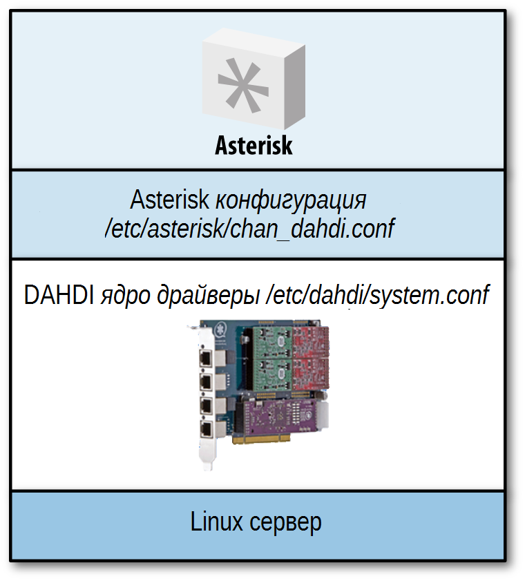

# Глава 9. Интернационализация

> **Дэвид Дюффетт**
>
> _Английский? Кто должен тратить время на его изучение? Я никогда не поеду в Англию!_
>
> -- Дэн Касталланета

Телефония - одна из тех сфер жизни, где люди не любят сюрпризов, будь они дома или на работе. Когда люди пользуются телефонами, все, что выходит за рамки нормы, не оправдывается, и, как человек, который, вероятно занимается поставками телефонных систем, вы будете знать, что неудовлетворенные ожидания могут привести к неописуемым страданиям с точки зрения дополнительной работы, потерянных денег и других проблем, связанных с недовольством клиентов.

Помимо того, что пользовательский интерфейс соответствует тому, что ожидают пользователи, также необходимо, чтобы ваш Asterisk чувствовал себя «как дома». Например, если исходящий вызов сделан по аналоговой линии \(FXO\), Asterisk будет нужно интерпретировать тоны, которые он «слышит» на линии \(занято, вызов и т.д.\).

По умолчанию \(а возможно, как и следовало бы ожидать, поскольку он был “рожден в США”\), Asterisk настроен на работу в Северной Америке. Однако, поскольку Asterisk развертывается во многих местах и \(к счастью\) люди со всего мира вносят свой вклад в него, вполне возможно настроить Asterisk для правильной работы практически в любом месте, где вы решите его развернуть.

Если вы читали эту книгу с самого начала - глава за главой, вы уже сделали некоторый выбор во время установки и начальной конфигурации, которая настроила ваш Asterisk для работы в вашем регионе \(и оправдает ожидания ваших клиентов\).

Довольно много глав в этой книге содержат информацию, которая поможет вам интернационализировать[1](https://learning.oreilly.com/library/view/asterisk-the-definitive/9781492031598/ch09.html#idm46178407219928) или \(возможно, более правильно\) локализовать вашу реализацию Asterisk. Цель этой главы - обеспечить единое место, куда можно будет ссылаться, обсуждать и объяснять все аспекты изменений, которые необходимо внести в телефонную систему на базе Asterisk в этом контексте. Причина использования фразы "телефонная система на основе Asterisk", а не просто” Asterisk", заключается в том, что некоторые изменения необходимо будет внести в другие части системы \(IP-телефоны, ATAs и т. д.\), в то время как другие изменения будут реализованы в конфигурационных файлах Asterisk и DAHDI.

Давайте начнем с составления списка \(не в определенном порядке\) вещей, которые возможно потребуется изменить для оптимизации вашей телефонной системы на основе Asterisk для данного местоположения за пределами Северной Америки. Вы можете выкрикнуть что-нибудь ещё, если хотите.…

* Язык/акцент подсказок
* Физическое подключение для интерфейсов ТфОП \(FXO, BRI, PRI\)
* Тоны, слышимые пользователями IP-телефонов и/или ATA
* Формат идентификатора вызывающего абонента \(CallerID\), передаваемый и/или принимаемый аналоговыми интерфейсами
* Сигналы для аналоговых интерфейсов, подаваемые или определяемые Asterisk
* Формат меток времени/даты для голосовой почты
* Способ, которым вышеуказанные метки времени/даты объявляются системой Asterisk
* Шаблоны в диалплане \(IP-телефонов, ATA и самой Asterisk, если вы используете образец диалплана\)
* Способ указания аналоговому устройству об ожидании голосовой почты \(MWI\)
* Тоны, подаваемые абонентам Asterisk \(они вступают в игру, когда пользователь находится “внутри " системы; например, тоны, услышанные во время трансфера вызова\)

Мы рассмотрим все в этом списке, приняв стратегию работы от внешнего края системы к самому ядру \(самой Asterisk\). Мы закончим с удобным контрольным списком того, что вам может понадобится изменить и где это сделать.

Хотя принципы, описанные в этой главе, позволят вам адаптировать установку Asterisk специально для вашего региона \(или для вашего клиента\), для обеспечения согласованности все наши примеры будут сосредоточены на том, как адаптировать Asterisk для одного региона: Соединенного Королевства.

## Внешние устройства по отношению к серверу Asterisk

Существуют огромные различия между хорошим старомодным аналоговым телефоном и любым из большого количества IP-телефонов, и нам нужно подобрать одно из действительно фундаментальных различий, чтобы пролить свет на следующее объяснение, которое охватывает настройки, которые нам, возможно, придется изменить на устройствах, внешних по отношению к Asterisk, таких как IP-телефоны.

Вы когда-нибудь задумывались о том, что аналоговый телефон - это совершенно немое устройство \(мы знаем, что базовая модель очень, очень дешевая\), которое должно подключаться к интеллектуальной сети \(ТфОП\), тогда как IP-телефон \(например, SIP или IAX2\) - это очень умное устройство, которое подключается к немой сети \(Интернет или любая обычная IP-сеть\)? Рисунки 9-1 и 9-2 проиллюстрируют разницу.


_Рисунок 9-1. Старые времена: немые устройства подключаются к умной сети_


_Рисунок 9-2. Ситуация на сегодняшний день: умные устройства подключаются через немую сеть_

Можем ли мы взять два аналоговых телефона, подключить их непосредственно друг к другу и иметь функциональность, которую мы обычно связываем с обычным телефоном? Нет, конечно нет, потому что сеть предоставляет все: фактическое питание телефона, сигнал вызова \(от местной станции или центрального офиса\), информацию об идентификаторе вызывающего абонента \(CallerID\), сигнал вызова \(от удаленной \[ближайшего к телефону назначения\] станции или ЦО\), всю необходимую сигнализацию и так далее.

И наоборот, можем ли мы взять два IP-телефона, подключить их непосредственно друг к другу и получить некоторую разумную функциональность? Конечно можем, потому что весь интеллект находится внутри самих IP—телефонов - они обеспечивают тоны, которые мы слышим \(сигнал вызова, звонок, занято\) и запускают протокол, который выполняет всю необходимую сигнализацию \(обычно SIP\). Фактически, вы можете попробовать это для себя - большинство средних IP-телефонов имеют встроенный коммутатор Ethernet, поэтому вы можете подключить два IP-телефона непосредственно друг к другу с помощью обычного \(прямого\) кабеля Ethernet или просто подключить их через обычный коммутатор. Они должны иметь фиксированные IP-адреса в отсутствие DHCP-сервера, и вы сможете набрать IP-адрес другого телефона, просто используя клавишу \* для точек в адресе.

Рисунок 9-2 указывает на тот факт, что на IP-телефоне мы несем ответственность за настройку всех тонов, которые предоставила бы сеть в былые времена. Это можно сделать одним \(по крайней мере\) из двух способов. Первый заключается в настройке тонов, предоставляемых IP-телефоном на собственном веб-интерфейсе устройства. Вы делаете это, просматривая IP-адрес телефона \(IP-адрес обычно можно получить с помощью опции меню на телефоне\), а затем выбрав соответствующие параметры. Например, на IP-телефоне Yealink тоны устанавливаются на странице веб-графического интерфейса _Телефон_ под вкладкой _Тоны_ \(где вы найдете список различных типов тонов, которые можно изменить — в случае Yealink это набор, КПВ, занято, перегрузка, ожидание вызова, повторный вызов, запись, информация, заикание, сообщение и автоответ\).

Другой способ, которым эта конфигурация может быть применена - это автоматическое предоставление телефону этих настроек. Полное объяснение механизма автопровижинга выходит за рамки этой книги, но как правило вы можете настроить тоны в соответствующих атрибутах необходимых элементов в XML-файле.

В то время как мы меняем настройки на IP-телефонах, есть еще две вещи, которые может потребоваться изменить, чтобы телефоны выглядели правильно и функционировали как часть системы.

Большинство телефонов отображают время в режиме ожидания, и, поскольку многие люди находят это особенно раздражающим, когда их телефоны показывают неправильное время, мы должны убедиться, что отображается правильное местное время. Должно быть довольно легко найти соответствующую страницу веб-интерфейса \(или атрибутов XML\) для указания сервера сингхронизации времени. Вы также обнаружите что есть настройки для перехода на летнее время и другие важные вещи.

Последнее, что нужно изменить - это потенциальный showstopper, когда речь идет о телефонном звонке - диалплан. Мы говорим не о диалплане, который находится в _/etc/asterisk/extensions.conf_, а о диалплане телефона. Не все понимают что IP-телефоны также имеют схемы набора номеров, хотя эти диалпланы больше связаны с тем, какие строки набора разрешены, чем с тем, что делать с данным набором.

Общее правило, по-видимому, заключается в том, что если вы набираете при положенной трубке - встроенная схема набора номера проигнорируется, но если вы поднимаете трубку - в игру вступает диалплан телефона и может случиться так, что диалплан не позволит набрать необходимую строку. Хотя эта проблема может проявляться в отказе телефона передавать определенные типы номеров в Asterisk, она также может повлиять на любые коды функций, которые вы планируете использовать. Это может быть легко исправлено путем поиска номера модели телефона вместе с «UK dialplan» \(или конкретным нужным вам регионом\) или вы можете перейти на соответствующую страницу в веб-интерфейсе пользователя и там либо вручную настроить диалплан, либо выбрать страну из выпадающего списка \(в зависимости от типа телефона, с которым вы работаете\).

Предварительное обсуждение конфигурации IP-телефона также относится к любым аналоговым телефонным адаптерам \(ATA\), которые вы планируете использовать, в частности к тем, которые поддерживают интерфейс FXS. Кроме того, может потребоваться указать некоторые электрические характеристики телефонного интерфейса, такие как линейное напряжение и импеданс, а также формат идентификатора вызывающего абонента, который будет работать с локальными телефонами. Все, что отличается - это способ получения IP-адреса для веб-интерфейса - обычно это делается набором определенного кода на подключенном аналоговом телефоне, что приводит к тому, что IP-адрес произносится вызывающему абоненту.

Конечно, ATA также может иметь интерфейс FXO, который также должен быть настроен для правильного взаимодействия с аналоговой линией, предоставляемой в вашем регионе. Типы настроек, которые необходимо изменить, аналогичны интерфейсу FXS.

Что делать, если вы подключаете аналоговый телефон или линию к карте Digium? Мы рассмотрим это в следующий раз.

## Подключение ТфОП, DAHDI, карт Digium и аналоговых телефонов

Прежде чем мы перейдем к конфигурации DAHDI и Asterisk, нам нужно физически подключиться к ТфОП. К сожалению, общемировых стандартов для пордобных соединений не существует; на самом деле, даже в разных частях одной страны часто существуют различия.

Primary Rate Interfaces \(PRI\) обычно оканчиваются соединением RJ45 в настоящее время, хотя импеданс соединений может варьироваться. В некоторых странах \(в частности, в Южной Америке\) все еще можно найти PRI, обжатый двумя разъемами BNC: один для передачи и один для приема.

Проще говоря PRI, оконеченный RJ45, будет соединением ISDN, а если вы обнаружите, что соединение выполнено парой разъемов BNC \(push-and-twist coaxial connectors\), велика вероятность что вы имеете дело с более старым протоколом на основе CAS \(например, MFCR2\).

На Рисунке 9-3 показан адаптер, необходимый в том случае, если ваша телефонная компания поставила разъемы BNC \(карты Sangoma/Digium требуют подключения RJ45\). Он называется _balun_, поскольку преобразует из сбалансированного соединения \(RJ45\) в несбалансированное соединение \(BNCs\) в дополнение к изменению импеданса соединения.

---

**Примечание**

Basic Rate Interfaces \(BRI\) распроастранены в континентальной Европе и почти всегда поставляются через соединение RJ45.

---


_Рисунок 9-3. Balun_

Аналоговые соединения сильно различаются в зависимости от местоположения - вы должны знать, какой тип разъема используется в вашей местности. Важно помнить, что аналоговая линия - это только два провода, и они должны подключаться к двум средним контактам разъема RJ11, который входит в плату Digium, другой конец является локальным. На Рисунке 9-4 показан коннектор, используемый в Великобритании, где два провода подключены к контактам 2 и 5.


_Рисунок 9-4. Штекер BT, используемый для аналоговых соединений ТфОП в Великобритании \(обратите внимание, присутствуют только контакты 2–5\)_

Интерфейс аппаратного устройства Digium Asterisk \(Digium Asterisk Hardware Device Interface\) или DAHDI на самом деле охватывает несколько вещей. Он содержит драйверы ядра для плат адаптеров телефонии, которые работают в рамках DAHDI, а также утилиты автоматической настройки и инструменты тестирования. Эти части содержатся в двух отдельных пакетах \(_dahdi-linux_ и _dahdi-tools_\), но мы также можем использовать один полный пакет, который называется _dahdi-linux-complete_. Все три пакета доступны [на сайте Digium](http://downloads.digium.com/pub/telephony/).

После того, как вы установили тип соединения PRI, предоставленного вам телекоммуникационным оператором, вам понадобятся некоторые дополнительные сведения для правильной настройки DAHDI и Asterisk \(например, является ли соединение ISDN или протоколом на основе CAS\). Опять же, вы найдете их в [Главе 7](glava-07.md).

### Драйверы DAHDI

Соединения, в которых потребуется реальная локализация - это аналоговые интерфейсы. Для того, чтобы настроить телефонную систему на базе Asterisk так, чтобы она лучше всего работала в данной местности, сначала необходимо настроить некоторые низкоуровневые аспекты взаимодействия карты Digium с подключенным устройством или линией. Это делается через драйвер(ы) ядра DAHDI, в файле с именем _/etc/dahdi/system.conf_.

В следующих строках (взятых из примера конфигурации, который вы получаете с новой установкой DAHDI), вы найдете настройки `loadzone` и `defaultzone`. Настройка `loadzone` позволяет выбрать набор(ы) тонов, которые карта будет генерировать (подавать на аналоговые телефоны) и распознавать (на подключенных аналоговых телефонных линиях):

```text
# Tone Zone Data
# ^^^^^^^^^^^^^^
# Наконец, вы можете предварительно загрузить некоторые тональные
# зоны, чтобы предотвратить их перезапись другими пользователями (если
# вы разрешаете пользователям (не root), открывать интерфейсы /dev/dahdi/*).
# Кроме того, это означает, что они не должны быть загружены во время выполнения.
# Формат - "loadzone=<zone>", где zone представляет собой двухбуквенный код страны.
# Вы также можете указать зону по умолчанию в "defaultzone=<zone>",
# где zone - это двухбуквенный код страны.
# Актуальный список зон можно найти в файле zonedata.с
#
loadzone = us
#loadzone = us-old
#loadzone=gr
#loadzone=it
#loadzone=fr
#loadzone=de
#loadzone=uk
#loadzone=fi
#loadzone=jp
#loadzone=sp
#loadzone=no
#loadzone=hu
#loadzone=lt
#loadzone=pl
defaultzone=us
#
```

---

**Подсказка**

В файле _/etc/dahdi/system.conf_ используется символ решётка (**#**) для обозначения комментария вместо точки с запятой (**;**), как в файлах _/etc/asterisk_.

---

Хотя можно загрузить несколько различных наборов тонов (вы можете увидеть все наборы в zonedata.c) и переключаться между ними, в большинстве случаев вам понадобится только:

```text
loadzone=uk    # загружаемый набор тонов
defaultzone=uk # по умолчанию DAHDI использует этот набор
```

…или тоны, необходимые для Вашего региона.

Если вы выполняете dahdi_genconf для автоматической (или она должна быть автомагическая?) настройки своих адаптеров DAHDI, то заметите, что сгенерированный _/etc/dahdi/system.conf_ объявит как `loadzone`, так и `defaultzone` как `us`. Несмотря на предупреждения не редактировать файл вручную, нормальная практика - изменить эти параметры на то, что Вам нужно.

Если вам интересно как проверить почтовый ящик, связанный с каналом, к которому подключен аналоговый телефон, на наличие голосовых сообщений, то это делается заикающимся тоном. Формат этой заикнутой мелодии определяется выбранной комбинацией `loadzone/defaultzone`.

В качестве быстрого отступления, аналоговые телефоны, у которых есть индикатор ожидания сообщения (например, светодиод или лампа, которая мигает, чтобы указать на новую голосовую почту), достигают этого, автоматически периодически отключаясь и слушая заикающийся тон. Вы можете увидеть это, посмотрев вывод командной строки Asterisk, чтобы увидеть как канал DAHDI становится активен (если у вас нет ничего лучше!).

Вот и все на уровне DAHDI. Мы выбрали протокол(ы) для соединений PRI или BRI, тип сигнализации для аналоговых каналов (все рассмотрено в [Главе 7](glava-07.md)) и тональные сигналы для аналоговых соединений, которые только что были обсуждены.

Связь между Linux, DAHDI и Asterisk (и, следовательно, _/etc/dahdi/system.conf_ и _/etc/asterisk/chan_dahdi.conf_) показана на Рисунке 9-5.



_Рисунок 9-5. Связь между Linux, DAHDI и Asterisk_

---
**Подсказка**

После завершения настройки на уровне DAHDI (в файле _/etc/dahdi/system.conf_), вам нужно выполнить _dahdi\_cfg -vvv_ чтобы DAHDI перечитал конфигурацию. Это также хороший шанс, чтобы использовать _dahdi\_tool_ для проверки что все в порядке на уровне Linux.

Таким образом, если что-то не работает должным образом после настройки Asterisk для работы с адаптерами DAHDI, вы можете быть уверены, что проблема ограничена _chan\_dahdi.conf_ (или _\#include dahdi-channels.conf_ если вы используете эту часть вывода _dahdi\_genconf_).

---

## Интернационализация в Asterisk

Теперь, когда все настроено на уровне Linux, нам нужно только настроить Asterisk, чтобы использовать каналы, которые мы только что включили на уровне Linux, и настроить способ, которым Asterisk интерпретирует и генерирует информацию, поступающую из этих каналов или исходящую через них. Эта работа выполняется в файле _/etc/asterisk/chan_dahdi.conf_.

В этом файле мы не только расскажем Asterisk, какие каналы у нас есть (эти настройки будут соответствовать тому, что мы уже сделали в DAHDI), но и настроим ряд вещей, которые гарантируют, что Asterisk хорошо подходит для своего нового дома.

### Caller ID

Ключевым компонентом этого изменения является CallerID (идентификатор вызывающего абонента). Хотя методы доставки CallerID являются довольно стандартными в мире BRI и PRI, в аналоговом мире они сильно различаются; таким образом, если вы подключите американский аналоговый телефон к телефонной сети Великобритании, он, фактически, будет работать как телефон, но CallerID отображаться не будет. Это потому, что эта информация передается разными способами в разных местах по всему миру, и американский телефон будет искать сигнализацию CallerID в формате США, в то время как телефонная сеть Великобритании будет поставлять ее в формате Великобритании (если он включен - CallerID не является стандартным в Великобритании, вы должны попросить, а иногда даже заплатить, это!).

Мало того, что формат отличается, но и способ сообщить телефону (или Asterisk) искать CallerID также может варьироваться от места к месту. Это важно, так как мы не хотим, чтобы Asterisk тратил время на поиск информации о CallerID, если он не отображается на линии.

Опять же, Asterisk по умолчанию использует североамериканский формат идентификатора (записи в _/etc/asterisk/chan_dahdi.conf_ не описывают этого, это просто значение по умолчанию) и для его изменения нам потребуется сделать несколько записей, которые опишут технические детали системы идентификации вызывающего абонента. В случае Великобритании о доставке информации CallerID сигнализирует смена полярности на телефонной линии (другими словами, жилы A и B пары телефонных проводов временно переключаются) и фактическая информация о CallerID доставляется в формате, известном как V.23 (частотная манипуляция или FSK). Таким образом, записи в файле _chan_dahdi.conf_ для получения идентификатора вызывающего абонента в британском стиле на любых интерфейсах FXO будут выглядеть следующим образом:

```text
cidstart=polarity ; доставка caller ID будет осуществляться
                  ; методом изменения полярности
cidsignalling=v23 ; доставка информации о вызываемом идентификаторе
                  ; будет в формате V23
```

Конечно, вам также может понадобиться отправить CellrID, используя ту же информацию локальной сигнализации, на любые аналоговые телефоны, которые подключены к интерфейсам FXS, и может потребоваться еще одна запись, поскольку в некоторых местах информация CallerID отправляется после указанного количества звонков. Если это так - вы должны использовать эту запись:

```text
sendcalleridafter=2
```

Прежде чем вы сможете сделать эти записи, вам нужно будет установить детали вашей локальной системы CallerID (кто-то из вашей местной телефонной компании или Google может помочь в этом, но также есть некоторая полезная информация в файле примера _/etc/asterisk/chan_dahdi.conf_).

### Язык и/или акцент подсказок

Как вы знаете, подсказки (или записи), используемые Asterisk, хранятся в _/var/lib/asterisk/sounds/_. В более старых версиях Asterisk все звуки были в этом фактическом каталоге, но в наши дни вы найдете ряд подкаталогов, которые позволяют использовать различные языки или акценты. Имена этих подкаталогов произвольны; вы можете называть их как угодно.

Обратите внимание, что имена файлов в этих каталогах должны соответствовать ожиданиям Asterisk — например файл _/var/lib/asterisk/sound/en-hello.gsm_ будет содержать слово "Hello" (произнесенное прекрасной Элисон), тогда как hello.gsm в _/var/lib/asterisk/sounds/es (для испанского в данном случае) будет содержать слово "Hola" (произнесенное испанским эквивалентом прекрасной Эллисон[2]).

По умолчанию используется каталог _/var/lib/asterisk/sounds/en/_, так как же это изменить?

Есть два способа. Один из них - установить язык в файле конфигурации канала, на который поступают вызовы, используя директиву `language`. Например, строка:

```text
language=en_UK
```

помещенная в _chan_dahdi.conf_, _sip.conf_ и т.д. (Для применения в целом или только для данного канала или профиля) укажет Asterisk использовать звуковые файлы, найденные в _/var/lib/asterisk/sounds/en_UK/_ (которые могут содержать подсказки с британским акцентом) для всех вызовов, поступающих через эти каналы.

Другой способ - изменить язык во время телефонного звонка через диалплан. Этот параметр (наряду со многими атрибутами отдельного вызова) можно задать с помощью функции Channel() dialplan. См. [Глава 10](../glava-10.md) для полной обработки функций диалплана.

В следующем примере вызывающий абонент может выбрать один из трех языков для продолжения вызова:

```text
; дает выбор (1) Французского, (2) Испанского или (3) Немецкого
exten => s,1,Background(choose-language)
    same => n,WaitExten(5)
exten => 1,1,Set(CHANNEL(language)=fr)
exten => 2,1,Set(CHANNEL(language)=es)
exten => 3,1,Set(CHANNEL(language)=de)
; следующий приоритет для  расширений 1, 2 или 3 будет обрабатываться здесь
exten => _[123],n,Goto(menu,s,1)
```

Если вызывающий абонент нажмет 1, звуки будут воспроизводиться из _/var/lib/asterisk/sounds/fr/_; если он нажмет 2, звуки будут браться из _/var/lib/asterisk/sounds/es/_ и так далее.

Как уже упоминалось, имена этих каталогов произвольны и необязательно должны быть длиной всего два символа - главное, чтобы вы соответствовали имени подкаталога, который создали в директиве языка в конфигурации канала, или когда установили в качестве аргумента в `CHANNEL(language)` через диалплан.

### Штампы времени/даты и произношение

Asterisk использует системное время Linux с хост-сервера как и следовало ожидать, но у нас могут быть пользователи системы, которые находятся в разных часовых поясах или даже в разных странах. Голосовая почта - это место, где резина попадает в дорогу, так как именно здесь пользователи вступают в контакт с информацией о времени/дате.

Рассмотрим сценарий, в котором одни пользователи системы находятся в США, а другие - в Великобритании.

Помимо разницы во времени, еще одна вещь, которую следует учитывать — это то, какой формат даты и времени используют люди в разных местах - в США даты обычно упорядочиваются по месяцам, дням, годам, а время указывается в 12-часовом формате (например, 2:54 P.M.).

В отличие от этого, в Великобритании даты упорядочены как день, месяц, год и время указывается в 24-часовом формате (14:54 hrs), хотя некоторые люди в Великобритании предпочитают 12-часовой формат часов, поэтому мы рассмотрим его тоже.

Поскольку все эти вещи связаны с голосовой почтой, Вы были бы правы, предположив, что мы настраиваем это в _/etc/asterisk/voicemail.conf_ - в частности, в разделе файла `[zonemessages]`.

Вот часть `[zonemessages]` образца файла _voicemail.conf_, который поставляется с Asterisk, добавлены зоны `UK24` (для британцев, которые любят 24-часовой формат) и `UK12` (для британцев, предпочитающих 12-часовой формат):

```text
[zonemessages]
; Пользователи могут находиться в разных часовых поясах или иметь разные
; объявления для сообщения при входе в систему голосовой почты. Здесь можно
; установить сообщение и часовой пояс для каждого пользователя. Определите
; пользователя в одну из этих зон с помощью tz=атрибут в параметрах почтового
; ящика. Конечно, замена языка здесь всё еще применяется, поэтому у вас
; может быть несколько деревьев каталогов, которые имеют альтернативные
; варианты языка.
;
; Найдите в /usr/share/zoneinfo/ названия часовых поясов.
; Посмотрите страницу руководства для strftime для быстрой справки о том,
; как выполняется подстановка переменных на значениях ниже.
;
; Поддерживаемые значения:
; 'filename' имя звукового файла (требует одиночные кавычки вокруг имени
; файла)
; ${VAR} подстановка переменных
; A или a - день недели (Saturday, Sunday, ...)
; B или b или h - название месяца (January, February, ...)
; d или e - число в месяце (first, second, ... thirty-first)
; Y - год
; I или l - час, 12-часовой формат
; H - час, 24-часовой формат (одноразрядные часы перед "oh")
; k - час, 24-часовой формат (одноразрядные часы НЕ перед "oh")
; M - минута, с 00 произносится как "o'clock"
; N - минута, с 00 произносится как "hundred" (военное время США)
; P или p - AM или PM
; Q "today", "yesterday" или ABdY
; (*примечание: нестандартное значение strftime)
; q " (для today), "yesterday", weekday или ABdY
; (*примечание: нестандартное значение strftime)
; R - 24-часовой формат, включая минуты
;
eastern=America/New_York|'vm-received' Q 'digits/at' IMp
central=America/Chicago|'vm-received' Q 'digits/at' IMp
central24=America/Chicago|'vm-received' q 'digits/at' H N 'hours'
military=Zulu|'vm-received' q 'digits/at' H N 'hours' 'phonetic/z_p'
european=Europe/Copenhagen|'vm-received' a d b 'digits/at' HM
UK24=Europe/London|'vm-received' q 'digits/at' H N 'hours'
UK12=Europe/London|'vm-received' Q 'digits/at' IMp
```

Эти зоны не только определяют время, но и указывают порядок следования и считывания времени и дат.

Создав эти зоны, мы можем перейти к контекстной части _voicemail.conf_, чтобы связать соответствующие почтовые ящики с правильными зонами:

```text
[default]
4001 => 1234,Russell Bryant,rb@shifteight.org,,|tz=central
4002 => 4444,David Duffett,dd@shifteight.org,,|tz=UK24
4003 => 4450,Mary Poppins,mp@shifteight.org,,|tz=UK12|attach=yes
```

Как вы могли заметить, когда мы объявляем почтовый ящик, мы также (необязательно) связываем его с определенной зоной. Полную информацию о голосовой почте можно найти в [Главе 8](glava-08.md).

Последнее, что нужно локализовать в нашей конфигурации Asterisk - это тоны, воспроизводимые для абонентов Asterisk, когда они находятся внутри системы (например, тоны, которые абонент слышит во время трансфера).

Как было указано ранее в этой главе, исходные сигналы, которые люди слышат, когда звонят в систему, будут поступать с IP-телефона или с DAHDI для аналоговых каналов.

Эти тоны задаются в _/etc/asterisk/indication.conf_. Вот часть файла примера, где вы можете увидеть данный регион, указанный в директиве страны. Нам просто нужно изменить код страны соответствующим образом:

```text
;
; indications.conf
;
; Конфигурационный файл для индикаций конкретного местоположения
;
; ПРИМЕЧАНИЕ:
; При добавлении стран в этот файл, пожалуйста, держите их в алфавитном
; порядке в соответствии с 2-символьными кодами стран!
;
; Категория [general] предназначена для некоторых глобальных переменных.
; Все остальные категории интерпретируются как индикации для
; конкретного местоположение
;
[general]
country=uk ; по умолчанию - US, поэтому мы изменили его на uk
```

Ваш диалплан должен будет отражать схему нумерации для вашего региона. Если вы еще не знаете схему для своего региона, местный регулятор электросвязи обычно предоставляет подробную информацию об этом. Кроме того, пример диалплана в _/etc/asterisk/extensions.conf_ конечно же содержит номера и шаблоны для Северной Америки.

## Вывод - простая шпаргалка

Как вы теперь можете видеть - есть довольно много вещей, которые необходимо изменить, чтобы полностью локализовать вашу телефонную систему на основе Asterisk и не все из них находятся в конфигурации Asterisk или даже DAHDI — некоторые параметры должны быть изменены на подключенных IP-телефонах или ATA.

Прежде чем мы покинем главу, взгляните на Таблицу 9-1: шпаргалка, подсказывающая что и где изменить для дальнейшего использования.

_Таблица 9-1. Шпаргалка интернационализации_

<table>
  <thead>
    <tr>
      <th style="text-align:left">Что изменить</th>
      <th style="text-align:left">Где это изменить</th>
    </tr>
  </thead>
  <tbody>
    <tr>
      <td style="text-align:left">Тоны выполнения вызова</td>
      <td style="text-align:left">
        <p></p>
        <ul>
          <li>IP-телефоны&#x2014;в самом телефоне</li>
          <li>ATAs&#x2014;в самом ATA</li>
          <li>Аналогвоые телефоны&#x2014;DAHDI (<em>/etc/dahdi/system.conf</em>)</li>
        </ul>
      </td>
    </tr>
    <tr>
      <td style="text-align:left">Тип PRI/BRI и протокол</td>
      <td style="text-align:left">DAHDI&#x2014;<em>/etc/dahdi/system.conf</em> and <em>/etc/asterisk/chan_dahdi.conf</em>
      </td>
    </tr>
    <tr>
      <td style="text-align:left">Физические подключения ТфОП</td>
      <td style="text-align:left">
        <p></p>
        <ul>
          <li>Balun если требуется для PRI</li>
          <li>Подключить аналоговую пару к средним двум контактам RJ11, подключенному к плате Digium
          </li>
        </ul>
      </td>
    </tr>
    <tr>
      <td style="text-align:left">Caller ID на аналоговой линии</td>
      <td style="text-align:left">Asterisk&#x2014;<em>/etc/asterisk/chan_dahdi.conf</em>
      </td>
    </tr>
    <tr>
      <td style="text-align:left">Языковые подсказки и/или акцент</td>
      <td style="text-align:left">
        <p></p>
        <ul>
          <li>Канал&#x2014;<em>/etc/asterisk/sip.conf</em>, <em>/etc/asterisk/iax.conf</em>, <em>/etc/asterisk/chan_dahdi.conf</em>,
            и тд.</li>
          <li>Диалплан&#x2014;функция <code>CHANNEL(language)</code></li>
        </ul>
      </td>
    </tr>
    <tr>
      <td style="text-align:left">Штампы время/дата и произношение для голосовой почты</td>
      <td style="text-align:left">Asterisk&#x2014;<em>/etc/asterisk/voicemail.conf</em>
      </td>
    </tr>
    <tr>
      <td style="text-align:left">Тоны, предоставляемые Asterisk</td>
      <td style="text-align:left">Asterisk&#x2014;<em>/etc/asterisk/indications.conf</em>
      </td>
    </tr>
  </tbody>
</table>Пусть все ваши развертывания Asterisk чувствуют себя как дома…

---
[1](https://learning.oreilly.com/library/view/asterisk-the-definitive/9781492031598/ch09.html%22%20/l%20%22idm46178407219928-marker) _i18n_ -это термин, используемый для сокращения слова _internationalization_, из-за его длины. Формат:_&lt;первый_символ&gt;&lt;число&gt;&lt;последний_символ&gt;_, где &lt;number&gt;, где _&lt;число&GT;_ - это количество букв между первой и последней буквами. Другие слова, такие как localization \(L10n\) и modularization \(m12n\), также нашли применение с этой схемой, которую Лейф находит немного смешной. Дополнительную информацию можно найти в [W3C глоссарий онлайн](https://www.w3.org/2001/12/Glossary#I18N).

[2](https://learning.oreilly.com/library/view/asterisk-the-definitive/9781492031598/ch09.html%22%20/l%20%22idm46178407073864-marker) который, по сути, та же самая Эллисон, которая делает английские подсказки; Джун Уоллак делает французские подсказки. Мужские подсказки с австралийским акцентом сделаны Камероном Туми. Все таланты озвучки также доступны для записи дополнительных подсказок. Смотрите страницу [Digium IVR](http://www.digium.com/en/products/ivr/) для получения дополнительной информации.
