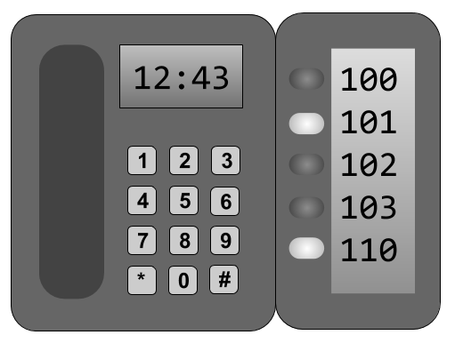

# Глава 13. Состояния устройств

> Среди беспорядка найдите простоту.
>
> --_Albert Einstein_

Часто бывает полезно иметь возможность определить состояние устройств, подключенных к телефонной системе. Например, оператору в приемной может потребоваться видеть статусы всех сотрудников офиса, чтобы определить, может ли кто-то принять телефонный звонок. Сам Asterisk нуждается в такой же информации. В качестве другого примера, если вы создали очередь вызовов, как описано в [Главе 12](glava-15.md), Asterisk должен знать, когда агент становится доступен, чтобы можно было отправить другой вызов. В этой главе рассматриваются понятия состояний устройства в Asterisk, а также способы использования и доступа устройств и приложений к этой информации.

## Состояния устройств

Существует две категории устройств, для которых Asterisk предоставляет информацию о состоянии: канальные устройства (такие как конечные точки PJSIP) и виртуальные (являющиеся встроенными службами, которые можно отслеживать, например конференц-залы).

Чтобы ссылаться на состояние _канала_, Вы делаете это точно так же, как с `Dial()`, например `DEVICE_STATE(PJSIP/000f300B0B02)`, тогда как для ссылки на состояние _виртуального устройства_ используется формат `тип виртуального устройства:идентификатор`, например `DEVICE_STATE(ConfBridge:1234)`.

Виртуальные устройства включают вещи, которые находятся внутри Asterisk, но предоставляют полезную информацию о состоянии (см. [Таблицу 13-1](13.%20Device%20States%20-%20Asterisk%20%20The%20Definitive%20Guide,%205th%20Edition.htm%22%20/l%20%22table-virtualDevices)\).

Таблица 13-1. Устройства, для которых Asterisk может предоставлять информацию о состоянии

| Устройство | Описание |
| :--- | :--- |
| `PJSIP/channel name` | Многие каналы позволяют контролировать их состояние, но канал PJSIP предлагает на сегодняшний день наибольшее количество полезных данных; таким образом, мониторинг SIP-устройств является наиболее распространенным использованием `DEVICE_STATE`. |
| `ConfBridge:conference bridge` | Состояние конференц-моста MeetMe. Состояние будет отражать, имеются ли в настоящее время участники в конференц-зале. Более подробную информацию об использовании `MeetMe()` для конференц-связи можно найти в [Главе 11](glava-11.md). |
| `Custom:custom name` | Пользовательские состояния устройств. Эти состояния имеют пользовательские имена и изменяются с помощью функции `DEVICE_STATE()`. Пример использования можно найти в разделе ["Использование пользовательских состояний устройств"](glava-13.md#Использование-пользовательских-состояний-устройств). |
| `Park:exten@context` | Состояние слота парковки вызова. Информация о состоянии будет отражать, припаркован ли вызывающий абонент в данный момент на этом добавочном номере. Дополнительную информацию о парковке вызовов в Asterisk можно найти в ["Парковке вызовов"](glava-11.md#Парковка-вызовов). |
| `Calendar:calendar name` | Состояние календаря. Asterisk будет использовать содержимое названного календаря, чтобы установить состояние `available` или `busy`. |

### Проверка состояний устройств

Функция диалплана `DEVICE_STATE()` считывает текущее состояние устройства.
```
exten => 7012,1,Answer()
   same => n,Set(DeviceIdent=PJSIP/000f300B0B02)
   same => n,Verbose(3,${DeviceIdent} is ${DEVICE_STATE($DeviceIdent})})
   same => n,Hangup()
```
Если мы вызываем расширение 7012 с того же устройства, на котором проверяем состояние, в консоли Asterisk появляется следующее подробное сообщение:
```
 -- PJSIP/000f300B0B02 is INUSE
```
---
#### Примечание

В [Главе 17](glava-17.md) обсуждается Asterisk Manager Interface (AMI). Действие диспетчера `GetVar` можно использовать для получения значения состояния устройства из внешней программы. Вы можете использовать его для получения значения обычной переменной или для возврата значения из функции диалплана, например `DEVICE_STATE()`.

---

Вот список значений, которые вернет функция `DEVICE_STATE()` (в зависимости, конечно, от того, что было найдено):

* `UNKNOWN`
* `NOT_INUSE`
* `INUSE`
* `BUSY`
* `INVALID`
* `UNAVAILABLE`
* `RINGING`
* `RINGINUSE`
* `ONHOLD`

Эта информация может затем использоваться в диалплане для принятия решений о потоке вызовов (например, локальный канал вызова агента может использовать эту информацию для определения того, что телефон агента находится на вызове по другой линии, и таким образом отклонить вызов, чтобы тот вернулся в очередь).

## Состояния расширения используя директиву hint

Состояние расширения - это механизм диалплана, который Asterisk использует, чтобы разрешить SIP-устройствам подписываться на информацию о присутствии. Например, телефон в приемной может иметь модуль Busy Lamp Field (BLF), содержащий кнопки, которые будут использоваться для отображения состояний различных телефонов в офисе. Телефон с BLF будет отправлять запросы на подписку, чтобы сообщить Asterisk, с каких устройств он хочет получать информацию о присутствии. В диалплане мы используем директиву hint для определения сопоставления между расширением и одним или несколькими устройствами.

### Хинты

Чтобы определить хинт в диалплане, вместо приоритета используется ключевое слово `hint`.
```
[hints]
;exten = <extension>,hint,<device state id>[& <more dev state id],<presence state id>

exten => 100,hint,${UserA_DeskPhone}

exten => 221,hint,ConfBridge:221
```
Часто вы можете увидеть хинты, определенные в том же разделе диалплана, что и обычные расширения. Это может сделать диалплан немного визуально загроможденным, и это также предполагает, что хинт так или иначе связан с набираемым добавочным номером, что на самом деле не так.
```
[sets]

exten => 100,hint,${UserA_DeskPhone}
exten => 100,1,Gosub(subDialUser,${EXTEN},1(${UserA_DeskPhone},${EXTEN},default,22))
exten => 101,hint,${UserA_SoftPhone}
exten => 101,1,Gosub(subDialUser,${EXTEN},1(${UserA_SoftPhone},${EXTEN},default,23))
exten => 102,hint,${UserB_DeskPhone}
exten => 102,1,Gosub(subDialUser,${EXTEN},1(${UserB_DeskPhone},${EXTEN},default,26))
exten => 103,hint,${UserB_SoftPhone}
exten => 103,1,Gosub(subDialUser,${EXTEN},1(${UserB_SoftPhone},${EXTEN},default,24))

exten => 110,1,Dial(${UserA_DeskPhone}&${UserA_SoftPhone}&${UserB_SoftPhone})
```
В нашем примере мы сделали прямую взаимосвязь между добавочным номером подсказки и набираемым добавочным номером, хотя этого не требуется.

### Проверка состояний расширения

Самый простой способ проверить текущее состояние хинтов расширений - через CLI Asterisk. Команда `core show hints` отобразит все настроенные в данный момент хинты:
```
*CLI> core show hints
    -= Registered Asterisk Dial Plan Hints =-
100@hints : PJSIP/0000f30A0A01   State:Unavailable Presence:not_set Watchers 0
101@hints : PJSIP/SOFTPHONE_A    State:Unavailable Presence:not_set Watchers 0
102@hints : PJSIP/0000f30B0B02   State:Unavailable Presence:not_set Watchers 0
103@hints : PJSIP/SOFTPHONE_B    State:Unavailable Presence:not_set Watchers 0
110@hints : PJSIP/0000f30A0A01&P State:Unavailable Presence:not_set Watchers 0
221@hints : ConfBridge:221       State:Unavailable Presence:not_set Watchers 0
----------------
- 6 hints registered
```
В дополнение к отображению состояния каждого хинта, вывод `core show hints` также выводит количество наблюдателей. _Наблюдатель_ - это объект, который подписался на получение обновлений о состоянии этого расширения. Если конечная точка SIP подписывается на состояние добавочного номера, количество наблюдателей будет увеличено.

Состояние расширения также может быть получено с помощью функции диалплана `EXTENSION_STATE()`. Эта функция работает так же, как `DEVICE_STATE()`, описанная в предыдущем разделе. Добавьте следующий пример в файл _/etc/asterisk/extensions.conf_ как новое расширение сразу после 235:

```
exten => 234,1,NoOp()
  same => n,Set(FEATURE(parkingtime)=60)

exten => 235,1,Noop(The state of 100@hints is ${EXTENSION_STATE(100@hints)} )
  same => n,Hangup()

exten => 321,1,NoOp()
```
Когда это расширение вызывается из конечной точки с номером 100, в консоли Asterisk отобразится следующее сообщение:
```
 -- The state of 100@hints is INUSE
```
В следующем списке перечислены возможные значения, которые могут быть возвращены функцией `EXTENSION_STATE()`:

* `UNKNOWN`
* `NOT_INUSE`
* `INUSE`
* `BUSY`
* `UNAVAILABLE`
* `RINGING`
* `RINGINUSE`
* `HOLDINUSE`
* `ONHOLD`

## SIP-присутствие

Asterisk дает устройствам возможность подписаться на состояние расширения с использованием протокола SIP. Эту функцию часто называют BLF (Busy Lamp Field); см. [Рисунок 13-1](13.%20Device%20States%20-%20Asterisk%20%20The%20Definitive%20Guide,%205th%20Edition.htm%22%20/l%20%22fig1301).



_Рисунок 13-1. Busy Lamp Field или боковая панель_

Конфигурация модуля будет немного (или очень) отличаться для каждого производителя; однако информация о подписке, так или иначе, должна включать следующее:
* Адрес сервера Asterisk (это может быть определено для каждой кнопки или может применяться ко всему телефону).
* Контекст для подписки (в нашем примере диалплана он называется `[hints]`). Этот параметр определяется в поле `subscribe_context` таблицы `asterisk.ps_endpoints`.
* Соответствующее расширение (100, 101, 102 и т.д.)[1](https://learning.oreilly.com/library/view/asterisk-the-definitive/9781492031598/ch13.html%22%20/l%20%22idm46178405538488)

Один из самых простых и недорогих способов тестирования присутствия - использование opensource софтфона для Windows, MicroSIP[2](https://learning.oreilly.com/library/view/asterisk-the-definitive/9781492031598/ch13.html#idm46178405536680). Сначала вам нужно скачать MicroSIP и зарегистрировать его в вашей системе Asterisk. Затем на вкладке контактов софтфона вы можете щелкнуть правой кнопкой мыши в открытой области, чтобы добавить контакт. В разделе «Имя» вы можете указать все что пожелаете, но в разделе «Номер» вы должны ввести `extension@hints context`, который в нашем случае будет одним из `100@hints`, `101@hints`, `102@hints` или `103@hints`. Если вы настроили все в Asterisk согласно предыдущим примерам, то должны увидеть, как состояние ваших подписок меняется в зависимости от того, что делает устройство. Вы также можете отслеживать это с точки зрения Asterisk с помощью такой команды:
```
$ watch -n 0.5 "sudo asterisk -rx 'core show hints'"
```
Конфигурация присутствия на физических настольных телефонах по существу одинакова, но может быть сложнее понять конкретный синтаксис, который требуется каждому производителю. Наш совет - заставить его работать с MicroSIP (который вы сможете запустить на WINE под Linux или macOS). Это простая установка, и оттуда у вас будет отличная конфигурация, которой вы можете доверять, когда выбираете аналогичную конфигурацию для одного из ваших настольных телефонов.

## Использование пользовательских состояний устройств

В дополнение к устройствам, которые Asterisk знает как внутренне контролировать (`PJSIP`, `ConfBridge`, `Park`, `Calendar`), Asterisk также предоставляет возможность создавать собственные состояния устройств, которые могут быть очень полезны при разработке некоторых интересных приложений.

Пользовательские состояния устройства определяются с помощью префикса `Custom:`. Текст, который идет после префикса, может быть чем угодно. Чтобы установить или прочитать значение пользовательского состояния устройства, используйте функцию диалплана `DEVICE_STATE()`. Поместите это в свой файл _extensions.conf_ сразу после расширения 235:
```
exten => 235,1,Noop(The state of 100@hints is ${EXTENSION_STATE(100@hints)} )
  same => n,Hangup()

exten => 236,1,Noop(Set a custom status)
  same => n(blink),Set(DEVICE_STATE(Custom:rudolph)=UNAVAILABLE)
  same => n,Set(DEVICE_STATE(Custom:santa)=NOT_INUSE)
  same => n,Wait(0.75)
  same => n,Set(DEVICE_STATE(Custom:rudolph)=NOT_INUSE)
  same => n,Set(DEVICE_STATE(Custom:santa)=UNAVAILABLE)
  same => n,Wait(0.75)
  same => n,Goto(blink)
```
Затем добавьте это себе в контекст `[hints]`:
```
exten => 221,hint,ConfBridge:221
exten => santa,hint,Custom:santa
exten => rudolph,hint,Custom:rudolph
```
Весело, да?

---
#### Примечание

Вы заметите, что когда вы повесите трубку, одно из пользовательских состояний устройств останется "Unavailable". Это важный момент: в системе нет ничего, что обновляло бы ваши пользовательские состояния устройства, если вы сами не внедрили что-то для этого.

---

## Вывод

Функциональность состояний устройств в Asterisk может использоваться для отслеживания состояния различных ресурсов и доставки информации об этих состояниях различным подписчикам. Обычно (и традиционно) используется для BLF, пользовательское состояние устройства позволяет этому ресурсу быть гораздо более гибким, чем в традиционной УАТС.

[1](https://learning.oreilly.com/library/view/asterisk-the-definitive/9781492031598/ch13.html#idm46178405538488-marker) Элементы 2 и 3 могут быть сформированы в виде одной строки, похожей на 100@hints или что-то подобное.

[2](https://learning.oreilly.com/library/view/asterisk-the-definitive/9781492031598/ch13.html#idm46178405536680-marker) Который написан с использованием той же библиотеки PJSIP что использует Asterisk.

[Глава 12. Automatic Call Distribution Queues](glava-12.md) | [Содержание](SUMMARY.md) | [Глава 14. Автосекретарь](glava-14.md)